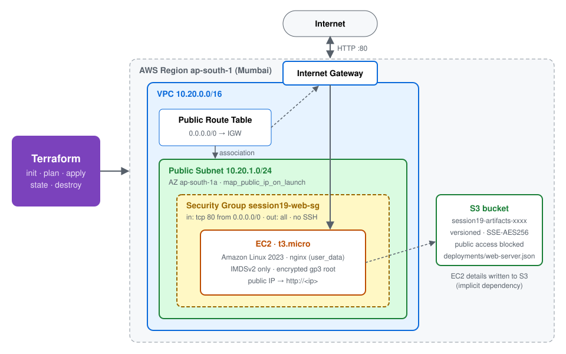
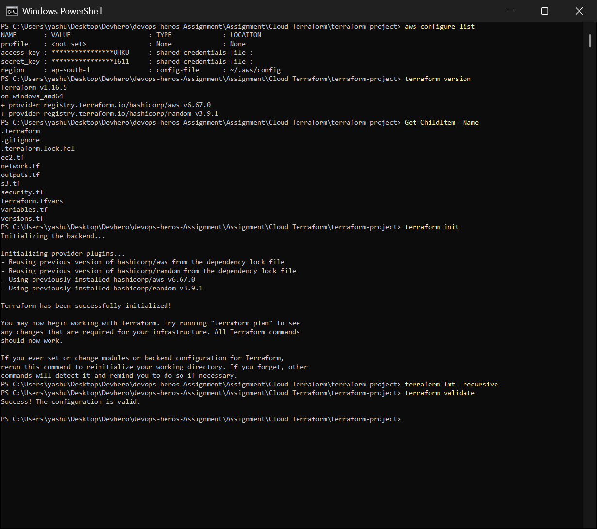
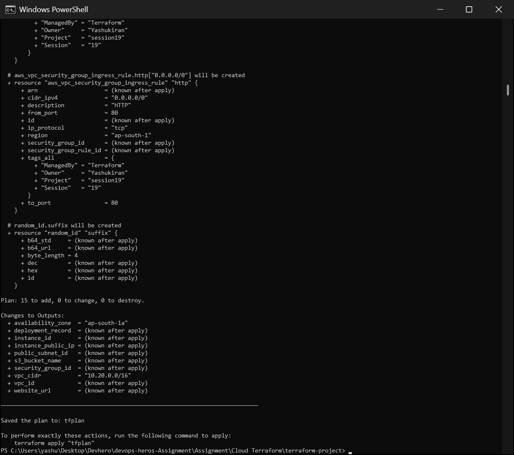
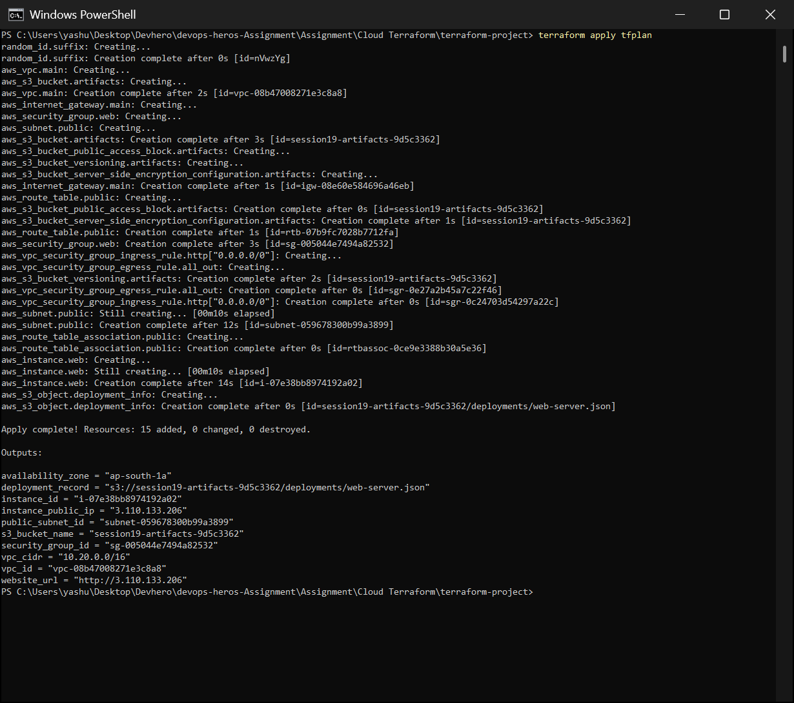
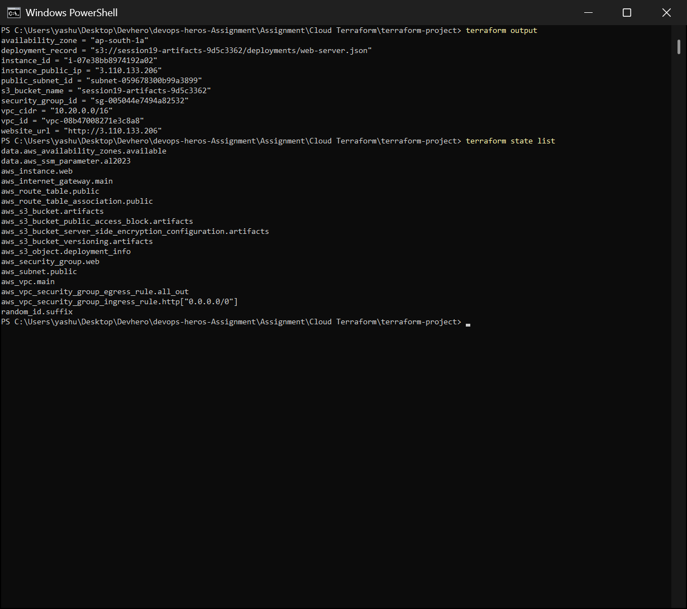
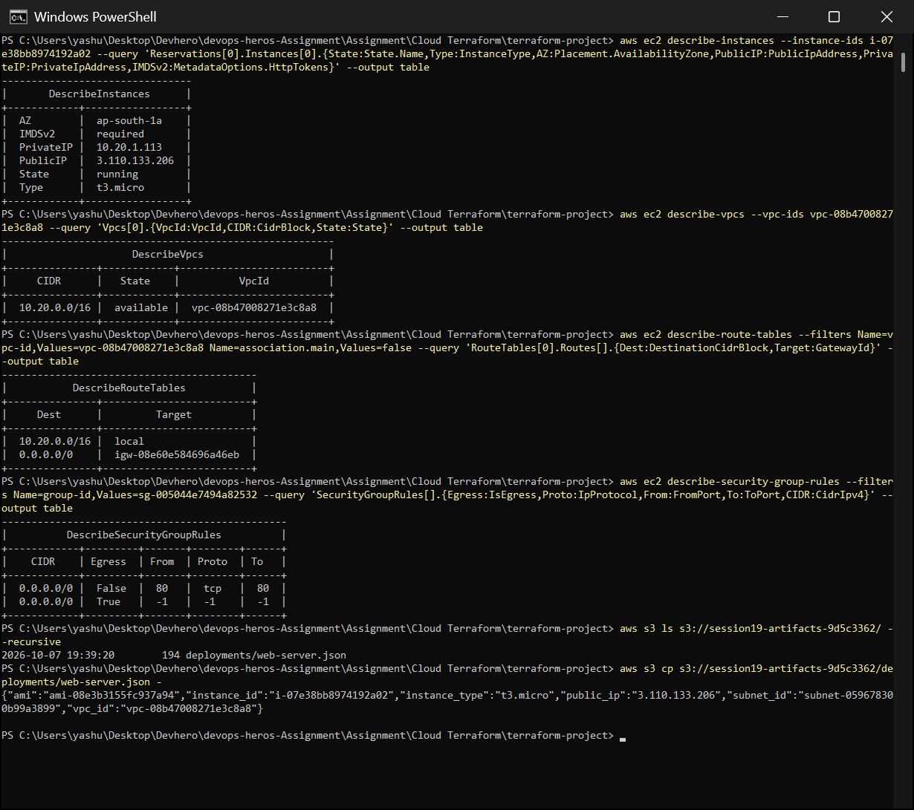
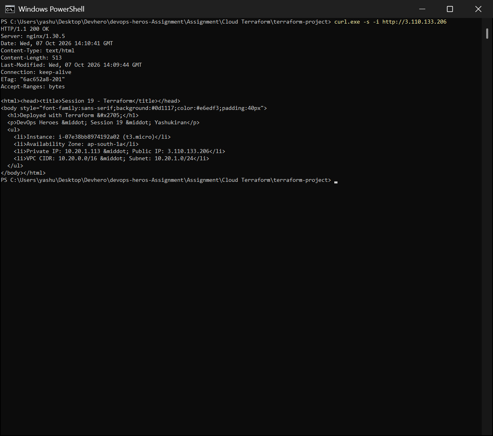
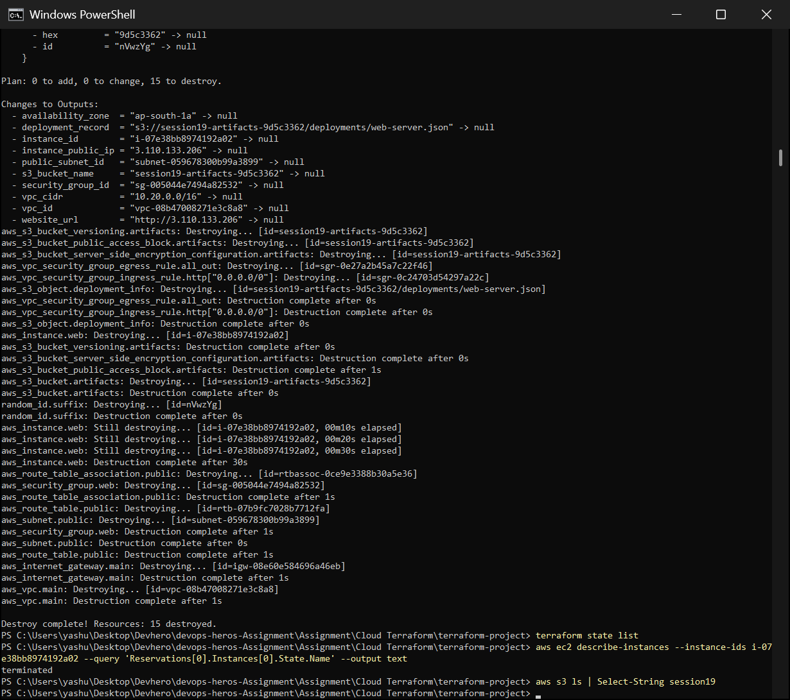

# Session 19 – Cloud & Terraform in Action

An end-to-end AWS infrastructure project built entirely with Terraform: a **VPC** with a **public subnet**, **Internet Gateway** and **route table**, a **security group**, an **EC2** web server (nginx, configured by `user_data`), and a private, encrypted **S3** bucket. It builds on the course's [`08-mini-project`](../../session19-cloud-terraform/08-mini-project) (network only) and adds the "optional extension" EC2, plus S3.

## Architecture



```text
Terraform
    │
    ├── VPC 10.20.0.0/16
    │     ├── Internet Gateway
    │     ├── Public Route Table (0.0.0.0/0 → IGW)
    │     └── Public Subnet 10.20.1.0/24 (ap-south-1a)
    │            └── Security Group (HTTP 80 in, all out, no SSH)
    │                   └── EC2 t3.micro – Amazon Linux 2023 + nginx
    │
    └── S3 bucket (versioned, encrypted, public access blocked)
           └── deployments/web-server.json  ← details of the EC2 instance
```

## Project Structure

```text
Cloud Terraform/
├── README.md
├── architecture.svg
├── screenshots/           # real run: init → plan → apply → verify → curl → destroy
└── terraform-project/
    ├── versions.tf        # terraform + providers (aws ~> 6.0, random), default tags
    ├── variables.tf       # region, project, owner, CIDRs, instance type, allowed CIDRs (with validation)
    ├── terraform.tfvars   # values for the variables
    ├── network.tf         # VPC, AZ data source, public subnet, IGW, route table + association
    ├── security.tf        # security group + ingress/egress rules
    ├── ec2.tf             # AMI lookup (SSM parameter), EC2 instance + user_data
    ├── s3.tf              # bucket, versioning, encryption, public-access block, deployment record
    └── outputs.tf         # IDs, public IP, website URL, bucket name
```

---

## Terraform concepts in this project

### Providers
`versions.tf` pins **`hashicorp/aws ~> 6.0`** and **`hashicorp/random ~> 3.6`**, with `terraform >= 1.6`. The AWS provider gets the region from a variable and adds **`default_tags`** (`Project`, `Session`, `Owner`, `ManagedBy=Terraform`) to every resource automatically. `terraform init` downloads the providers and writes `.terraform.lock.hcl` to lock the exact versions.

### Variables
`variables.tf` declares typed inputs with descriptions and defaults, plus a **`validation`** block (`vpc_cidr` must be a valid CIDR). `terraform.tfvars` provides the values. The same code can deploy another environment just by changing the tfvars (e.g. a different CIDR or instance type).

### Resources
15 managed resources:
- **Network:** `aws_vpc`, `aws_subnet`, `aws_internet_gateway`, `aws_route_table`, `aws_route_table_association`
- **Security:** `aws_security_group` and its 2 rules (`aws_vpc_security_group_ingress_rule`, `aws_vpc_security_group_egress_rule`)
- **Compute:** `aws_instance`
- **Storage:** `aws_s3_bucket` + its `_versioning`, `_server_side_encryption_configuration` and `_public_access_block` settings, `aws_s3_object`
- **Helper:** `random_id`

There are also two **data sources** (they read, never create):
- `aws_availability_zones` picks the first available AZ instead of hard-coding `ap-south-1a`.
- `aws_ssm_parameter` finds the **latest Amazon Linux 2023 AMI**. AMI IDs differ per region and change often, so hard-coding them is fragile.

### Outputs
`vpc_id`, `vpc_cidr`, `public_subnet_id`, `availability_zone`, `security_group_id`, `instance_id`, `instance_public_ip`, **`website_url`**, `s3_bucket_name`, `deployment_record`. Printed after `apply`, or later with `terraform output`.

### Dependencies
Terraform builds a **dependency graph** from the references between resources and creates things in the right order, running independent branches in parallel. From `terraform graph`:

```text
aws_internet_gateway.main          -> aws_vpc.main
aws_subnet.public                  -> aws_vpc.main, data.aws_availability_zones.available
aws_route_table.public             -> aws_internet_gateway.main
aws_route_table_association.public -> aws_route_table.public, aws_subnet.public
aws_security_group.web             -> aws_vpc.main
aws_instance.web                   -> aws_security_group.web, data.aws_ssm_parameter.al2023,
                                      aws_route_table_association.public   (explicit depends_on)
aws_s3_bucket.artifacts            -> random_id.suffix
aws_s3_object.deployment_info      -> aws_instance.web, aws_s3_bucket.artifacts
```

- **Implicit dependencies** come from references, e.g. `subnet_id = aws_subnet.public.id`.
- **Explicit dependency:** `depends_on = [aws_route_table_association.public]` on the EC2 instance. Nothing in the instance *references* the route table, but `user_data` runs `dnf install nginx` at boot, which needs the internet route to already exist. Terraform can't see that from the code, so it's declared by hand.
- `destroy` uses the **reverse** order (instance before subnet before VPC).

### AWS infrastructure – design decisions
| Decision | Why |
|---|---|
| Security group allows **only port 80**, **no SSH** | Configuration is done by `user_data`, so port 22 never needs to be open to `0.0.0.0/0` |
| **IMDSv2 required** on EC2 | Blocks SSRF attacks from stealing instance metadata/credentials |
| **Encrypted gp3** root volume | Encryption at rest by default |
| S3: **versioning + SSE-AES256 + Block Public Access** | Safe defaults: recoverable, encrypted, never public by mistake |
| Random suffix on the bucket name | S3 names are globally unique |
| `t3.micro` | Free Tier eligible in ap-south-1 |
| `force_destroy = true` on the bucket | `terraform destroy` can clean up even though the bucket has an object (lab only) |

### Terraform state
After `apply`, Terraform records every real resource ID and attribute in **`terraform.tfstate`**. That's how it knows what already exists, what changed (drift) and what to delete.
- `terraform state list` lists all managed resources. `terraform state show <addr>` shows one in detail.
- The state can contain sensitive data, so it is **git-ignored** and must never be committed.
- In a team, store it in a **remote backend** (an S3 bucket with state locking) so everyone shares one state and two `apply`s can't run at the same time.

---

## Terraform Commands

```bash
cd terraform-project
terraform init                # download providers, create .terraform/ and the lock file
terraform fmt -recursive      # canonical formatting
terraform validate            # syntax + type check  →  "Success! The configuration is valid."
terraform plan -out tfplan    # preview: what will be created/changed/destroyed
terraform apply tfplan        # create exactly what the plan showed
terraform output              # print outputs
terraform state list          # resources Terraform now manages
terraform show                # full current state
terraform graph               # dependency graph (DOT format)
curl http://<instance_public_ip>   # verify the web server
terraform plan -destroy       # preview the teardown
terraform destroy             # delete everything (reverse dependency order)
```

| Command | Changes AWS? | Purpose |
|---|---|---|
| `init` / `fmt` / `validate` | no | prepare and check the code |
| `plan` | no (read-only API calls) | show the diff between code and reality |
| `apply` | **yes** | make reality match the code, then update state |
| `destroy` | **yes** | delete everything in the state |

---

## Execution & Screenshots

Run against my AWS account in **ap-south-1 (Mumbai)**.

### 1. Init, fmt, validate
AWS CLI configured (keys masked), Terraform v1.16.5 with the AWS v6.67.0 and random v3.9.1 providers. Providers are installed from the lock file, formatting is clean, and **the configuration is valid**.



### 2. Plan
`terraform plan -out tfplan` shows **15 to add, 0 to change, 0 to destroy**. The plan includes every resource with the `default_tags` merged into `tags_all`, plus the outputs that will be known after apply.



### 3. Apply
`terraform apply tfplan` gives **Apply complete! Resources: 15 added**. The order follows the dependency graph:
1. The VPC and `random_id` are created first.
2. Then the IGW, subnet, security group and bucket are created in parallel.
3. Then the route table and its association.
4. Then the EC2 instance, which waited for the route association because of `depends_on`.
5. Last, the S3 deployment record, which needs the instance's attributes.

The outputs include the public IP and `website_url`.



### 4. Outputs and state
`terraform output` and `terraform state list` show 15 managed resources plus the 2 data sources.



### 5. Verify in AWS (AWS CLI)
Checked independently of Terraform:
- **EC2**: `running`, `t3.micro`, `ap-south-1a`, private IP `10.20.1.113` inside the subnet, a public IP, **IMDSv2 `required`**.
- **VPC**: `10.20.0.0/16`, `available`.
- **Route table**: `10.20.0.0/16 → local` and **`0.0.0.0/0 → igw-…`**. This is what makes the subnet public.
- **Security group rules**: inbound only **tcp 80** from `0.0.0.0/0`, all outbound, **no port 22**.
- **S3**: `deployments/web-server.json` exists and contains the instance ID, AMI, IP, subnet and VPC written by Terraform.



### 6. The web server is live
`curl -i http://<public-ip>` returns **`HTTP/1.1 200 OK`** from **nginx/1.30.5**. The page was generated at boot by `user_data`, using IMDSv2 to read the instance's own metadata: instance ID, AZ, private and public IPs, VPC and subnet CIDRs. nginx answered about 10 seconds after `apply` finished.



### 7. Destroy
`terraform destroy -auto-approve` gives **Destroy complete! Resources: 15 destroyed**, in **reverse** dependency order:
1. The SG rules, S3 object and bucket go first.
2. The EC2 instance takes about 30 s to terminate.
3. Then the route association, SG, route table and subnet.
4. Then the IGW, and the VPC last.

Afterwards `terraform state list` is empty, the instance shows `terminated`, and no `session19` bucket is left.



### Troubleshooting I hit
| Problem | Cause | Fix |
|---|---|---|
| `plan` failed: `UnauthorizedOperation: ec2:DescribeAvailabilityZones` and `AccessDeniedException: ssm:GetParameter` | Even a *read-only* plan calls AWS APIs for the data sources, and the IAM user had no policies | Attached `AmazonEC2FullAccess`, `AmazonS3FullAccess` and `AmazonSSMReadOnlyAccess` to the IAM user |

---

## What I Learned

1. **Infrastructure as Code**: the whole environment (network, firewall, server, storage) is described in ~200 lines that can be reviewed, versioned in Git, and recreated or destroyed with one command.
2. **Networking order matters:** a subnet is only "public" because its route table sends `0.0.0.0/0` to an Internet Gateway, *and* the instance has a public IP, *and* the security group allows the port. All four are needed to reach the EC2 instance from the internet.
3. Terraform's **dependency graph** handles ordering. Use `depends_on` only for hidden dependencies (like `user_data` needing the internet route).
4. **Data sources** avoid hard-coded IDs (AMIs, AZs), so the same code works in any region.
5. **Variables + validation + tfvars** make the code reusable across environments.
6. **plan before apply.** `plan -out` + `apply tfplan` guarantees you apply exactly what you reviewed.
7. **State** is Terraform's memory: keep it out of Git, and use a remote, locked backend in teams.
8. **Secure defaults cost nothing in code:** no SSH, IMDSv2, encryption and blocked public access are a few lines each.
9. `terraform destroy` makes labs cheap and leaves nothing running that you forgot about.
