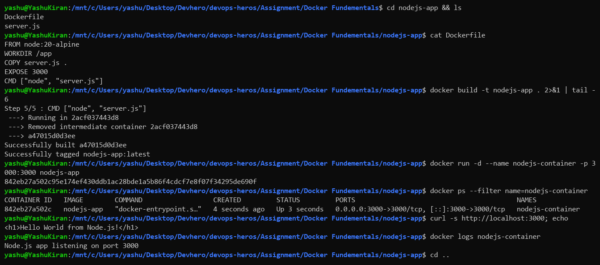
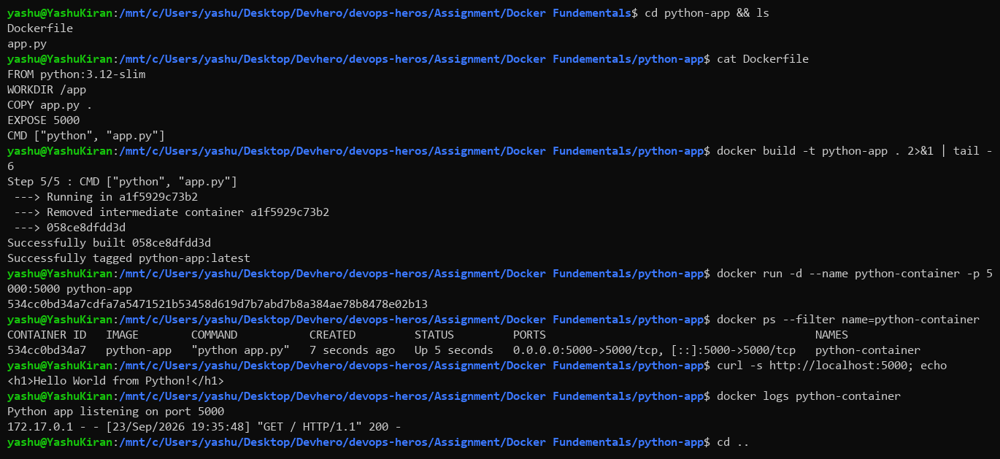
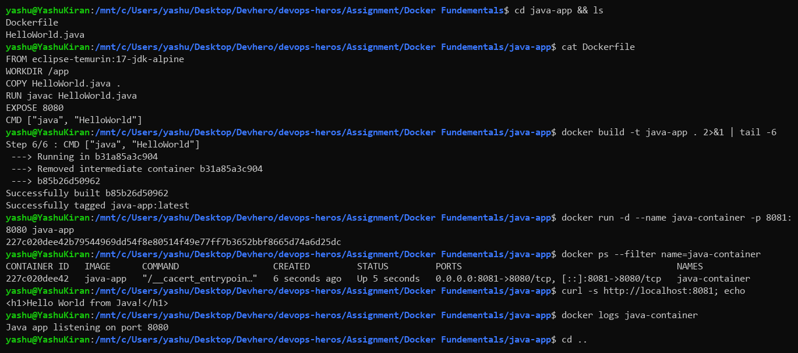
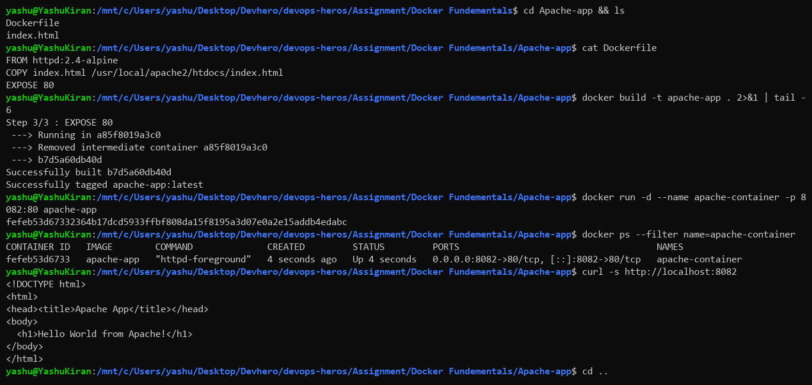
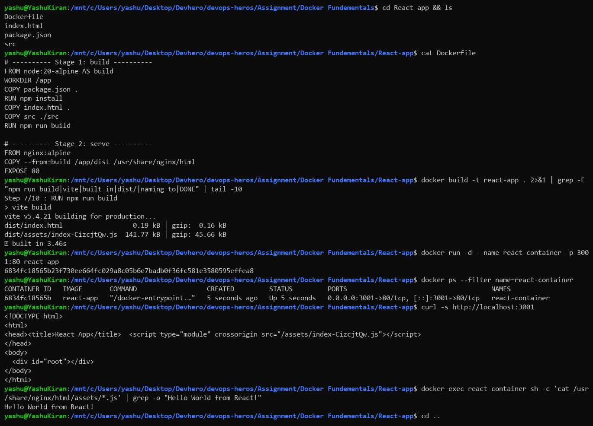
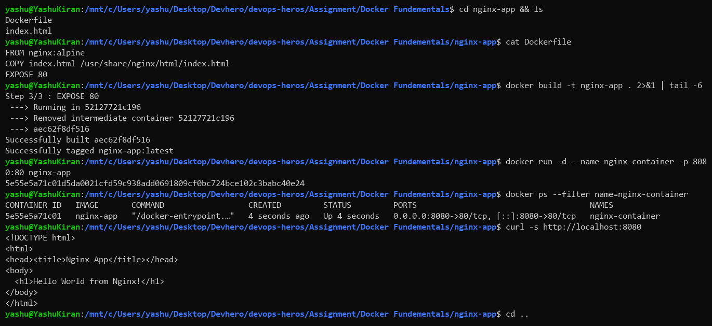
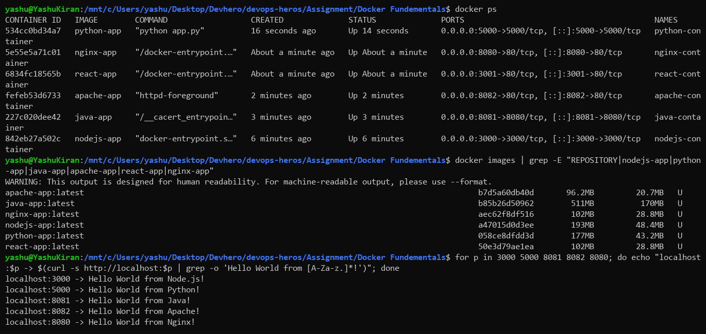

# Docker Fundamentals — Hello World Applications

## About this assignment

The goal here was to take six different kinds of applications and get each one running inside its own Docker container. The stack varied a lot — a Node.js server, a Python server, a compiled Java program, and three web servers (Apache, Nginx, and a React app served through Nginx) — which was the point. The same workflow had to work for all of them.

For every app I made a folder, wrote the application code, wrote a Dockerfile describing how to package it, built an image from that Dockerfile, ran a container from the image, and opened it in the browser on localhost to confirm the Hello World message appeared.

What I actually came away with was a feel for the basic Docker loop, which turns out to be the same four steps every single time regardless of what language is inside.

---

## Repository layout

```text
Docker Fundementals/
│
├── screenshot/
│   ├── node.png
│   ├── python.png
│   ├── java.png
│   ├── apache.png
│   ├── react.png
│   ├── nginx.png
│   └── containers.png
│
├── nodejs-app/      server.js, Dockerfile
├── python-app/      app.py, Dockerfile
├── java-app/        HelloWorld.java, Dockerfile
├── Apache-app/      index.html, Dockerfile
├── React-app/       package.json, index.html, src/main.jsx, Dockerfile
├── nginx-app/       index.html, Dockerfile
└── README.md
```

---

## The applications

### Node.js — port 3000

A small HTTP server written with Node's built-in `http` module, returning a Hello World response.

The Dockerfile starts from a Node base image, copies the source in, declares port 3000, and runs the server as the container's startup command.

```bash
docker build -t nodejs-app .
docker run -d --name nodejs-container -p 3000:3000 nodejs-app
docker ps
```

Opening `http://localhost:3000` showed **Hello World from Node.js!**



---

### Python — port 5000

Same idea in Python, using the standard library's HTTP server rather than installing a framework. No dependencies to manage, so the Dockerfile stays short — base image, copy the script, expose 5000, run it.

```bash
docker build -t python-app .
docker run -d --name python-container -p 5000:5000 python-app
docker ps
```

`http://localhost:5000` showed **Hello World from Python!**



---

### Java — container port 8080, host port 8081

Java was the interesting one because it has a compile step. The Dockerfile uses a JDK base image and runs `javac` during the **build**, so the compiled class ends up baked into the image. The container's startup command then just runs the already-compiled program — nothing is compiled at runtime.

```bash
docker build -t java-app .
docker run -d --name java-container -p 8081:8080 java-app
docker ps
```

Here the ports differ on each side. The program listens on 8080 inside the container, but I mapped it to 8081 on my machine because 8080 was already taken:

```text
localhost:8081  →  container:8080
```

`http://localhost:8081` showed **Hello World from Java!**



---

### Apache — container port 80, host port 8082

No application code at all for this one — just an HTML file. The Dockerfile pulls the official Apache image and drops `index.html` into the directory Apache serves from. Apache is already configured to start on its own, so there's no startup command to write.

```bash
docker build -t apache-app .
docker run -d --name apache-container -p 8082:80 apache-app
docker ps
```

```text
localhost:8082  →  container:80
```

`http://localhost:8082` showed **Hello World from Apache!**



---

### React — container port 80, host port 3001

React can't be served straight from source — it has to be compiled into plain HTML, CSS and JavaScript first. So this Dockerfile has two stages:

1. A Node stage that installs the dependencies and runs the production build
2. An Nginx stage that copies in only the built output and serves it

The final image contains no Node and no `node_modules` at all, just Nginx and the compiled files.

```bash
docker build -t react-app .
docker run -d --name react-container -p 3001:80 react-app
docker ps
```

```text
localhost:3001  →  container:80
```

`http://localhost:3001` showed **Hello World from React!**



---

### Nginx — container port 80, host port 8080

The simplest of the six. An HTML file copied into Nginx's default web root, using the Alpine variant of the image to keep the size down.

```bash
docker build -t nginx-app .
docker run -d --name nginx-container -p 8080:80 nginx-app
docker ps
```

```text
localhost:8080  →  container:80
```

`http://localhost:8080` showed **Hello World from Nginx!**



---

## Port map for the whole assignment

| Application | Inside container | On my machine | URL |
| :--- | :--- | :--- | :--- |
| Node.js | 3000 | 3000 | http://localhost:3000 |
| Python | 5000 | 5000 | http://localhost:5000 |
| Java | 8080 | 8081 | http://localhost:8081 |
| Apache | 80 | 8082 | http://localhost:8082 |
| React | 80 | 3001 | http://localhost:3001 |
| Nginx | 80 | 8080 | http://localhost:8080 |

All six ran at the same time. Notice that three of them listen on port 80 internally and it causes no conflict — they only differ on the host side.



---

## Commands I used

**Checking the setup**

| Command | What it does |
| :--- | :--- |
| `docker --version` | Which Docker version is installed |
| `docker info` | Details about the Docker environment |

**Working with images**

| Command | What it does |
| :--- | :--- |
| `docker build -t nodejs-app .` | Build an image from the Dockerfile in the current folder; `-t` names it |
| `docker images` | List images stored locally |
| `docker rmi nginx-app` | Delete an image |

**Running containers**

```bash
docker run -d --name nodejs-container -p 3000:3000 nodejs-app
```

| Flag | Meaning |
| :--- | :--- |
| `-d` | Detached — runs in the background instead of taking over the terminal |
| `-p HOST:CONTAINER` | Forwards a host port to a container port |
| `--name` | Gives the container a readable name instead of a random one |
| `-it` | Interactive terminal, for when you want a shell inside |

**Managing containers**

| Command | What it does |
| :--- | :--- |
| `docker ps` | Currently running containers |
| `docker ps -a` | Every container, including stopped ones |
| `docker stop <name>` | Stop a running container |
| `docker start <name>` | Start a stopped one back up |
| `docker restart <name>` | Stop and start in one go |
| `docker rm <name>` | Delete a container |
| `docker rm -f <name>` | Delete it even if it's running |

**Looking inside**

| Command | What it does |
| :--- | :--- |
| `docker logs <name>` | Whatever the container printed |
| `docker logs -f <name>` | Same, but keeps streaming |
| `docker exec -it <name> sh` | Open a shell inside a running container |
| `docker inspect <name>` | Full configuration details as JSON |

---

## Concepts that took a while to click

### An image is not a container

This distinction matters more than it first looks. An **image** is a read-only template — a packaged filesystem plus instructions. A **container** is a live instance created from that template. One image can spawn many containers, which is exactly what happened here: the same `nginx:alpine` image is the base for both my Nginx app and the final stage of the React app.

The whole flow reads as:

```text
Dockerfile  →  docker build  →  Image  →  docker run  →  Container
```

### `docker run` and `docker start` are not interchangeable

`docker run` creates a **brand new** container from an image. `docker start` resumes a container that already exists but was stopped. I ran into this by accident — after `docker stop`, my instinct was to `docker run` again, which quietly created a second container and then failed on the port being in use. `docker ps -a` showed both.

### `rm` versus `rmi`

`docker rm` deletes a container; `docker rmi` deletes an image. The extra `i` stands for image. You also can't remove an image while a container built from it still exists, which forces you to clean up in the right order.

### Port mapping

Each container gets its own isolated network space, so a port inside a container isn't reachable from my machine unless I explicitly forward it. That's what `-p` does:

```text
Host (localhost:8082)  →  Docker forwards  →  Container:80  →  Apache
```

The `EXPOSE` line in a Dockerfile looks like it should do this, but it doesn't — it's purely documentation about which port the app uses. The `-p` flag at run time is what actually opens the door.

---

## What I took away from this

The biggest realisation was that I never installed Node, Python or Java on my laptop to do any of this. Each container brought its own runtime along with it. That's really the entire selling point — the image carries its environment, so it behaves the same on my machine as it would anywhere else, and my laptop stays clean.

The second thing was how uniform the process is. Once I'd done the Node app, the other five were the same four steps with different contents. Whether the thing inside is a compiled Java class, an interpreted Python script or a folder of static HTML, Docker treats it identically.

The Java and React apps were the two that taught me the most, because both needed a build step. Java compiles during `docker build` so the running container never touches a compiler. React goes further with two stages, throwing away the entire build toolchain before producing the final image. That got me thinking about image size in a way the simpler apps didn't.

Finally, `docker logs` turned out to be the tool I reached for whenever something broke. A container that fails on startup vanishes from `docker ps` immediately, so it looks like nothing happened — `docker ps -a` shows it as Exited, and `docker logs` is the only way to find out why.