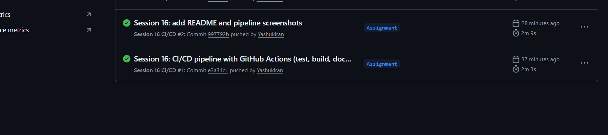
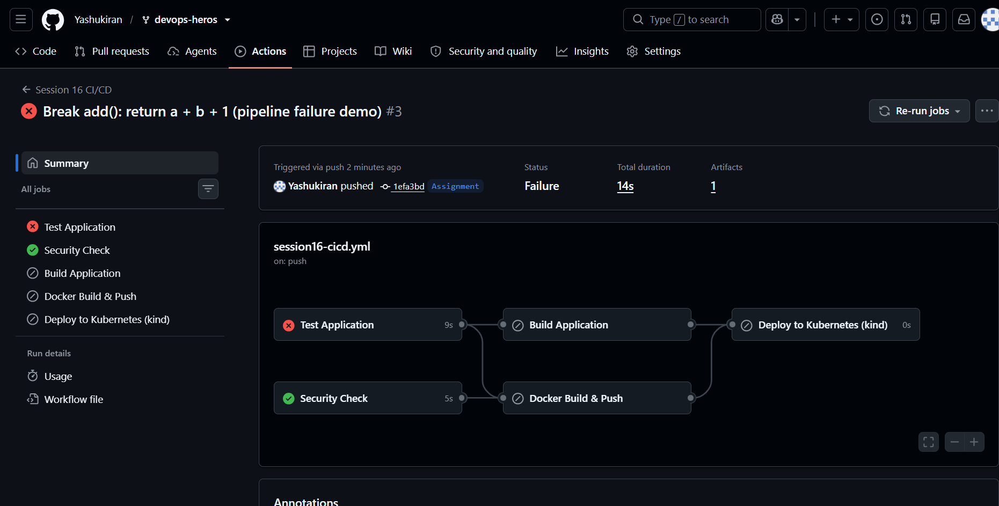

# Session 16 – CI/CD with GitHub Actions

A complete CI/CD demo project built on the course's [`10-final-cicd-pipeline`](../../session-16-github-actions/session-16-github-actions/10-final-cicd-pipeline). It's a small **Python calculator web API** that GitHub Actions automatically **tests, scans, builds, packages as a Docker image, pushes to a container registry, and deploys to Kubernetes** on every push.

- **Workflow file:** [`.github/workflows/session16-cicd.yml`](../../.github/workflows/session16-cicd.yml)
- **Successful run:** [Actions run #1](https://github.com/Yashukiran/devops-heros/actions/runs/37511470127). All 5 jobs green, total 2m 3s.
- **Failed run (demo):** [Actions run #3](https://github.com/Yashukiran/devops-heros/actions/runs/37515783279). Tests fail, so build/docker/deploy are skipped.
- **Published image:** `ghcr.io/yashukiran/session16-calculator`

---

## Project Structure

```text
Assignment/GitHub Actions/
├── app/
│   ├── calculator.py     # add / subtract / multiply / divide
│   └── server.py         # HTTP API: /health, /api/<op>?a=&b=   (standard library only)
├── tests/
│   ├── test_calculator.py   # unit tests
│   └── test_server.py       # API tests (starts the server on a random port)
├── k8s/
│   ├── deployment.yaml   # 2 replicas, readiness/liveness probes, resource limits
│   └── service.yaml
├── Dockerfile            # python:3.12-slim, non-root user, HEALTHCHECK
├── build.sh              # creates build/ + build-info.txt (the build artifact)
├── requirements.txt      # pytest
└── pytest.ini

.github/workflows/session16-cicd.yml   # (at the repo root – GitHub only reads workflows from there)
```

### The application

```bash
GET /health                 -> {"status": "ok", "version": "<git sha>"}
GET /api/add?a=10&b=5       -> {"operation": "add", "a": 10.0, "b": 5.0, "result": 15.0}
GET /api/divide?a=1&b=0     -> 400 {"error": "Cannot divide by zero"}
```

---

## CI vs CD

| | **CI – Continuous Integration** | **CD – Continuous Delivery / Deployment** |
|---|---|---|
| Goal | Every change is automatically **built and tested** | Every change that passed CI is automatically **packaged and released/deployed** |
| Answers | "Is this commit correct?" | "Can (and does) this commit run in an environment?" |
| In this project | `test`, `security-check`, `build` jobs | `docker` (build + push image), `deploy` (to Kubernetes) jobs |

*Continuous **Delivery** = always ready to deploy (maybe with a manual approval). Continuous **Deployment** = every green commit deploys automatically. This pipeline does automatic deployment to a `dev` environment.*

---

## The Pipeline

```text
                    push to "Assignment" (Assignment/GitHub Actions/**)
                                       │
               ┌───────────────────────┴───────────────────────┐
               ▼                                               ▼
        ┌──────────────┐                              ┌────────────────┐
        │     test     │  pytest (9 tests)            │ security-check │  secret files? secrets usage
        └──────┬───────┘                              └───────┬────────┘
       ┌───────┴────────────────────┐                         │
       ▼                            ▼                         │
┌──────────────┐            ┌────────────────┐ ◄──────────────┘
│    build     │ artifact   │     docker     │  build → smoke test → save artifact → push to GHCR
└──────┬───────┘            └───────┬────────┘
       └──────────┬─────────────────┘
                  ▼
          ┌───────────────┐
          │    deploy     │  kind cluster → load image → kubectl apply → rollout → curl
          └───────────────┘   (environment: dev)
```

| GitHub Actions concept | Where it is used here |
|---|---|
| **Workflow** | `session16-cicd.yml`. Triggers: `push` and `pull_request` to `Assignment` (only when this folder changes) plus manual `workflow_dispatch` |
| **Jobs** | `test`, `security-check`, `build`, `docker`, `deploy`. Jobs run in parallel unless linked with `needs:` |
| **Steps** | Each job's ordered list of `uses:` (a reusable action) or `run:` (shell commands) |
| **Runners** | `runs-on: ubuntu-latest`, a fresh GitHub-hosted VM for every job (so every job checks out the code again) |
| **Dependencies** | `build needs: test`, `docker needs: [test, security-check]`, `deploy needs: [docker, build]`. A failure stops everything downstream |
| **Secrets** | `secrets.GITHUB_TOKEN` (automatic) logs in to GHCR. `secrets.APP_SECRET` (optional) shows how secrets are passed via `env:` and **masked** in logs |
| **Permissions** | Least privilege: `contents: read` by default, `packages: write` only for the `docker` job |
| **Artifacts** | `test-results` (JUnit XML), `calculator-build` (build output), `docker-image` (image tarball passed from `docker` to `deploy`) |
| **Conditions** | `if: github.event_name != 'pull_request'`, so PRs are tested but never pushed or deployed |
| **Environments** | `deploy` uses `environment: dev` (shows in the repo's *Deployments* and can have protection rules / approvals) |

---

## Pipeline Screenshots

### 1. Successful runs (green ✓)



The Actions tab shows **run #1** (`e3a34c1`, the first push of the pipeline, 2m 3s) and **run #2** (`997792b`, the README push, 2m 9s). Both ran all 5 jobs successfully: **Test → Security Check → Build → Docker Build & Push → Deploy to Kubernetes**. Along the way the pipeline:
- ran 9 pytest tests on the GitHub runner
- uploaded the `test-results`, `calculator-build` and `docker-image` artifacts
- built the Docker image, smoke-tested it, and pushed it to `ghcr.io/yashukiran/session16-calculator` (tagged with the commit SHA) using `GITHUB_TOKEN`
- deployed it to a kind Kubernetes cluster (2/2 pods Running) and checked `/health` returned the exact commit SHA.

### 2. Failed run (red ✗): the CI gate stops broken code

To show the pipeline protecting the main branch, I deliberately broke the calculator:

```python
def add(a, b):
    return a + b + 1      # was: return a + b
```



Run **#3** (`1efa3bd`, *"Break add(): return a + b + 1"*): **Status: Failure**, in only 14s.

| Job | Result | Why |
|---|---|---|
| Test Application | ✗ failed | `test_add`: `assert 16 == 15`, and `test_api_add` fails the same way |
| Security Check | ✓ passed | It doesn't depend on `test`, so it still runs |
| Build Application | ⊘ skipped | `needs: test` |
| Docker Build & Push | ⊘ skipped | `needs: [test, security-check]` |
| Deploy to Kubernetes | ⊘ skipped | `needs: [docker, build]` |

Broken code **never became an image and never reached the cluster**. That's the whole point of a CI gate. Changing `add()` back to `return a + b` and pushing again makes the pipeline green.

---

## Secrets: how to use them correctly

```yaml
- name: Use a secret safely
  env:
    APP_SECRET: ${{ secrets.APP_SECRET }}   # Settings → Secrets and variables → Actions
  run: echo "configured: $APP_SECRET"        # printed as *** in the log
```

- Never hard-code passwords or tokens in the workflow or the code. Store them in **repository/environment secrets**.
- Prefer the built-in **`GITHUB_TOKEN`** (it expires automatically after the job) over personal access tokens.
- Give jobs **minimum `permissions:`**. Only the `docker` job here can write packages.
- Secrets are **not** passed to workflows triggered by pull requests from forks, so untrusted code can't steal them.

---

## What I Learned

1. **CI** proves every commit builds and passes its tests. **CD** turns every green commit into a versioned artifact (a Docker image) and deploys it automatically.
2. A **workflow** is YAML in `.github/workflows/` **at the repo root** (workflows inside sub-folders are ignored). `on:` with `branches` + `paths` controls exactly when it runs.
3. **Jobs** run in parallel on separate fresh **runners**. **`needs:`** creates the order and acts as a **quality gate**: no test pass, no build, no image, no deployment.
4. **Steps** combine reusable actions (`actions/checkout`, `setup-python`, `upload-artifact`, `helm/kind-action`) with plain shell `run:` commands.
5. **Artifacts** are how jobs share files (each job has its own machine) and how build outputs and test reports are kept after the run.
6. Tag images with the **commit SHA**, not just `latest`. Then the running version (`/health` → `e3a34c1`) can be traced back to the exact commit.
7. **`GITHUB_TOKEN` + `permissions:`** give secure, short-lived registry access with least privilege, and secrets are masked in logs.
8. A **smoke test** of the container inside CI catches "it builds but doesn't start" problems before deployment, and Kubernetes **readiness probes** make the rollout wait for healthy pods.
9. You can test a real Kubernetes deployment in CI with **kind**, with no cloud cluster needed.
10. Running everything **locally first** (pytest, docker build/run) makes pipeline failures much rarer and easier to debug.
