# Session 15 – Helm

Homework for Session 15 of DevOps Heroes. I used **Helm v4.3.0** on a local **Minikube** cluster (Kubernetes v1.37), with the charts in [`session-15-helm`](../../session-15-helm). The chart I generated with `helm create` is in [`my-first-chart/`](my-first-chart).

| Task | What I did | Screenshots |
|---|---|---|
| 1 | Practised every Helm command: `create`, `install`, `list`, `status`, `get`, `upgrade`, `history`, `rollback`, `uninstall`, `repo`, `search` | `task1-*.png` |
| 2 | The full rollback workflow: Install → Upgrade → Verify → Upgrade again → Verify → Rollback → Verify, plus automatic rollback | `task2-*.png` |
| 3 | Mini project: packaged the **Notes app** chart and deployed it to dev, upgraded it to prod, broke it, rolled it back and uninstalled it | `task3-*.png` |

---

## What is Helm?

Helm is the **package manager for Kubernetes**. Instead of applying many separate YAML files, you package them into a **chart**: templates plus default values. Helm then fills in the templates, installs everything as one **release**, and keeps a numbered **revision history** so you can upgrade and roll back with one command.

```text
Chart (templates + values.yaml)  +  your values (-f / --set)
                    │
               helm install / upgrade
                    ▼
     Release "web-app"  →  Revision 1, 2, 3 …  (stored as Secrets in the namespace)
                    ▼
     Kubernetes objects (Deployment, Service, ConfigMap …)
```

| Term | Meaning |
|---|---|
| **Chart** | A package: `Chart.yaml` (metadata), `values.yaml` (defaults), `templates/` (YAML with `{{ }}` placeholders) |
| **Release** | One installed copy of a chart, with its own name (you can install the same chart many times) |
| **Revision** | A numbered snapshot of a release. Every install, upgrade or rollback creates a new one. |
| **Repository** | A place charts are published (Bitnami, prometheus-community, Artifact Hub …) |

---

## Task 1 – Helm Commands

### `helm create`, `helm lint`, `helm template`

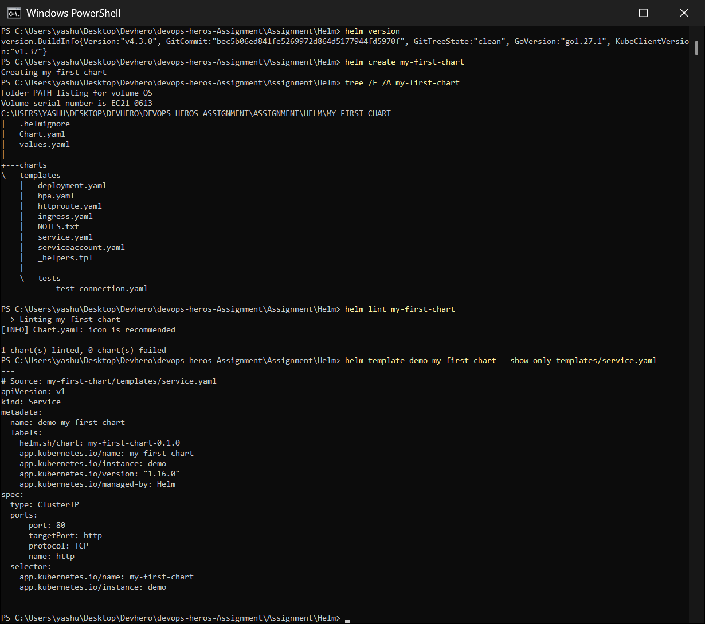

- `helm create my-first-chart` generates a complete starter chart: `Chart.yaml`, `values.yaml`, `charts/` (dependencies), and `templates/` with a Deployment, Service, HPA, Ingress, HTTPRoute, ServiceAccount, `_helpers.tpl`, `NOTES.txt` and a test.
- `helm lint` checks the chart for errors (`1 chart(s) linted, 0 chart(s) failed`; the only note is that an icon is recommended).
- `helm template` **renders the YAML locally without touching the cluster**. You can see how `{{ include "my-first-chart.fullname" . }}` becomes `demo-my-first-chart` and how the standard labels are filled in. It's the best way to debug templates.

### `helm repo` and `helm search`

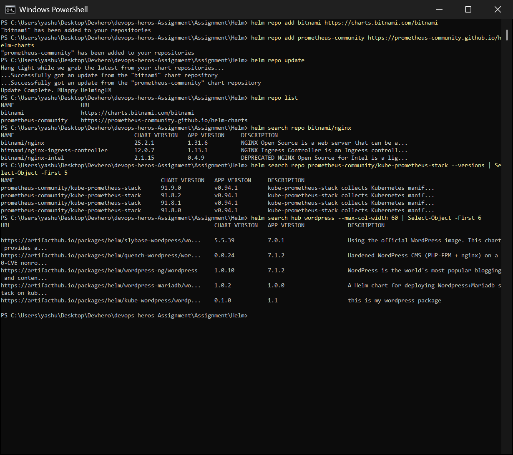

- `helm repo add` / `update` / `list` manage chart repositories (added `bitnami` and `prometheus-community`).
- `helm search repo bitnami/nginx` searches the repos you've **added locally**. `--versions` lists every published version.
- `helm search hub wordpress` searches **Artifact Hub**, the public catalogue of all Helm charts.

### `helm install` and `helm list`

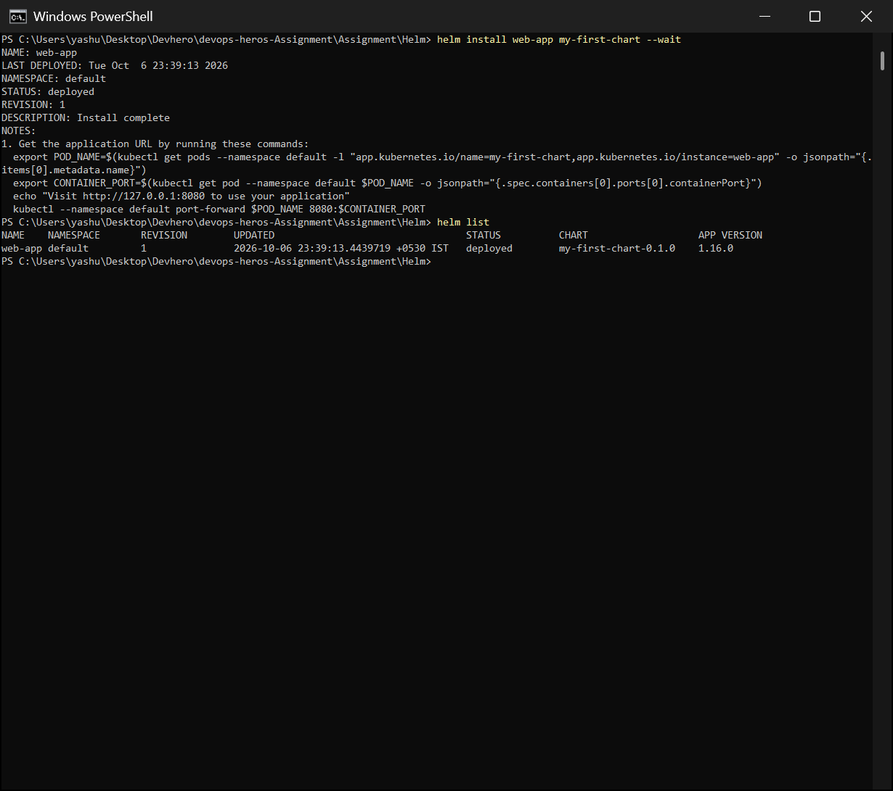

`helm install web-app my-first-chart --wait` created release `web-app`, **REVISION 1**, `STATUS: deployed`, and printed the chart's `NOTES.txt` (instructions for reaching the app). `helm list` shows every release in the namespace with its chart version and app version.

### `helm status`

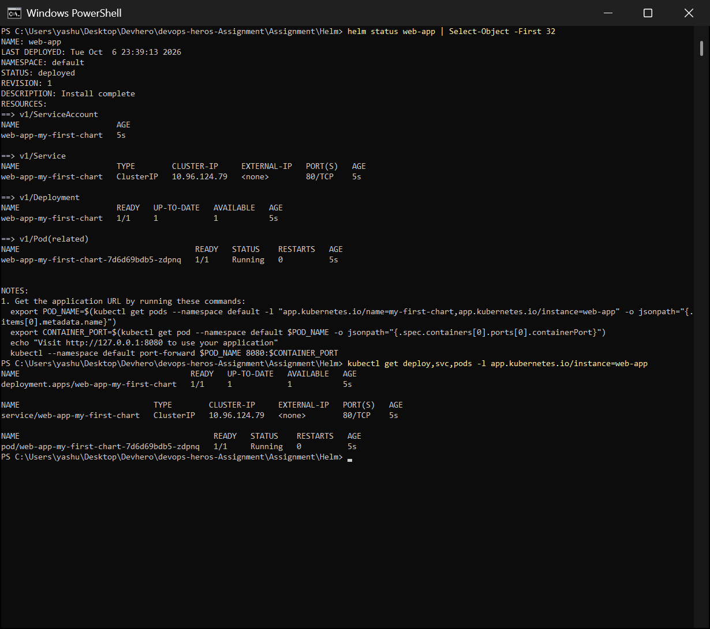

`helm status web-app` shows the release info **plus every resource it owns**: the ServiceAccount, Service, Deployment and Pod, all created from one command. The same objects are visible with `kubectl get … -l app.kubernetes.io/instance=web-app`.

### `helm get`

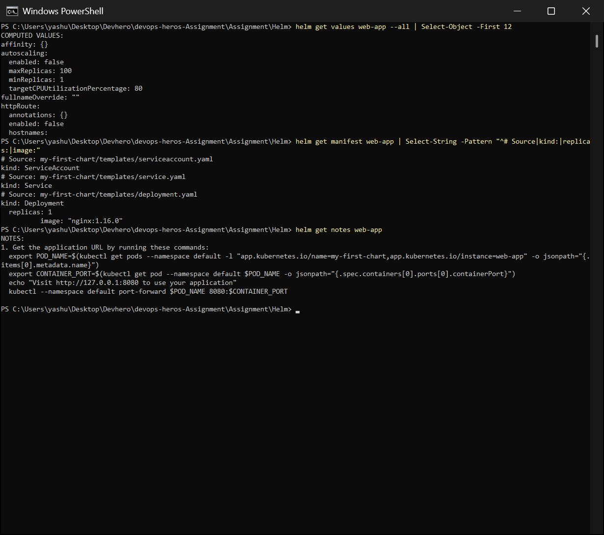

- `helm get values web-app --all` shows the **computed values** (chart defaults merged with any overrides).
- `helm get manifest web-app` shows the exact YAML Helm sent to Kubernetes (ServiceAccount, Service, Deployment with `replicas: 1` and `image: nginx:1.16.0`).
- `helm get notes web-app` shows the rendered NOTES again.

### `helm upgrade`, `helm history`, `helm rollback`, `helm uninstall`

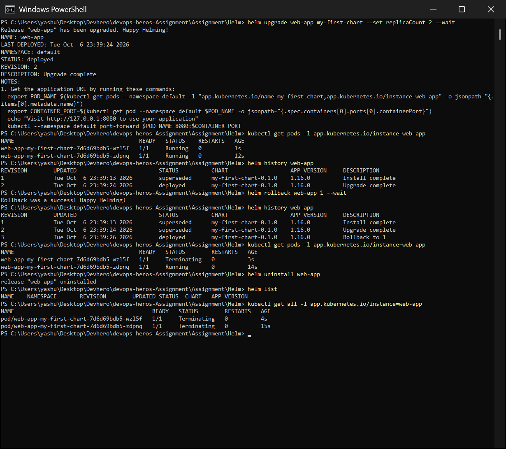

- `helm upgrade --set replicaCount=2` → **REVISION 2**, and a second pod appeared.
- `helm history` lists revision 1 (`superseded`) and revision 2 (`deployed`).
- `helm rollback web-app 1` → *"Rollback was a success!"*. History now shows **revision 3 = "Rollback to 1"**, and the extra pod is `Terminating`.
- `helm uninstall web-app` removed the release and **all** of its resources. `helm list` is empty and the pods are terminating.

| Command | What it does |
|---|---|
| `helm create <name>` | Generate a new chart skeleton |
| `helm lint <chart>` | Check a chart for problems |
| `helm template <rel> <chart>` | Render the YAML locally (dry run, no cluster) |
| `helm install <rel> <chart>` | Install a chart as a new release (revision 1) |
| `helm list` | List releases in the namespace (`-A` for all namespaces) |
| `helm status <rel>` | Release info + its resources |
| `helm get values/manifest/notes <rel>` | Inspect what a release was deployed with |
| `helm upgrade <rel> <chart>` | Deploy new values/chart version (new revision) |
| `helm history <rel>` | All revisions of a release |
| `helm rollback <rel> <rev>` | Redeploy an older revision (as a new revision) |
| `helm uninstall <rel>` | Delete the release and everything it created |
| `helm repo add/update/list` | Manage chart repositories |
| `helm search repo/hub <kw>` | Find charts locally / on Artifact Hub |

---

## Task 2 – Helm Rollback Workflow

I used `app-chart` from `07-install-upgrade/` (nginx Deployment, defaults: `replicaCount: 1`, `image.tag: "1.24"`).

### Install → Upgrade → Verify

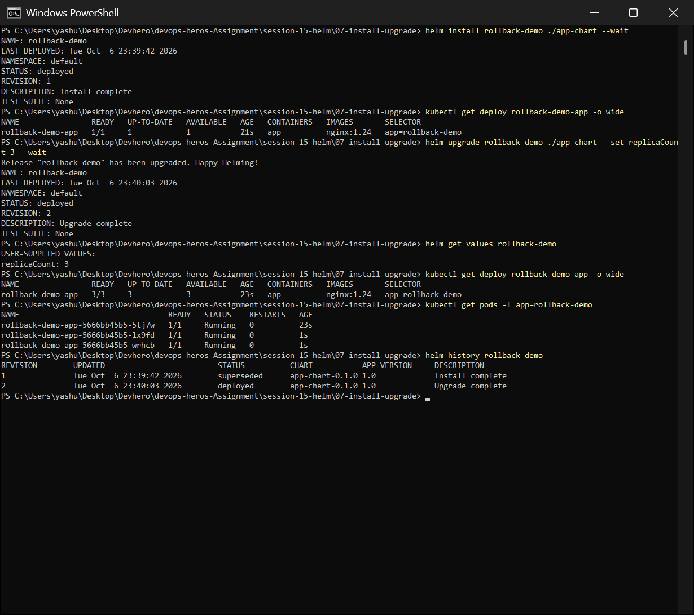

| Rev | Action | Verified |
|---|---|---|
| 1 | `helm install rollback-demo ./app-chart --wait` | Deployment `1/1`, image `nginx:1.24` |
| 2 | `helm upgrade … --set replicaCount=3 --wait` | `helm get values` → `replicaCount: 3`. Deployment `3/3`, 3 pods Running |

### Upgrade again (a bad release) → Verify

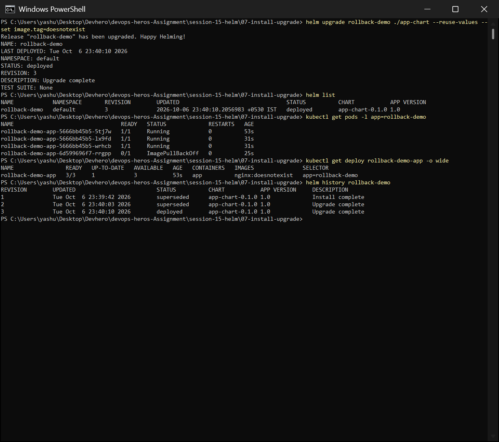

| Rev | Action | Verified |
|---|---|---|
| 3 | `helm upgrade … --reuse-values --set image.tag=doesnotexist` | The new pod is in **`ImagePullBackOff`**. The Deployment now points to `nginx:doesnotexist` |

Important observations:
- **Helm still says `STATUS: deployed` / "Upgrade complete"** for revision 3. Without `--wait`, Helm only checks that Kubernetes *accepted* the objects, not that the pods actually work.
- The 3 old pods **kept running**. The Deployment's rolling update stops when the new pod can't become Ready, so users were not affected. That's another safety net.
- `--reuse-values` kept `replicaCount: 3` from revision 2.

### Rollback → Verify

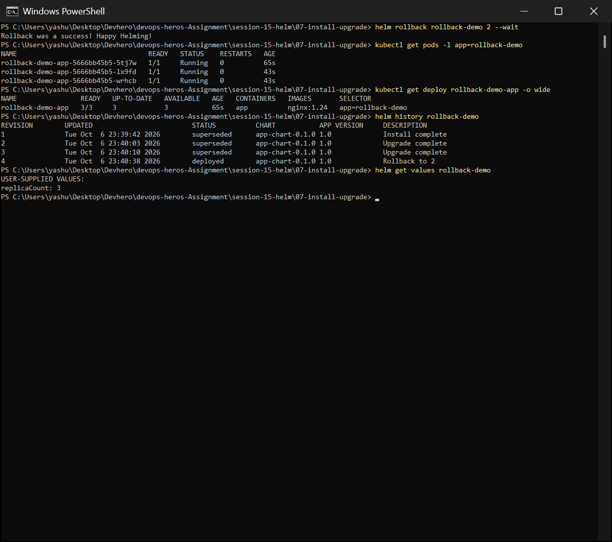

| Rev | Action | Verified |
|---|---|---|
| 4 | `helm rollback rollback-demo 2 --wait` | 3/3 pods Running on `nginx:1.24` again. `helm get values` → `replicaCount: 3` |

Rollback **doesn't delete history**. It creates a **new revision (4) "Rollback to 2"** that copies revision 2's config, so you can always see what happened and even roll forward again.

### Bonus: automatic rollback (`--atomic` → `--rollback-on-failure` in Helm 4)

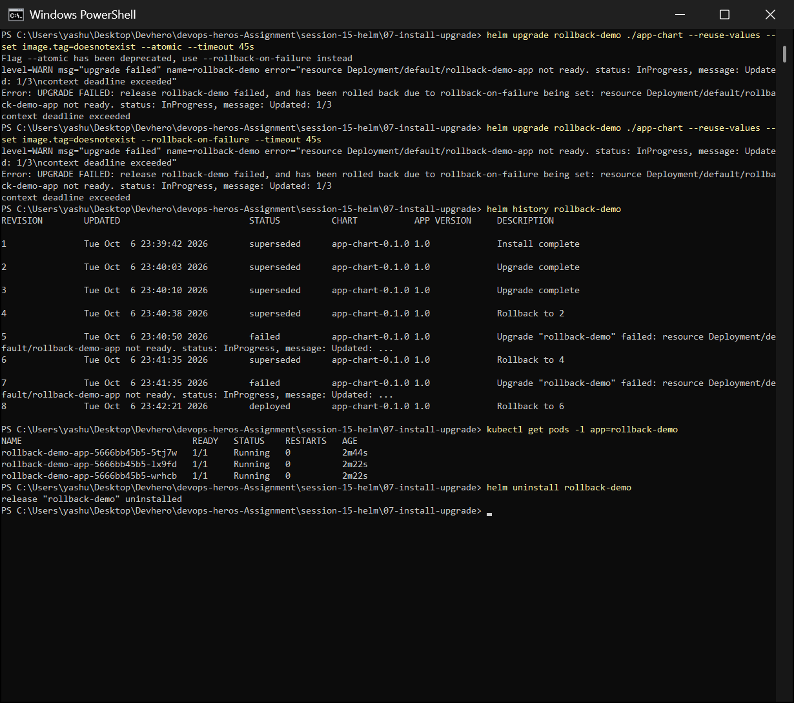

```bash
helm upgrade rollback-demo ./app-chart --reuse-values --set image.tag=doesnotexist --atomic --timeout 45s
helm upgrade rollback-demo ./app-chart --reuse-values --set image.tag=doesnotexist --rollback-on-failure --timeout 45s
```

- Helm waited 45s for the pods. They never became Ready, so Helm reported **UPGRADE FAILED** and **rolled back by itself**.
- History: revision 5 `failed` → 6 `Rollback to 4`, and revision 7 `failed` → 8 `Rollback to 6`. The app stayed on 3 healthy pods the whole time.
- **Helm 4 change:** `--atomic` prints *"Flag --atomic has been deprecated, use --rollback-on-failure instead"*. It still works for now, but CI/CD pipelines should switch to the new flag.

---

## Task 3 – Mini Project: Notes App Chart

```text
notes-chart/
├── Chart.yaml          # name: notes-chart, version 0.1.0, appVersion "1.0"
├── values.yaml         # dev:  1 replica,  nginx:1.24, environment=development, NodePort 30090
├── values-prod.yaml    # prod: 3 replicas, nginx:1.25, environment=production
└── templates/
    ├── configmap.yaml   # {{ .Release.Name }}-config  → APP_NAME, ENVIRONMENT
    ├── deployment.yaml  # envFrom the ConfigMap, image from values
    └── service.yaml     # NodePort {{ .Values.service.nodePort }}
```

### 3.1 Lint and render

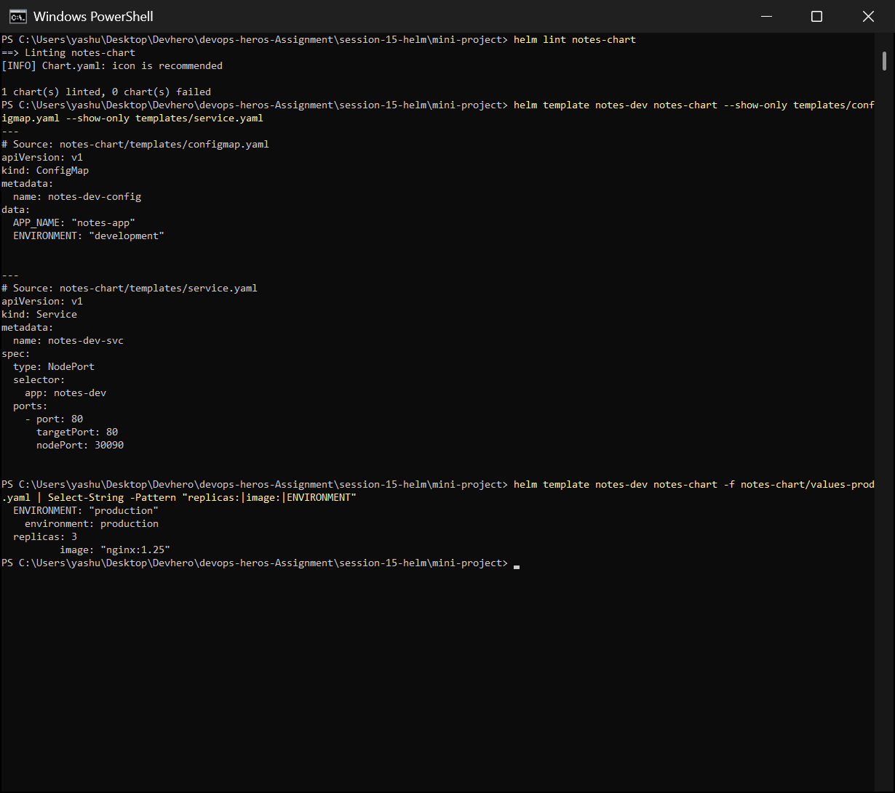

`helm lint` passes. `helm template` shows `{{ .Release.Name }}-config` rendered as `notes-dev-config`, `ENVIRONMENT: "development"`, and a NodePort Service on `30090`. Rendering with `-f values-prod.yaml` switches it to `replicas: 3`, `nginx:1.25`, `ENVIRONMENT: "production"`, with the **same templates**. Only the values change.

### 3.2 Install (development)

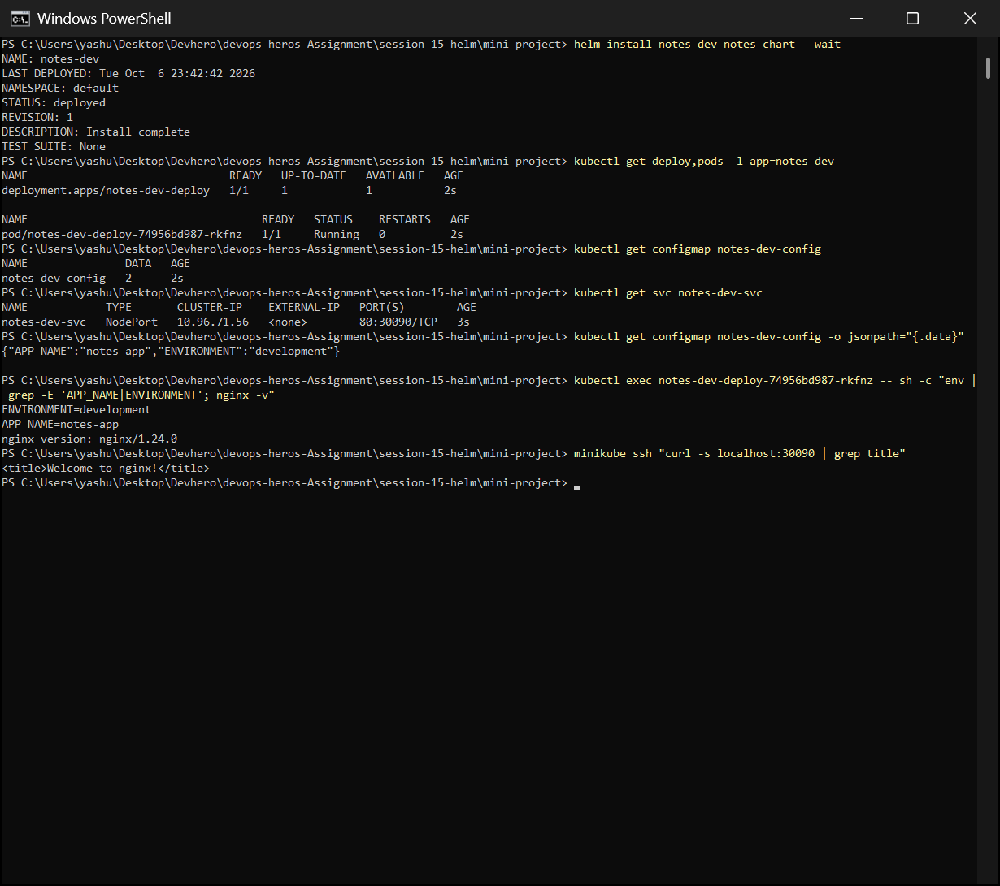

- `helm install notes-dev notes-chart` → revision 1. 1 pod, the ConfigMap `notes-dev-config` with 2 keys, and the NodePort Service `80:30090`.
- Inside the pod: `ENVIRONMENT=development`, `APP_NAME=notes-app`, `nginx/1.24.0`. The ConfigMap values reached the container through `envFrom`.
- `curl localhost:30090` on the node returns **Welcome to nginx!**, so the app is reachable through the NodePort.

### 3.3 Upgrade to production values

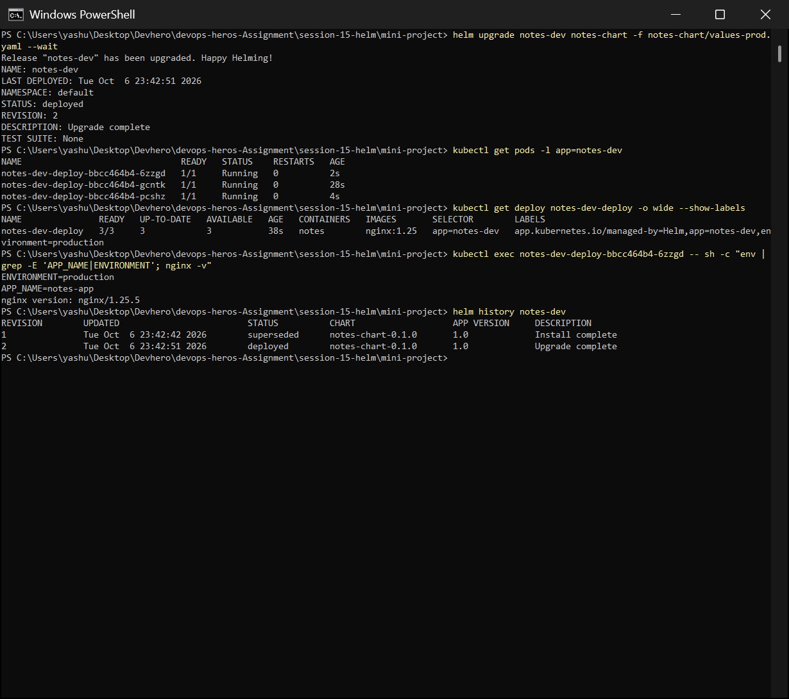

- `helm upgrade notes-dev notes-chart -f notes-chart/values-prod.yaml` → **revision 2**.
- **3 pods** Running, the Deployment image is `nginx:1.25`, and its label is `environment=production`.
- Inside a new pod: `ENVIRONMENT=production`, `nginx/1.25.5`.

### 3.4 Bad upgrade → Rollback → Uninstall

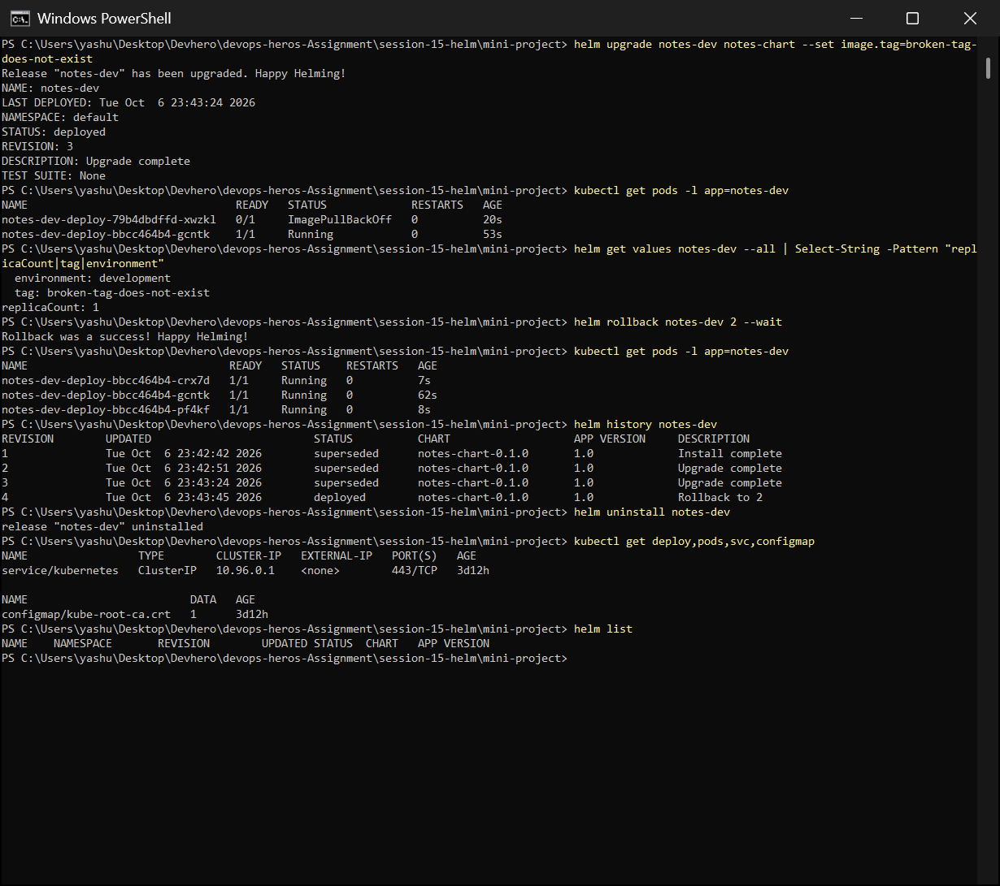

1. `helm upgrade notes-dev notes-chart --set image.tag=broken-tag-does-not-exist` → revision 3. The new pod is `ImagePullBackOff`.
2. **A gotcha I found:** `helm get values --all` shows `replicaCount: 1` and `environment: development`. Because I used `--set` **without** `-f values-prod.yaml` (or `--reuse-values`), Helm built the values again from the chart defaults. The bad upgrade didn't only break the image, it **also quietly reverted production to dev settings**. In real life, always pass the same values file on every upgrade (or use `--reuse-values`).
3. `helm rollback notes-dev 2 --wait` → back to **3 healthy pods** with the prod config. History: `4 – Rollback to 2`.
4. `helm uninstall notes-dev` removed the Deployment, Pods, Service and ConfigMap. Only the default `kubernetes` Service and `kube-root-ca.crt` remain, and `helm list` is empty.

```text
[PASS] Linted and rendered the chart locally
[PASS] Deployed dev with values.yaml (1 replica, nginx 1.24, development)
[PASS] Upgraded to prod with values-prod.yaml (3 replicas, nginx 1.25, production)
[PASS] Simulated a bad upgrade (broken image tag)
[PASS] Rolled back to the healthy revision
[PASS] Cleaned up with helm uninstall
```

---

## What I Learned

1. **Helm = templates + values.** One chart can deploy dev, staging and prod just by switching values files (`-f values-prod.yaml`). There's no copy-pasted YAML per environment.
2. **Releases and revisions:** every install, upgrade and rollback is a numbered revision, so `helm history` is an audit log of every change to the app.
3. **Rollback is a new revision** ("Rollback to 2"), not an undo. History is never lost.
4. **`helm template` and `helm lint`** catch mistakes before anything reaches the cluster. `helm get manifest` shows exactly what was deployed.
5. **"deployed" ≠ "healthy".** Without `--wait`, Helm marks a release successful as soon as Kubernetes accepts the YAML, even if the pods are in `ImagePullBackOff`. Use `--wait` (or `--rollback-on-failure`) in pipelines.
6. **`--rollback-on-failure` (formerly `--atomic`)** makes upgrades safe: if pods aren't Ready within `--timeout`, Helm rolls back automatically.
7. **Values handling on upgrade:** `--set` alone rebuilds the values from the chart defaults. Use `-f <same values file>` or `--reuse-values`, or you might silently lose settings (it turned my prod into dev).
8. **Kubernetes and Helm protect you together:** during the bad upgrade the Deployment's rolling update kept the old pods serving traffic, and Helm gave a one-command way back.
9. **`helm uninstall`** removes everything a release created. That's much cleaner than tracking down objects by hand.
10. **Helm 4 changes from the course notes:** `--atomic` is deprecated in favour of `--rollback-on-failure`, and `helm list --all` no longer exists (use `helm list` with `--superseded`, `--failed`, `--uninstalled`, or `-A` for all namespaces).
