# Kubernetes Core Objects (Session 10)

**Environment:** WSL2 (Ubuntu) on Windows, minikube v1.39.0 (Kubernetes v1.37.0, docker driver)

All commands were run from the `session10-k8s-core-objects` folder of the repo.

---

## Part 1: Core objects

### 1. Pod

```bash
kubectl apply -f k8s-core-objects/pod.yml
kubectl get pods -o wide
kubectl get pod mypod -o jsonpath='{range .spec.containers[*]}{.name}{"\t"}{.image}{"\n"}{end}'
kubectl logs mypod -c logger --tail=5
kubectl exec mypod -c app -- nginx -v
```

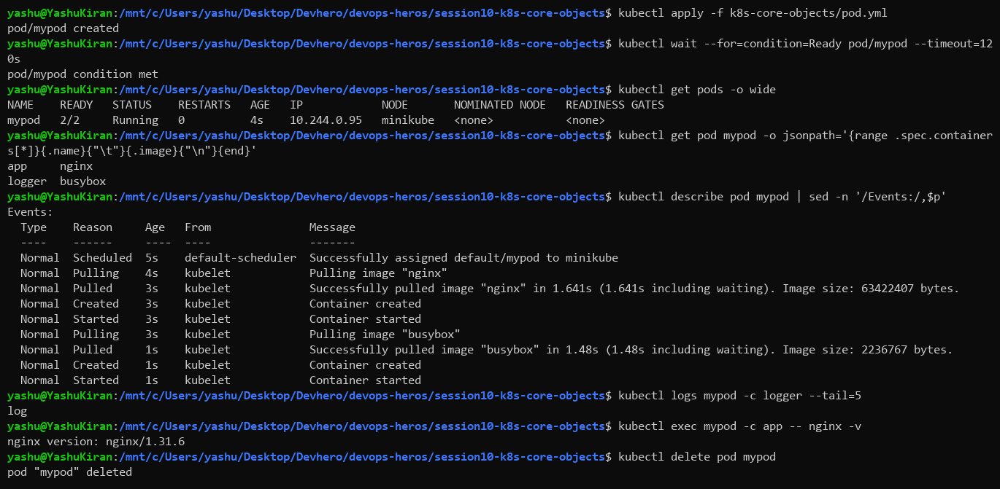

**What I understood:** A Pod is the smallest thing Kubernetes runs, and it can hold more than one container. `mypod` shows `2/2`: an nginx `app` container and a busybox `logger` sidecar. Both share the same IP and network namespace. With more than one container you have to name the one you want using `-c` for `logs` and `exec`.

### 2. ReplicaSet

```bash
kubectl apply -f k8s-core-objects/replicaset.yml
kubectl get rs myapp-rs
kubectl get pods -l app=web
kubectl delete pod <one-of-the-pods>
kubectl get pods -l app=web
kubectl scale rs myapp-rs --replicas=5
```

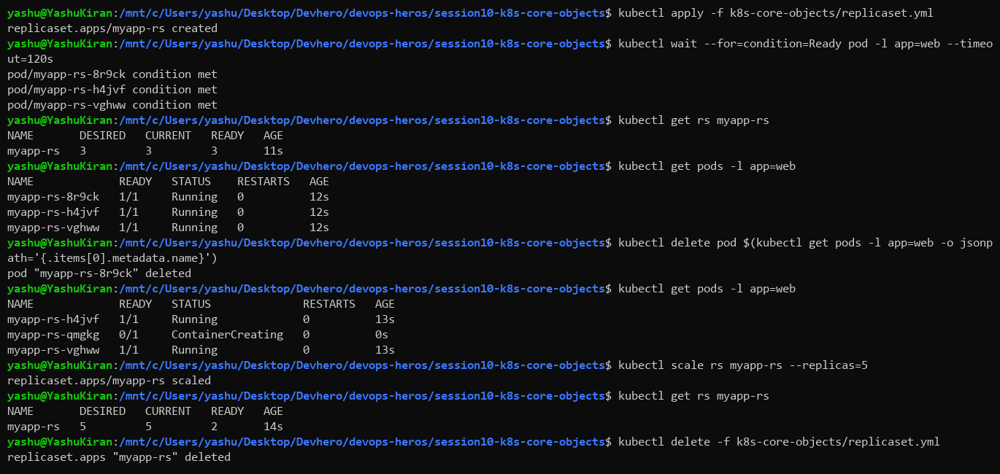

**What I understood:** A ReplicaSet keeps a fixed number of pods running. When I deleted `myapp-rs-8r9ck`, a replacement `myapp-rs-qmgkg` was already in `ContainerCreating` by the next command. That's self-healing. The ReplicaSet finds its pods by the `app=web` label, not by name. You rarely create ReplicaSets yourself, because a Deployment manages them for you.

### 3. Deployment

```bash
kubectl apply -f k8s-core-objects/deployment.yml
kubectl get deploy,rs,pods -l app=myapp
kubectl scale deployment myapp --replicas=5
kubectl set image deployment/myapp myapp-container=nginx:1.27
kubectl rollout status deployment/myapp
kubectl rollout history deployment/myapp
kubectl get rs -l app=myapp
```

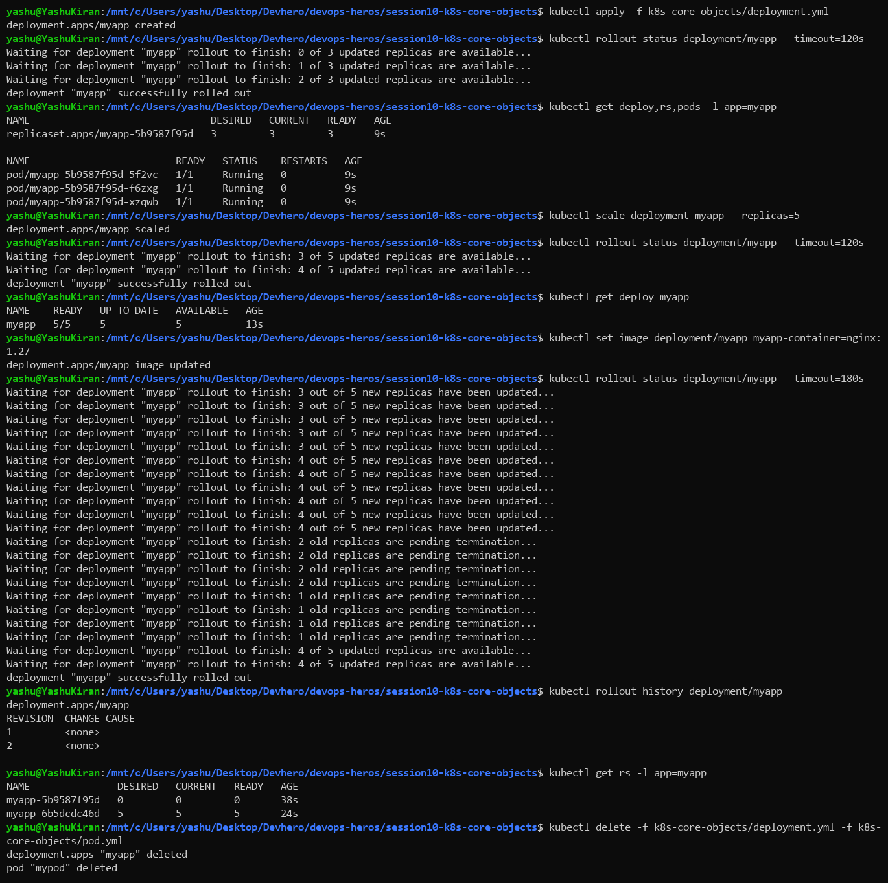

**What I understood:** A Deployment sits on top of ReplicaSets. After `set image` there were **two** ReplicaSets: the old one scaled to `0` and the new one at `5`. Kubernetes keeps the old ReplicaSet at zero so that `rollout undo` can switch back instantly. The rollout status lines ("3 out of 5 new replicas updated", "2 old replicas pending termination") show the old and new ReplicaSets being swapped a few pods at a time.

### 4. DaemonSet

```bash
kubectl apply -f k8s-core-objects/deamonset.yml
kubectl get daemonset node-exporter
kubectl get pods -l app=node-exporter -o wide
kubectl get ds -n kube-system
```

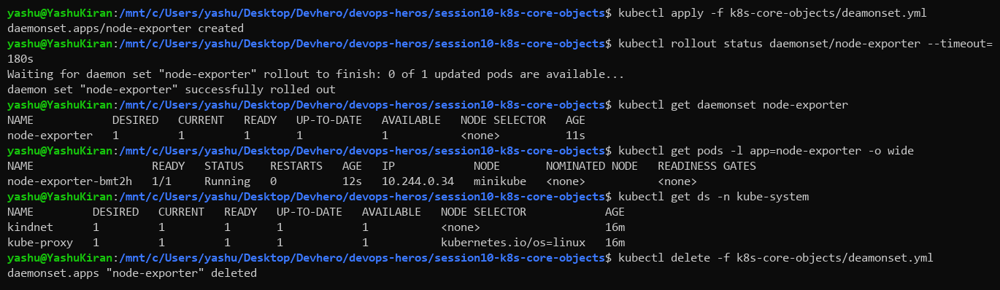

**What I understood:** A DaemonSet has no replica count. It runs **one pod on every node**, so on single-node minikube DESIRED is 1. It's used for per-node agents like log collectors and monitoring exporters (node-exporter here). Kubernetes itself uses DaemonSets: `kube-proxy` and `kindnet` in `kube-system` are both DaemonSets.

### 5. StatefulSet

```bash
kubectl apply -f k8s-core-objects/statefulset.yml
kubectl rollout status statefulset/mysql
kubectl get pods -l app=mysql -o wide
kubectl get pvc
kubectl delete pod mysql-1
kubectl get pods -l app=mysql
```

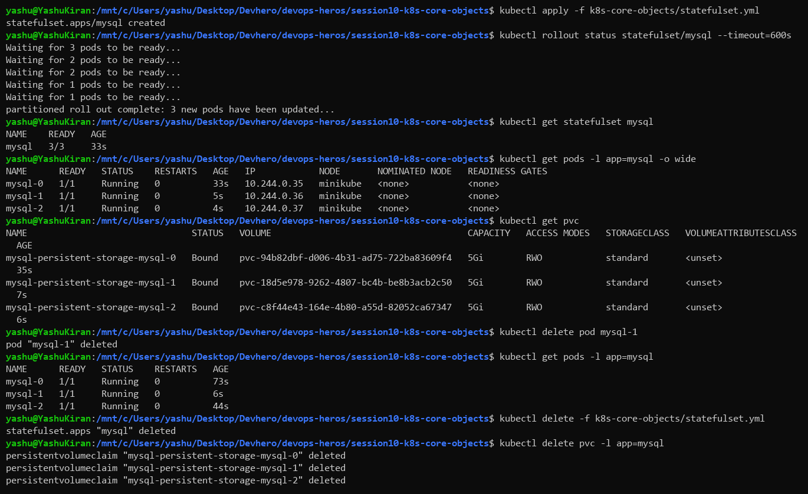

**What I understood:** A StatefulSet is for apps that need a stable identity and their own storage, like databases:

- Pods get fixed ordered names (`mysql-0`, `mysql-1`, `mysql-2`) instead of random hashes, and they start **in order**. The AGE column shows `mysql-0` was up well before the others.
- `volumeClaimTemplates` gave **each pod its own 5Gi PVC** (`mysql-persistent-storage-mysql-0`, ...).
- When I deleted `mysql-1`, it came back with the **same name** and reattaches to the same PVC, so its data survives.

Deleting the StatefulSet does not delete the PVCs. I had to remove them separately, which is deliberate so you don't lose database data by accident.

---

## Part 2: Pod lifecycle

Official pod **phases** are only `Pending`, `Running`, `Succeeded`, `Failed` and `Unknown`. Values like `CrashLoopBackOff`, `ImagePullBackOff` and `Completed` in the STATUS column are container states and reasons, not phases.

### Running and Pending

```bash
kubectl apply -f pod-lifecycle/01-running.yaml -f pod-lifecycle/02-pending.yaml
kubectl get pod lifecycle-running lifecycle-pending
kubectl get pod lifecycle-running -o jsonpath='{.status.containerStatuses[0].state}'
kubectl describe pod lifecycle-pending
```

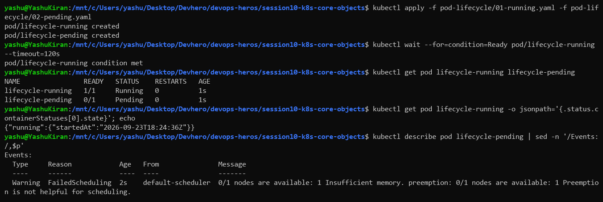

`lifecycle-pending` asks for 9Gi of memory, but my node only has about 7.6Gi. The scheduler can't place it anywhere, so it stays `Pending` with the event `0/1 nodes are available: 1 Insufficient memory`.

### Succeeded and Failed

```bash
kubectl apply -f pod-lifecycle/03-succeeded.yaml -f pod-lifecycle/04-failed.yaml
kubectl get pod lifecycle-succeeded lifecycle-failed -o custom-columns=NAME:.metadata.name,PHASE:.status.phase,EXIT:.status.containerStatuses[0].state.terminated.exitCode
kubectl logs lifecycle-succeeded
kubectl logs lifecycle-failed
```

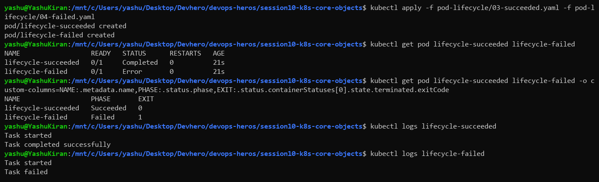

Both pods run a task and exit. Exit code `0` gives phase `Succeeded` (STATUS `Completed`). Exit code `1` gives phase `Failed` (STATUS `Error`). They aren't restarted because these pods use `restartPolicy: Never`.

### CrashLoopBackOff and ImagePullBackOff

```bash
kubectl apply -f pod-lifecycle/05-crashloopbackoff.yaml -f pod-lifecycle/06-imagepullbackoff.yaml
kubectl get pods -w
kubectl logs lifecycle-crashloop --previous
kubectl describe pod lifecycle-crashloop
kubectl describe pod lifecycle-image-error
```

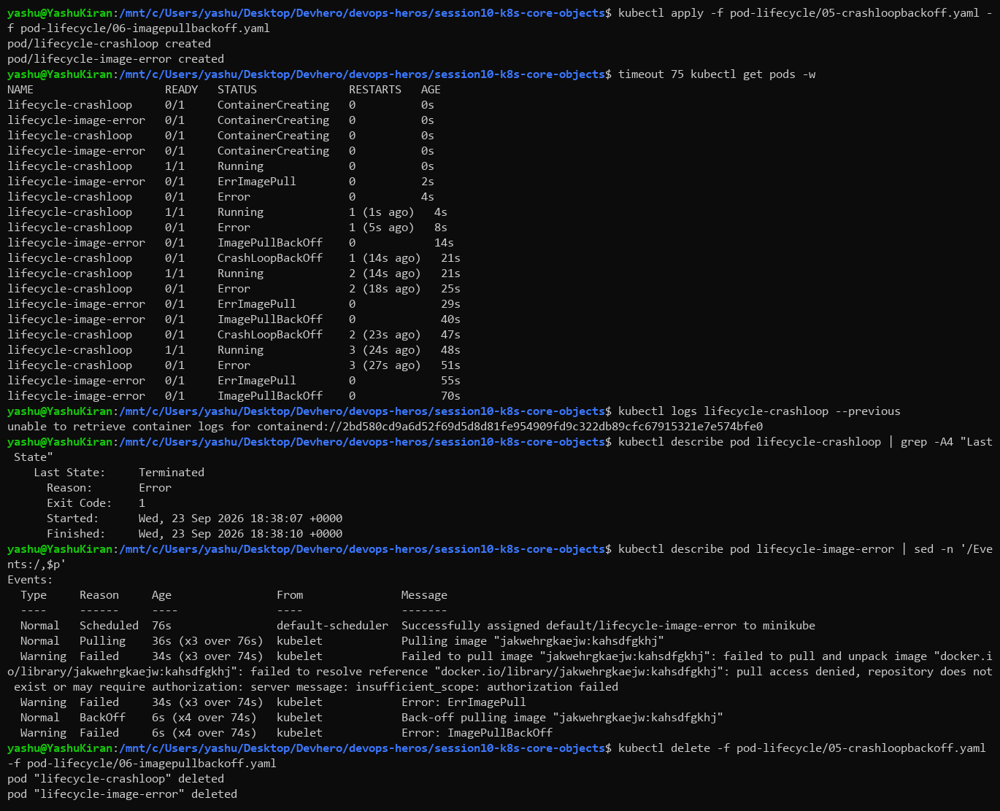

- **CrashLoopBackOff:** the container starts, exits with code 1, gets restarted, and fails again. The watch shows it cycling `Running → Error → CrashLoopBackOff` with RESTARTS going up, and Kubernetes waits longer between each retry. `describe` shows `Last State: Terminated, Exit Code: 1`.
- **ImagePullBackOff:** the image `jakwehrgkaejw:kahsdfgkhj` doesn't exist. The pod flips between `ErrImagePull` and `ImagePullBackOff`, and the Events show the failed pulls and back-off.

### Readiness, liveness and startup probes

```bash
kubectl apply -f pod-lifecycle/07-readiness.yaml -f pod-lifecycle/08-liveness.yaml -f pod-lifecycle/09-startup.yaml
kubectl get pods -w
kubectl describe pod lifecycle-liveness
kubectl describe pod lifecycle-startup
```

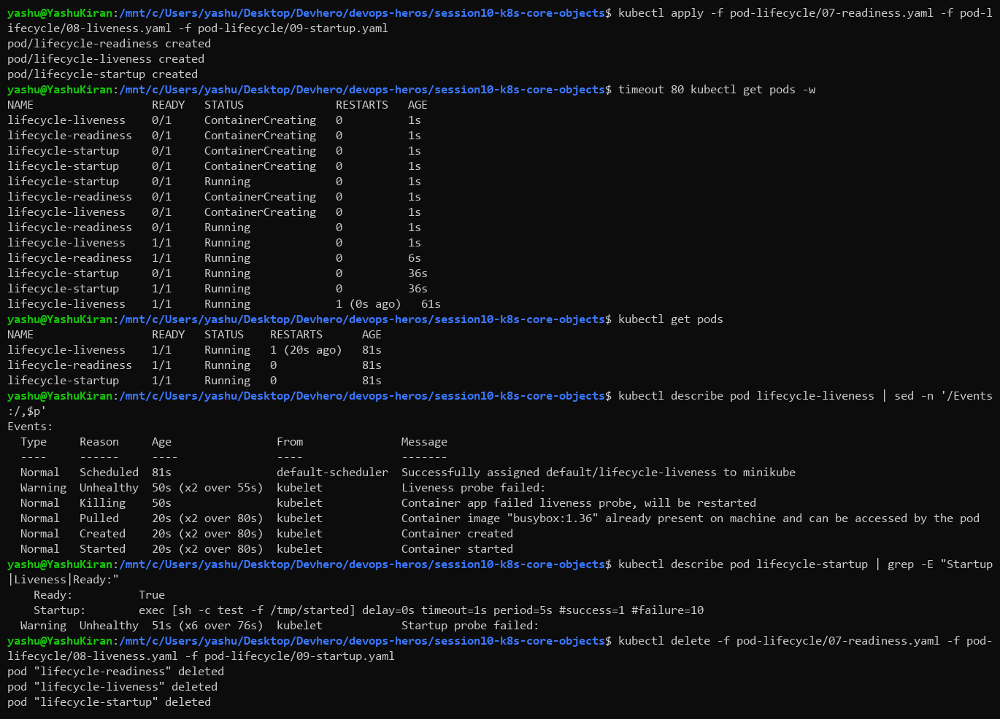

- **Readiness:** `lifecycle-readiness` was `Running` but `0/1` for about 6 seconds, until the HTTP probe passed. **Running is not the same as Ready.** A Service only sends traffic to Ready pods.
- **Liveness:** the container deletes its health file after 20s. The probe fails twice, and at 61s RESTARTS goes to `1`. Events show `Liveness probe failed` and then `Container app failed liveness probe, will be restarted`.
- **Startup:** the app takes 30s to start. The startup probe allowed up to 10 failures × 5s, so the pod only became `1/1` at 36s and was never killed while starting.

### Init container and multi-container pod

```bash
kubectl apply -f pod-lifecycle/10-init-container.yaml -f pod-lifecycle/11-multi-container.yaml
kubectl get pods -w
kubectl logs lifecycle-init -c setup
kubectl logs lifecycle-multi-container -c sidecar
```

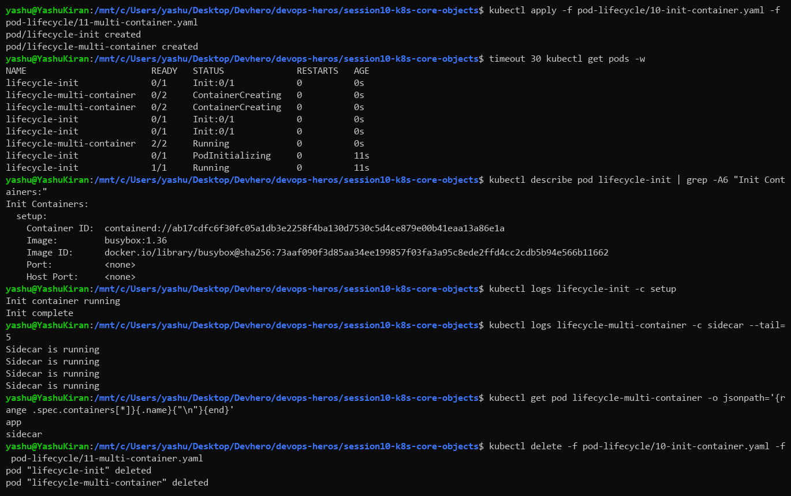

The init pod showed `Init:0/1` then `PodInitializing` then `Running`. The main container didn't start until the `setup` init container had finished ("Init complete"). The multi-container pod shows `2/2`: the app and sidecar run **side by side**, while an init container runs **before** the app.

### Graceful termination

```bash
kubectl apply -f pod-lifecycle/12-termination.yaml
kubectl delete pod lifecycle-termination
kubectl get pod lifecycle-termination -w
```

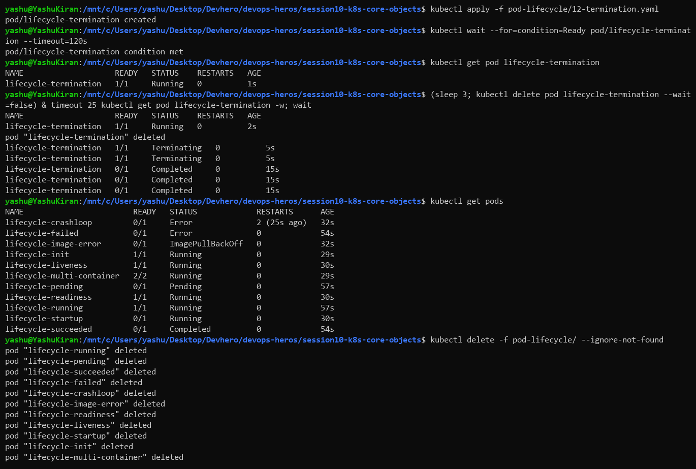

On delete, Kubernetes sends `SIGTERM` and marks the pod `Terminating`. The container `trap`s the signal, runs a 10-second cleanup, and exits with code 0. That's why it ends as `Completed` about 10 seconds later instead of being force-killed. This pod sets `terminationGracePeriodSeconds: 20` (the default is 30). If cleanup took longer than that, Kubernetes would send `SIGKILL`.

---

## Part 3: Deployment strategies

### Rolling update (default)

```bash
kubectl apply -f 01-rolling-update/deployment-v1.yaml -f 01-rolling-update/service.yaml
kubectl apply -f 01-rolling-update/deployment-v2.yaml
while true; do curl -s http://$(minikube ip):30010 | grep VERSION; sleep 1; done
kubectl rollout history deployment/app-rolling
kubectl rollout undo deployment/app-rolling
```

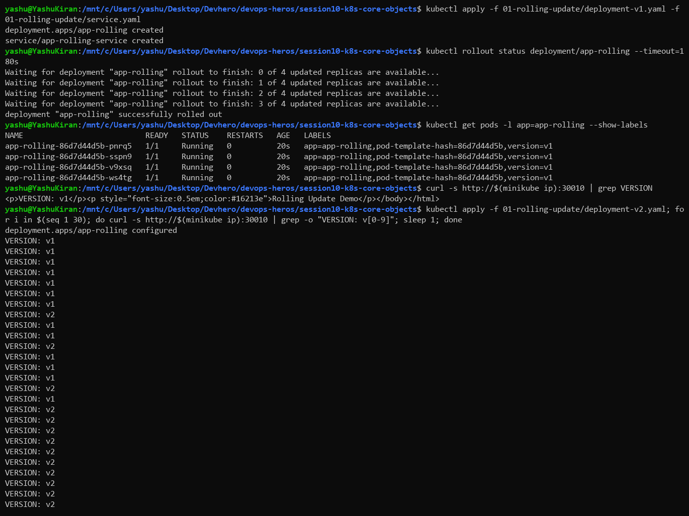
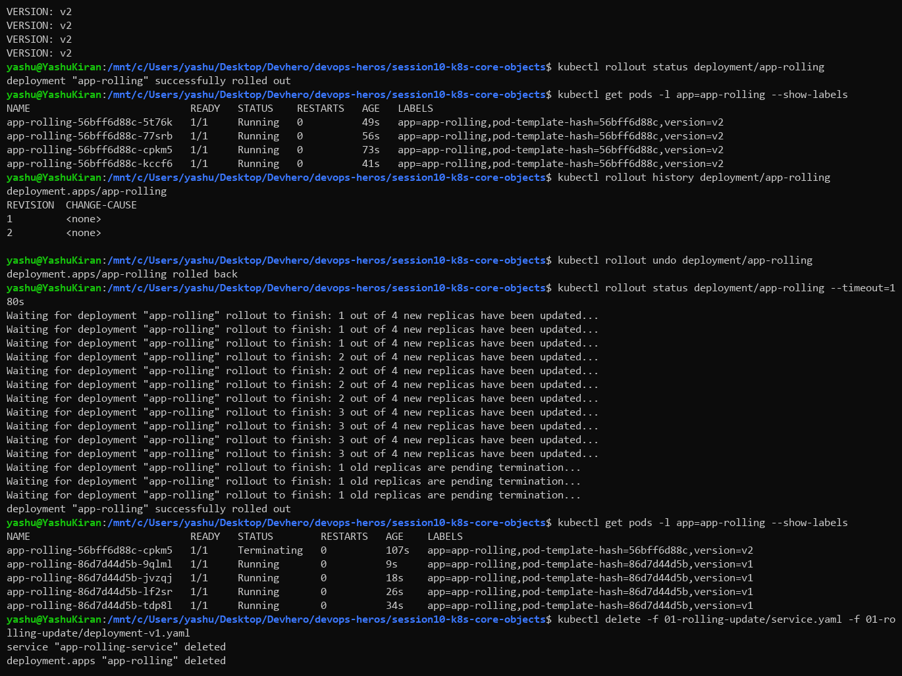

With `maxSurge: 1` and `maxUnavailable: 0`, the curl loop moved from `v1` to a mix of `v1`/`v2` to all `v2` **without a single failed request**. Pods are replaced one at a time, and each new pod has to pass its readiness probe before an old one is removed. `rollout undo` brought all 4 pods back to `version=v1`.

### Blue-green

```bash
kubectl apply -f 02-blue-green/deployment-blue.yaml -f 02-blue-green/deployment-green.yaml
kubectl apply -f 02-blue-green/service-blue.yaml      # live = BLUE
kubectl apply -f 02-blue-green/service-green.yaml     # switch to GREEN
kubectl describe svc myapp-service | grep Selector
kubectl get endpoints myapp-service
kubectl apply -f 02-blue-green/service-blue.yaml      # instant rollback
```

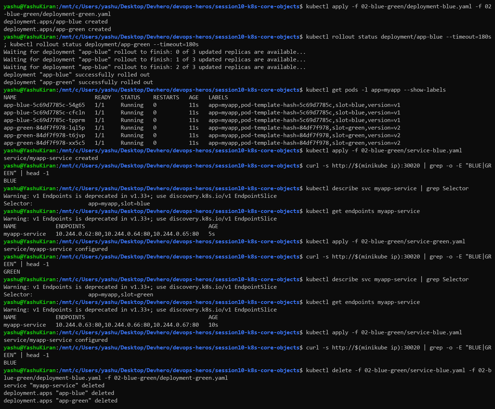

Both versions run at the same time, and the Service **selector** (`slot=blue` or `slot=green`) decides which one gets traffic. Switching the selector changed the endpoints to the green pod IPs, and curl went from `BLUE` to `GREEN` immediately. Rolling back is just re-applying the blue Service. The downside is that you pay for two full environments.

### Canary

```bash
kubectl apply -f 03-canary/deployment-stable.yaml -f 03-canary/service.yaml   # 9 stable pods
kubectl apply -f 03-canary/deployment-canary.yaml                             # 1 canary pod
for i in $(seq 1 20); do curl -s http://$(minikube ip):30030 | grep -o "STABLE v1\|CANARY v2"; done | sort | uniq -c
kubectl scale deployment app-canary --replicas=3; kubectl scale deployment app-stable --replicas=7
kubectl scale deployment app-canary --replicas=9; kubectl scale deployment app-stable --replicas=0
```

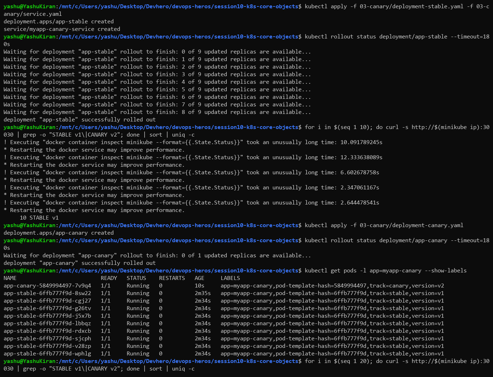
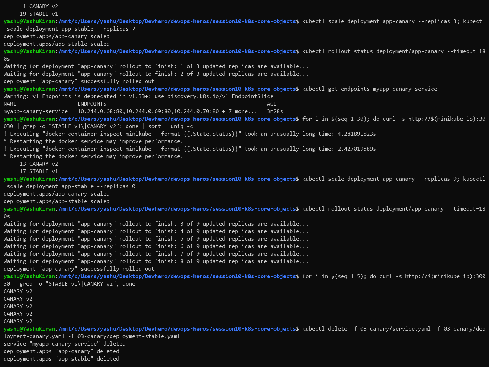

Both Deployments share the label `app=myapp-canary`, so one Service load-balances across all of them. Traffic split follows the **pod ratio**:

| Stable : Canary pods | Result I got |
|---|---|
| 9 : 1 (10%) | 19 stable, 1 canary out of 20 |
| 7 : 3 (30%) | 17 stable, 13 canary out of 30 |
| 0 : 9 (100%) | all 5 requests CANARY v2 |

It's only roughly proportional, because kube-proxy picks endpoints at random. For exact percentages you'd need an Ingress or a service mesh with weighted routing.

### Recreate

```bash
kubectl apply -f 04-recreate/deployment-v1.yaml -f 04-recreate/service.yaml
kubectl apply -f 04-recreate/deployment-v2.yaml
while true; do curl -s --connect-timeout 1 http://$IP:30040 | grep -o 'VERSION: [^<]*' || echo "[OUTAGE] Connection failed"; sleep 0.5; done
kubectl rollout undo deployment/app-recreate
```

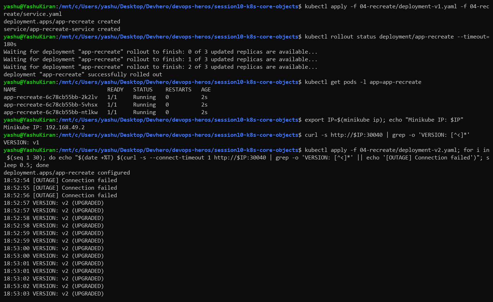
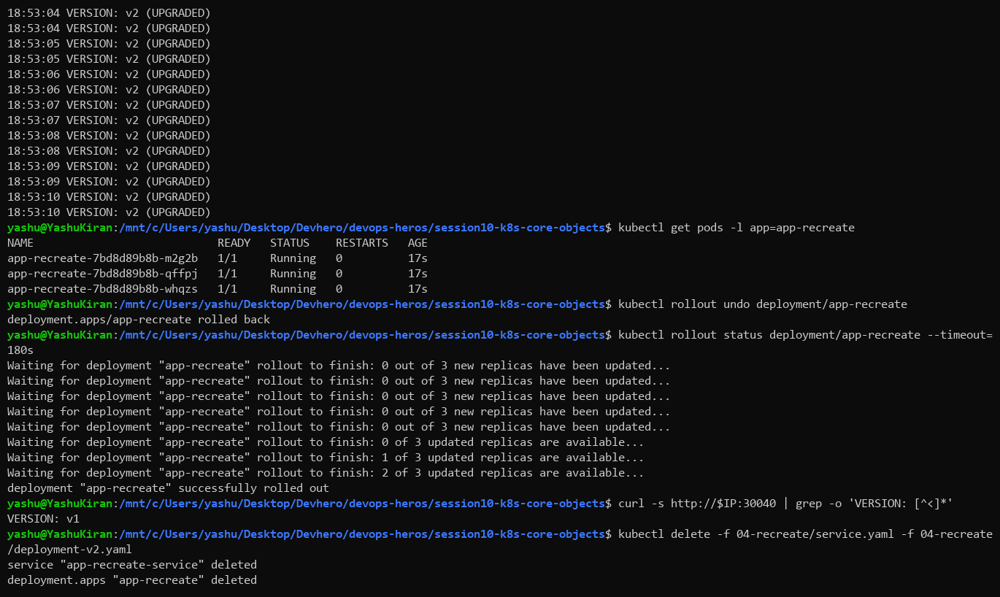

`Recreate` kills **all** old pods before creating any new ones, so there's real downtime: 3 failed requests (about 3 seconds) before `v2` answered. You'd only use it when two versions can't run at the same time, for example with an incompatible database schema.

> On my first attempt the outage didn't show, because each `$(minikube ip)` call took a few seconds and v2 was already up. Saving the IP in a variable first fixed it.

---

## Strategy comparison

| Strategy | Downtime | Rollback | Extra resources |
|---|---|---|---|
| Rolling update | None | `rollout undo` | 1 extra pod (maxSurge) |
| Blue-green | None | Switch selector back (instant) | 2× full environment |
| Canary | None | Scale canary to 0 | A few extra pods |
| Recreate | Yes | `rollout undo` (with downtime) | None |

## Commands reference

| Command | Purpose |
|---|---|
| `kubectl apply -f <file>` | Create/update from YAML |
| `kubectl get pods -w` | Watch status changes live |
| `kubectl describe pod <p>` | Events, probes, container states |
| `kubectl logs <p> -c <container>` / `--previous` | Logs of one container / the last crashed run |
| `kubectl get pod <p> -o jsonpath='...'` | Pull out one field |
| `kubectl scale deployment/rs <n> --replicas=<x>` | Change the replica count |
| `kubectl set image deployment/<n> <c>=` | Trigger a rollout |
| `kubectl rollout status / history / undo` | Watch / list / roll back |
| `kubectl get endpoints <svc>` | Which pod IPs a Service sends traffic to |
| `kubectl get pvc` | Storage claims (StatefulSet volumes) |
