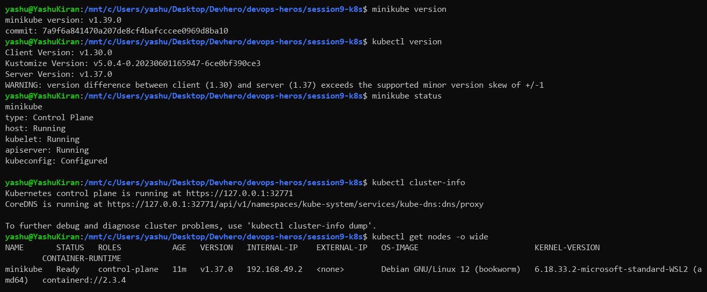
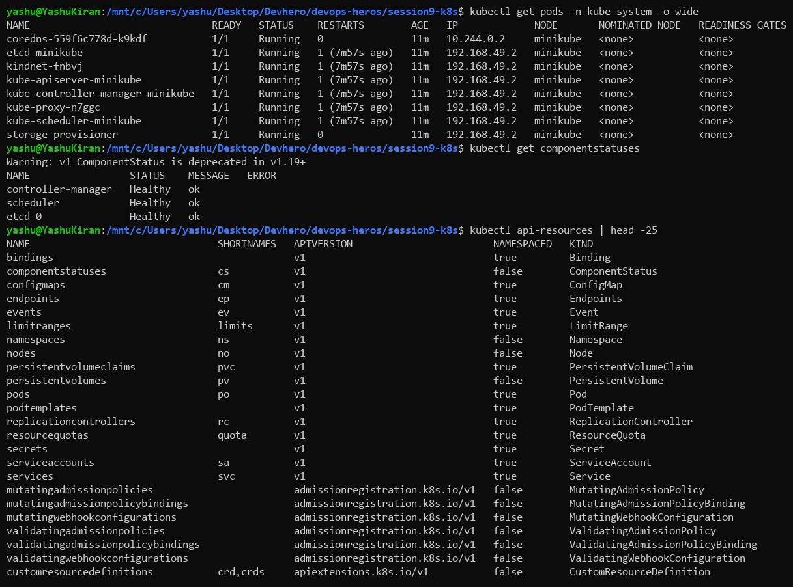
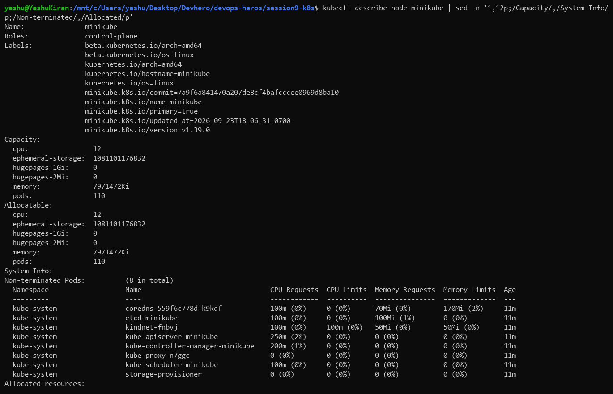
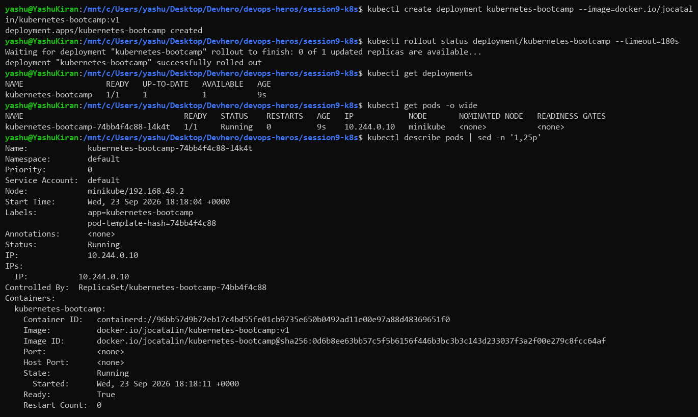
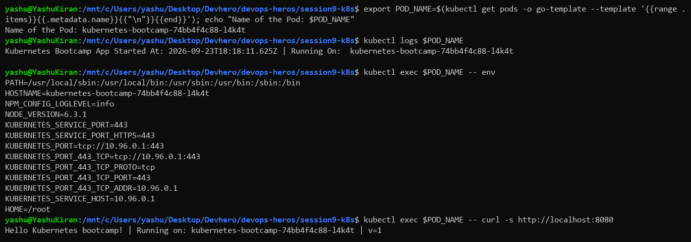
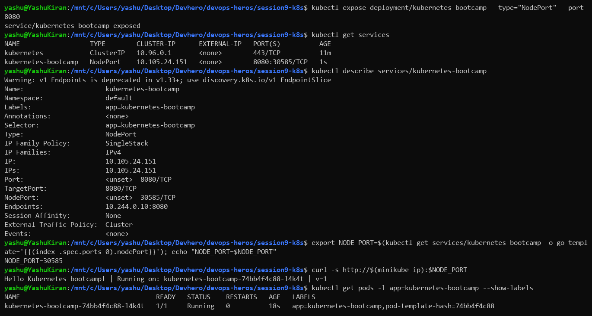
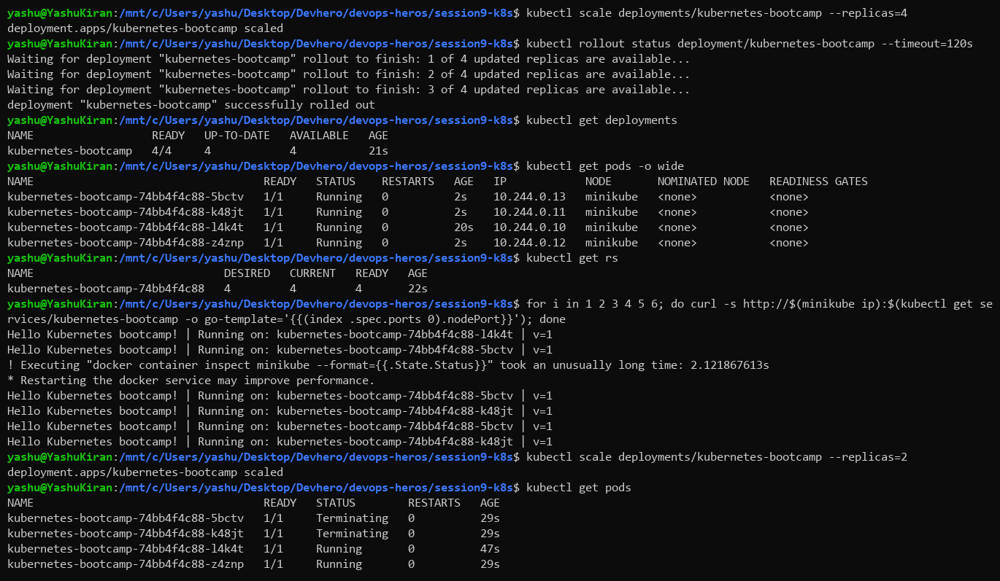
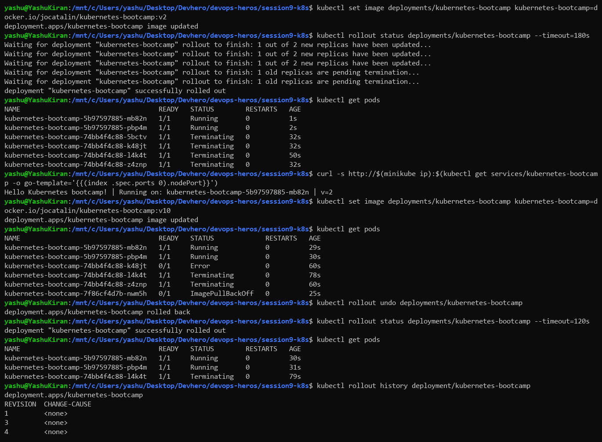
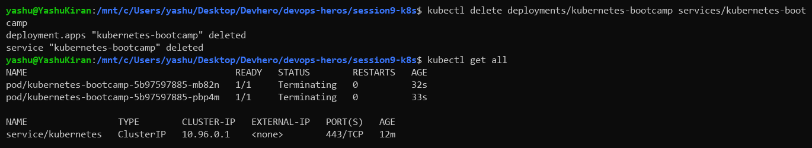

# Kubernetes Fundamentals (Session 9)

**Environment:** WSL2 (Ubuntu) on Windows, Docker Engine, minikube v1.39.0 (Kubernetes v1.37.0, docker driver)

Resources followed: [Kubernetes Basics tutorial](https://kubernetes.io/docs/tutorials/kubernetes-basics/), [minikube start](https://minikube.sigs.k8s.io/docs/start/), [Cluster Architecture](https://kubernetes.io/docs/concepts/architecture/)

---

## Task 1: Start the cluster and check it

```bash
minikube start --driver=docker
minikube version
kubectl version
minikube status
kubectl cluster-info
kubectl get nodes -o wide
```



### What I understood

minikube runs a whole single-node Kubernetes cluster inside one Docker container on my laptop. `minikube status` shows the pieces that have to be up: the host (the container), the kubelet and the API server. `kubectl` never talks to the node directly. It talks to the API server, and `kubectl cluster-info` shows where that is (`https://127.0.0.1:32771`).

`kubectl version` warned that my kubectl (1.30) is more than one minor version behind the server (1.37). Everything worked, but kubectl only officially supports being one minor version either side of the server.

---

## Task 2: Look at the control plane

```bash
kubectl get pods -n kube-system -o wide
kubectl get componentstatuses
kubectl api-resources | head -25
```



### What I understood

The control plane components run as ordinary pods in the `kube-system` namespace:

| Component | Job |
|---|---|
| `kube-apiserver` | Front door. Every kubectl command and every internal component goes through it |
| `etcd` | Key-value store holding the entire cluster state |
| `kube-scheduler` | Picks which node a new pod should run on |
| `kube-controller-manager` | Runs the control loops that keep actual state = desired state |
| `kube-proxy` | Runs on each node and programs the network rules that make Services work |
| `coredns` | Cluster DNS, so pods can find Services by name |
| `kindnet` | The CNI plugin minikube uses to give pods IPs |

Most of them have the node's IP (`192.168.49.2`) because they use host networking. CoreDNS has a pod IP (`10.244.0.2`) like any normal app. `api-resources` lists every object type the API server understands, with short names like `po`, `svc`, `deploy` and `cm`.

---

## Task 3: Inspect the node

```bash
kubectl describe node minikube
```



### What I understood

A node reports its **capacity** (12 CPUs and about 7.6 GiB memory from my WSL VM) and its **allocatable** amount, which is what the scheduler can actually hand out to pods. The `Non-terminated Pods` section shows every pod on the node with its CPU/memory requests. The scheduler uses those requests to decide if a new pod fits. The node also runs `containerd` as the container runtime, not Docker, even though minikube itself sits inside Docker.

---

## Task 4: Create the first Deployment

```bash
kubectl create deployment kubernetes-bootcamp --image=docker.io/jocatalin/kubernetes-bootcamp:v1
kubectl rollout status deployment/kubernetes-bootcamp
kubectl get deployments
kubectl get pods -o wide
kubectl describe pods
```



> The tutorial's original image `gcr.io/k8s-minikube/kubernetes-bootcamp:v1` no longer exists. The pod went into `ImagePullBackOff` on my first try, so I switched to the Docker Hub copy the current tutorial uses.

### What I understood

`kubectl create deployment` asks for "one copy of this image, kept running". The Deployment creates a ReplicaSet, and the ReplicaSet creates the Pod. `describe` shows that chain in `Controlled By: ReplicaSet/...`. The pod got its own cluster IP (`10.244.0.10`), and the node pulled the image through containerd.

---

## Task 5: Explore the running app

```bash
export POD_NAME=$(kubectl get pods -o go-template --template '{{range .items}}{{.metadata.name}}{{"\n"}}{{end}}')
kubectl logs $POD_NAME
kubectl exec $POD_NAME -- env
kubectl exec $POD_NAME -- curl -s http://localhost:8080
```



### What I understood

`kubectl logs` prints the container's stdout, and `kubectl exec` runs a command inside the container, much like `docker exec`. The environment variables show that Kubernetes injects `KUBERNETES_SERVICE_HOST` and similar variables into every container, so an app can always find the API server. At this point the app only answers from inside the pod (`localhost:8080`), because nothing exposes it yet.

---

## Task 6: Expose it with a Service

```bash
kubectl expose deployment/kubernetes-bootcamp --type="NodePort" --port 8080
kubectl get services
kubectl describe services/kubernetes-bootcamp
export NODE_PORT=$(kubectl get services/kubernetes-bootcamp -o go-template='{{(index .spec.ports 0).nodePort}}')
curl -s http://$(minikube ip):$NODE_PORT
```



### What I understood

Pods are temporary and their IPs change, so you don't connect to them directly. A **Service** gives a stable IP and a port, and finds its pods by **label selector** (`app=kubernetes-bootcamp`). `describe` shows `Endpoints: 10.244.0.10:8080`, the actual pod behind it. `NodePort` also opens a port (30585 here) on the node, which is how `curl` from WSL reached the app.

---

## Task 7: Scale the app

```bash
kubectl scale deployments/kubernetes-bootcamp --replicas=4
kubectl get deployments
kubectl get pods -o wide
kubectl get rs
for i in 1 2 3 4 5 6; do curl -s http://$(minikube ip):$NODE_PORT; done
kubectl scale deployments/kubernetes-bootcamp --replicas=2
```



### What I understood

Scaling just changes the desired replica count, and the ReplicaSet creates or deletes pods to match. Each new pod got a different IP. The curl loop answered from different pod names (`...l4k4t`, `...5bctv`, `...k48jt`), which shows the Service **load-balancing** across all ready pods without me configuring anything. Scaling down to 2 put the extra pods into `Terminating`.

---

## Task 8: Rolling update and rollback

```bash
kubectl set image deployments/kubernetes-bootcamp kubernetes-bootcamp=docker.io/jocatalin/kubernetes-bootcamp:v2
kubectl rollout status deployments/kubernetes-bootcamp
curl -s http://$(minikube ip):$NODE_PORT          # -> v=2
kubectl set image deployments/kubernetes-bootcamp kubernetes-bootcamp=docker.io/jocatalin/kubernetes-bootcamp:v10
kubectl get pods                                  # new pod stuck in ImagePullBackOff
kubectl rollout undo deployments/kubernetes-bootcamp
kubectl rollout history deployment/kubernetes-bootcamp
```



### What I understood

`set image` changes the pod template, so the Deployment creates a **new ReplicaSet** and gradually moves pods from the old one to the new one. The app now answered `v=2`.

The `v10` tag doesn't exist, so the new pod got stuck in `ImagePullBackOff`. The two old v2 pods **kept running and serving traffic** the whole time, because a rolling update doesn't remove old pods until new ones are ready. `rollout undo` went back to the previous revision. It shows up in the history as a new revision number (4) rather than reusing revision 2.

---

## Cleanup

```bash
kubectl delete deployments/kubernetes-bootcamp services/kubernetes-bootcamp
kubectl get all
```



---

## Commands reference

| Command | Purpose |
|---|---|
| `minikube start` / `minikube status` | Start / check the local cluster |
| `minikube ip` | IP of the minikube node |
| `kubectl cluster-info` | Where the API server is |
| `kubectl get nodes -o wide` | Nodes with IPs, OS, runtime |
| `kubectl describe node <name>` | Capacity, allocatable, pods on the node |
| `kubectl get pods -n kube-system` | Control plane components |
| `kubectl create deployment <n> --image=` | Create a Deployment |
| `kubectl expose deployment <n> --type=NodePort --port=<p>` | Create a Service for it |
| `kubectl scale deployment <n> --replicas=<x>` | Change the number of pods |
| `kubectl set image deployment/<n> <container>=` | Trigger a rolling update |
| `kubectl rollout status / history / undo` | Watch, list, roll back a rollout |
| `kubectl logs <pod>` / `kubectl exec <pod> -- <cmd>` | Logs / run a command in a container |
