# Kubernetes Ingress, ConfigMaps and Secrets (Session 12)

**Environment:** WSL2 (Ubuntu) on Windows, minikube v1.39.0 (Kubernetes v1.37.0, docker driver), ingress-nginx controller v1.15.1

All commands were run from the `session-12-ingress-configmaps-secrets` folder. Instead of editing `/etc/hosts` (needs sudo), I sent the hostname with `curl -H "Host: ..."` / `curl --resolve`, which is what the lab guide suggests for cloud instances.

---

## Task 1: ConfigMap

```bash
kubectl apply -f 01-configmap/app-config.yaml
kubectl get configmap yatri-app-config
kubectl describe configmap yatri-app-config
kubectl get configmap yatri-app-config -o jsonpath='{.data.LOG_LEVEL}'
kubectl delete configmap yatri-app-config
```

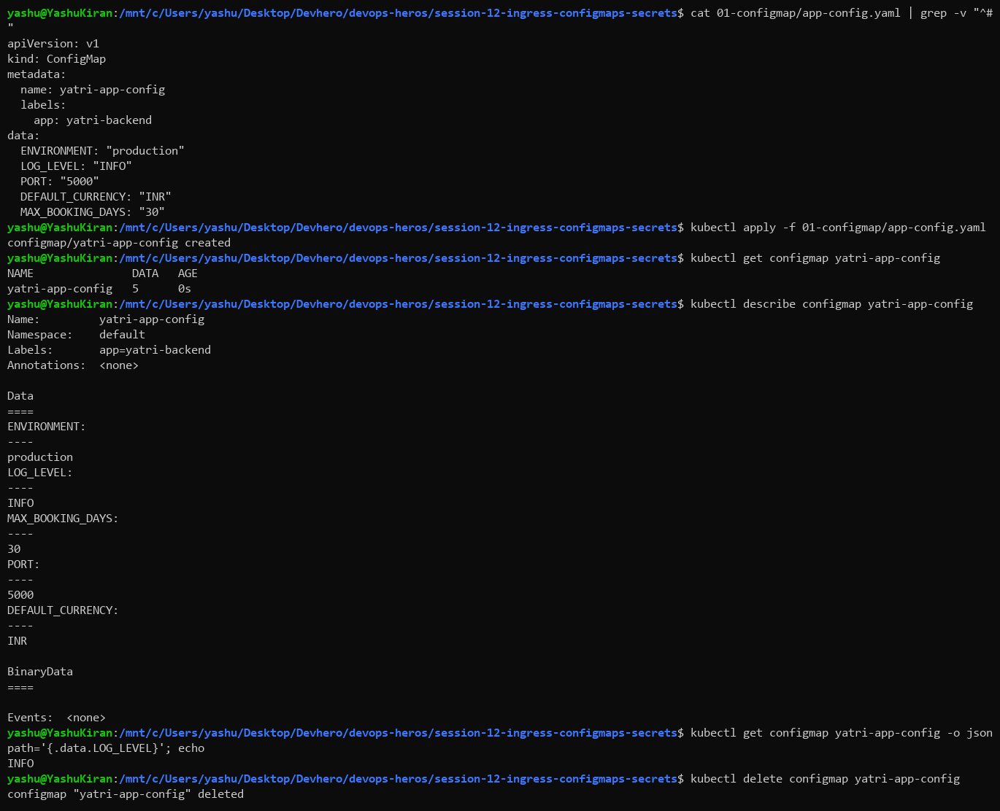

> The module README uses `configmap/app-config.yaml`, but the file is actually in `01-configmap/`.

### What I understood

A ConfigMap stores **non-sensitive** config as key-value pairs (environment, log level, port, currency) outside the container image. The same image can then run in dev, staging and production with different ConfigMaps. `describe` shows every key in plain text, and `jsonpath` pulls out a single value.

---

## Task 2: Secret

```bash
echo -n "yatri_admin" | base64
echo -n "secretpassword" | base64
echo -n "yatri_production_db" | base64
kubectl apply -f 02-secret/db-secret.yaml
kubectl get secret yatri-db-secret
kubectl describe secret yatri-db-secret
kubectl get secret yatri-db-secret -o jsonpath='{.data.POSTGRES_PASSWORD}' | base64 --decode
```

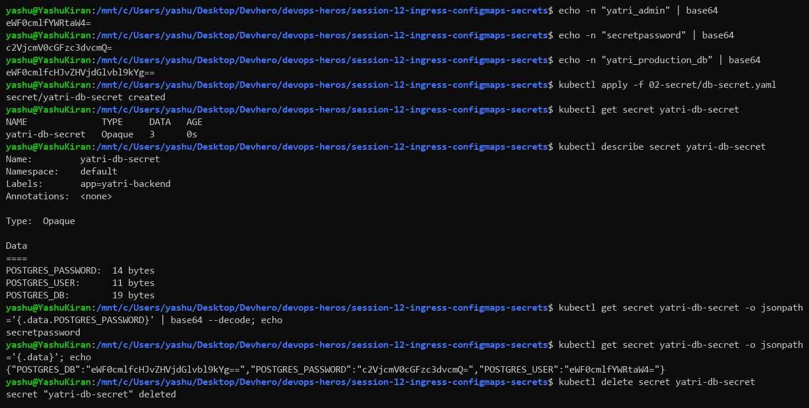

### What I understood

Values in a Secret's `data:` must be **base64-encoded**. `describe` hides them and only shows sizes (`POSTGRES_PASSWORD: 14 bytes`). But one `jsonpath` plus `base64 --decode` gave back `secretpassword` in plain text.

**Base64 is encoding, not encryption.** Anyone with read access to Secrets can read them. Real protection comes from RBAC (who can `get secrets`), encryption at rest in etcd, and never committing Secret YAML with real values to Git. Tools like Sealed Secrets, External Secrets or Vault handle that.

---

## Task 3: The base64 newline gotcha

```bash
echo "secretpassword" | base64        # c2VjcmV0cGFzc3dvcmQK
echo -n "secretpassword" | base64     # c2VjcmV0cGFzc3dvcmQ=
echo "c2VjcmV0cGFzc3dvcmQK" | base64 --decode | od -c
echo "c2VjcmV0cGFzc3dvcmQ=" | base64 --decode | od -c
```

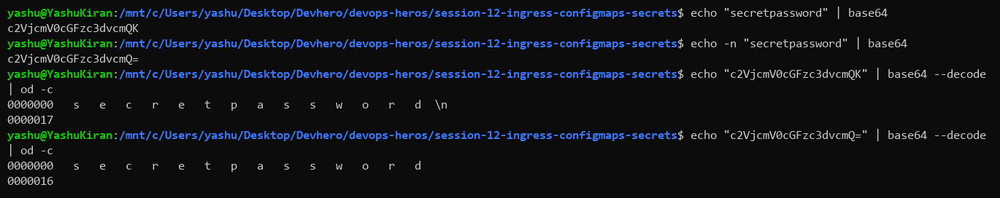

### What I understood

Plain `echo` adds a newline, so the encoded value ends in `K` instead of `=`. `od -c` shows it clearly: one version decodes to `...password\n` (15 bytes) and the other to `...password` (14 bytes). If the newline version goes into a Secret, the database password is effectively `secretpassword\n` and login fails, even though it looks right. **Always use `echo -n`**, or let `kubectl create secret generic --from-literal=` do the encoding.

---

## Task 4: Full demo – ConfigMap and Secret

```bash
kubectl apply -f 04-full-demo/configmap.yaml
kubectl describe configmap yatri-app-config
kubectl apply -f 04-full-demo/secret.yaml
kubectl describe secret yatri-db-secret
```

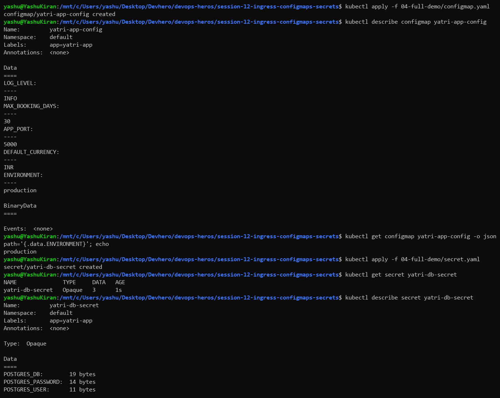

---

## Task 5: Inject them into the backend and deploy the frontend

```bash
kubectl apply -f 04-full-demo/backend.yaml
kubectl rollout status deployment/yatri-backend
kubectl exec deployment/yatri-backend -- env | grep -E "ENVIRONMENT|LOG_LEVEL|DEFAULT_CURRENCY|POSTGRES"
kubectl apply -f 04-full-demo/frontend.yaml
kubectl get svc yatri-frontend-service yatri-backend-service
```

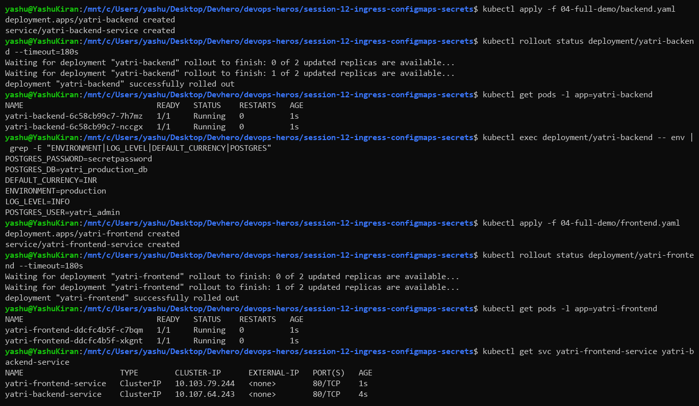

### What I understood

The backend Deployment uses `envFrom: configMapRef` to load **all** ConfigMap keys as environment variables, and `env.valueFrom.secretKeyRef` to load each Secret key. Inside the pod, `env` showed `ENVIRONMENT=production`, `LOG_LEVEL=INFO`, and the **decoded** `POSTGRES_PASSWORD=secretpassword`. Kubernetes decodes the base64 before handing values to the container. Both apps are exposed as ClusterIP Services only, because the Ingress will be the single way in from outside.

---

## Task 6: Enable the Ingress controller

```bash
minikube addons enable ingress
kubectl wait --namespace ingress-nginx --for=condition=ready pod --selector=app.kubernetes.io/component=controller --timeout=300s
kubectl get pods -n ingress-nginx
kubectl get ingressclass
```

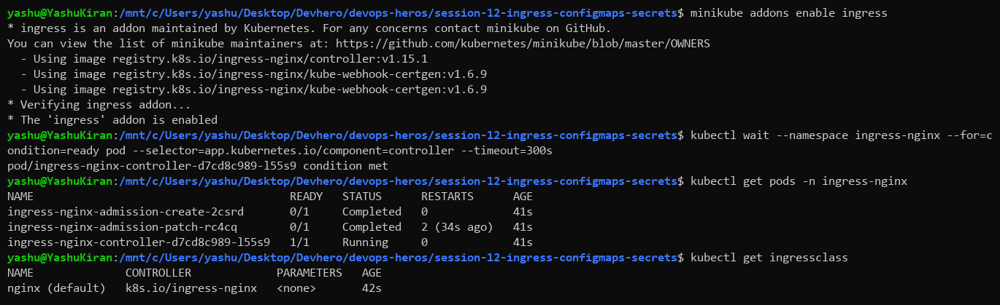

### What I understood

An `Ingress` object is only a set of routing rules, and nothing happens until an **Ingress controller** is running to act on them. The minikube addon installs ingress-nginx, which is just an nginx pod that watches Ingress objects and rewrites its config. The two `admission` pods are one-off jobs (`Completed`) that set up the validating webhook. `ingressclass` shows `nginx (default)`, which the `ingressClassName: nginx` in our YAML refers to.

---

## Task 7: Ingress routing

```bash
kubectl apply -f 04-full-demo/ingress.yaml
kubectl get ingress yatri-ingress
kubectl describe ingress yatri-ingress
curl -s -H "Host: yatri.local" http://$(minikube ip)/
curl -s -H "Host: yatri.local" http://$(minikube ip)/api/
curl -s http://$(minikube ip)/          # no Host header -> 404
```

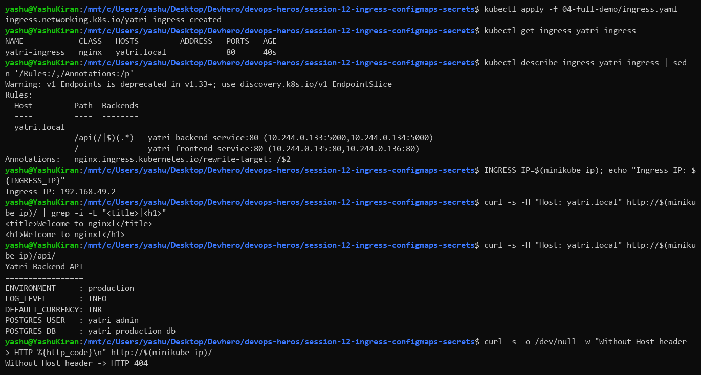

### What I understood

One IP and one port (80) now serve two apps:

| Request | Rule | Went to |
|---|---|---|
| `yatri.local/` | `path: /` | `yatri-frontend-service` → nginx page |
| `yatri.local/api/` | `path: /api(/\|$)(.*)` | `yatri-backend-service` → config values |
| no/other Host | no rule matches | 404 from the controller's default backend |

`rewrite-target: /$2` removes the `/api` prefix, so the backend receives `/` and doesn't need to know it's mounted under `/api`. The backend response printed the values it read from the ConfigMap and Secret, which proves the whole chain works: Ingress → Service → Pod → env vars. Routing is **host-based**: without `Host: yatri.local` the request matched nothing.

---

## Task 8: Everything at once

```bash
kubectl get configmap yatri-app-config
kubectl get secret yatri-db-secret
kubectl get pods -l app=yatri-frontend
kubectl get pods -l app=yatri-backend
kubectl get svc yatri-frontend-service yatri-backend-service
kubectl get ingress yatri-ingress
```

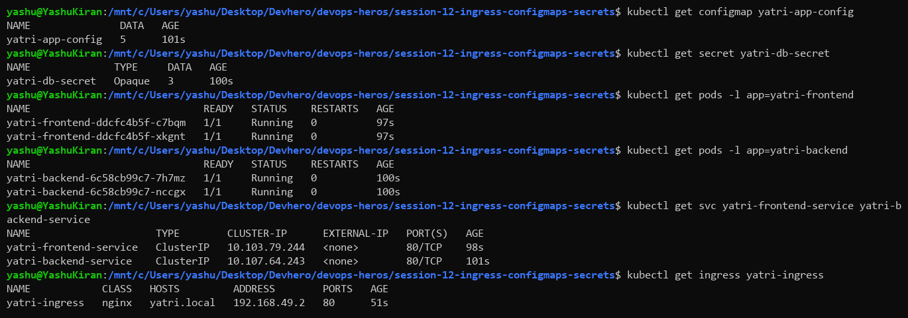

The Ingress now shows `ADDRESS 192.168.49.2`. Right after creating it the address was still empty, because the controller takes a few seconds to pick up the object and publish its status.

---

## Task 9: What happens when a ConfigMap changes?

```bash
kubectl patch configmap yatri-app-config --type merge -p '{"data":{"ENVIRONMENT":"staging"}}'
kubectl exec deployment/yatri-backend -- env | grep ENVIRONMENT     # still production
kubectl rollout restart deployment/yatri-backend
kubectl exec deployment/yatri-backend -- env | grep ENVIRONMENT     # now staging
curl -s -H "Host: yatri.local" http://$(minikube ip)/api/
```

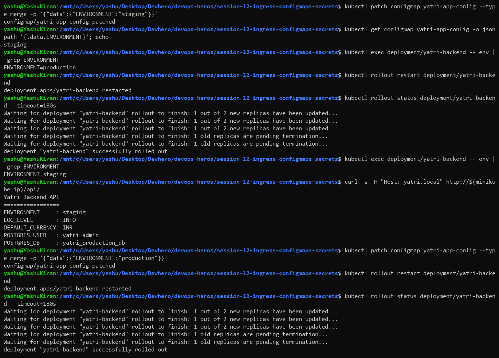

### What I understood

The ConfigMap said `staging` straight away, but the running pod still had `ENVIRONMENT=production`. **Environment variables are read once, when the container starts.** Only after `rollout restart` created new pods did they pick up `staging`, and the API response changed.

On my first run I curled immediately after the restart and got a **502 Bad Gateway**, because the Ingress was briefly still pointing at terminating pods. Waiting a few seconds fixed it. ConfigMaps mounted as **volumes** do update in place (after up to about a minute), but env vars never do.

---

## Task 10: TLS Ingress (and a bug I found)

```bash
openssl req -x509 -nodes -days 365 -newkey rsa:2048 -keyout tls.key -out tls.crt -subj "/CN=campus.local/O=CampusDevOps"
kubectl create secret tls campus-tls-cert --cert=tls.crt --key=tls.key
kubectl apply -f 03-ingress/ingress-tls.yaml
curl -sk --resolve portal.campus.local:443:$(minikube ip) https://portal.campus.local/
curl -sk --resolve api.campus.local:443:$(minikube ip) https://api.campus.local/api/health
curl -svk --resolve portal.campus.local:443:$(minikube ip) https://portal.campus.local/ 2>&1 | grep -E "subject:|issuer:"
kubectl logs -n ingress-nginx deploy/ingress-nginx-controller | grep campus-tls-cert
```

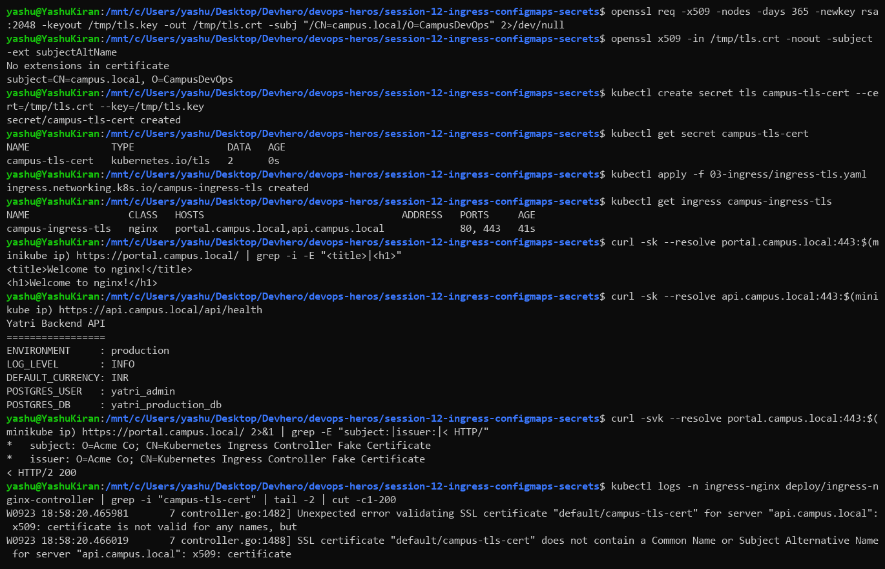

### What I found

Both hosts answered over HTTPS, but `curl -v` showed the certificate was **"Kubernetes Ingress Controller Fake Certificate"**, not mine. The controller logs gave the reason:

```
SSL certificate "default/campus-tls-cert" does not contain a Common Name or Subject Alternative Name for server "api.campus.local"
```

The README's command makes a certificate for `CN=campus.local` only, and it has **no Subject Alternative Names**. That doesn't match `portal.campus.local` or `api.campus.local`, so ingress-nginx ignores it and falls back to its built-in default certificate. `-k` hid the problem, because it skips certificate checks.

### Fix: add SANs

```bash
openssl req -x509 -nodes -days 365 -newkey rsa:2048 -keyout tls.key -out tls.crt \
  -subj "/CN=campus.local/O=CampusDevOps" \
  -addext "subjectAltName=DNS:portal.campus.local,DNS:api.campus.local"
kubectl create secret tls campus-tls-cert --cert=tls.crt --key=tls.key --dry-run=client -o yaml | kubectl apply -f -
curl -svk --resolve portal.campus.local:443:$(minikube ip) https://portal.campus.local/ 2>&1 | grep -E "subject:|issuer:"
curl -s -o /dev/null -w "%{http_code} -> %{redirect_url}\n" --resolve portal.campus.local:80:$(minikube ip) http://portal.campus.local/
```

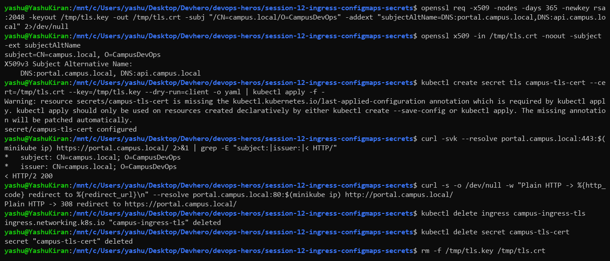

With SANs for both hostnames the controller served **my** certificate (`subject: CN=campus.local; O=CampusDevOps`). Plain HTTP now returns **308 → https://**, because of the `ssl-redirect: "true"` annotation. Modern clients match hostnames against the SAN list and ignore the CN, so a real certificate needs every hostname (or a wildcard like `*.campus.local`) as a SAN. TLS terminates at the Ingress controller, so the backend pods still speak plain HTTP.

---

## Task 11: Cleanup

```bash
bash 04-full-demo/cleanup.sh
file 04-full-demo/cleanup.sh
kubectl delete -f 04-full-demo/ingress.yaml -f 04-full-demo/backend.yaml -f 04-full-demo/frontend.yaml -f 04-full-demo/secret.yaml -f 04-full-demo/configmap.yaml
kubectl get all -l app=yatri-app
```

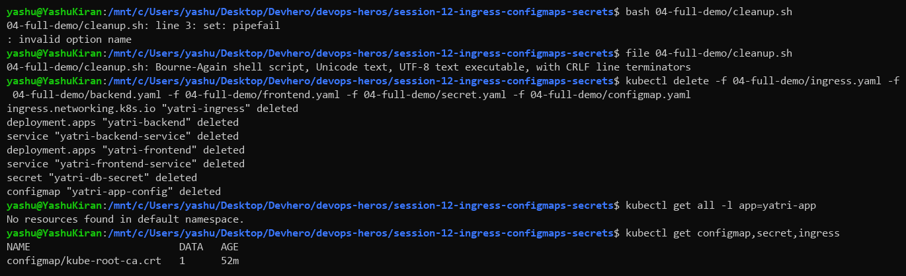

`cleanup.sh` failed with `set: pipefail: invalid option name`. `file` shows why: **CRLF line terminators**. Git on Windows (`core.autocrlf=true`) converted the script to Windows line endings, so bash read the option as `pipefail\r`. I cleaned up with the equivalent `kubectl delete -f` commands from the README. The permanent fix is to run `dos2unix` on the script, or to add `*.sh text eol=lf` to `.gitattributes`.

---

## ConfigMap vs Secret

| | ConfigMap | Secret |
|---|---|---|
| For | Non-sensitive config | Passwords, tokens, keys, certificates |
| Stored as | Plain text | Base64 (not encrypted by default) |
| `describe` shows values | Yes | No, only byte counts |
| Consumed as | env vars / volume files | env vars / volume files |
| Update reaches running pod | Only via volume, or after a restart | Same |

## Commands reference

| Command | Purpose |
|---|---|
| `kubectl get/describe configmap <cm>` | View config |
| `kubectl get secret <s> -o jsonpath='{.data.KEY}' \| base64 --decode` | Read a secret value |
| `echo -n "<value>" \| base64` | Encode for a Secret (no trailing newline) |
| `kubectl create secret tls <n> --cert --key` | TLS Secret for an Ingress |
| `kubectl patch configmap <cm> --type merge -p '<json>'` | Change config in place |
| `kubectl rollout restart deployment/<d>` | Restart pods to pick up new env |
| `minikube addons enable ingress` | Install the nginx Ingress controller |
| `kubectl get/describe ingress <i>` | Routing rules and address |
| `curl -H "Host: <host>" http://<ip>/` | Test host-based routing without DNS |
| `curl --resolve <host>:443:<ip> https://<host>/` | Test HTTPS with SNI without DNS |
