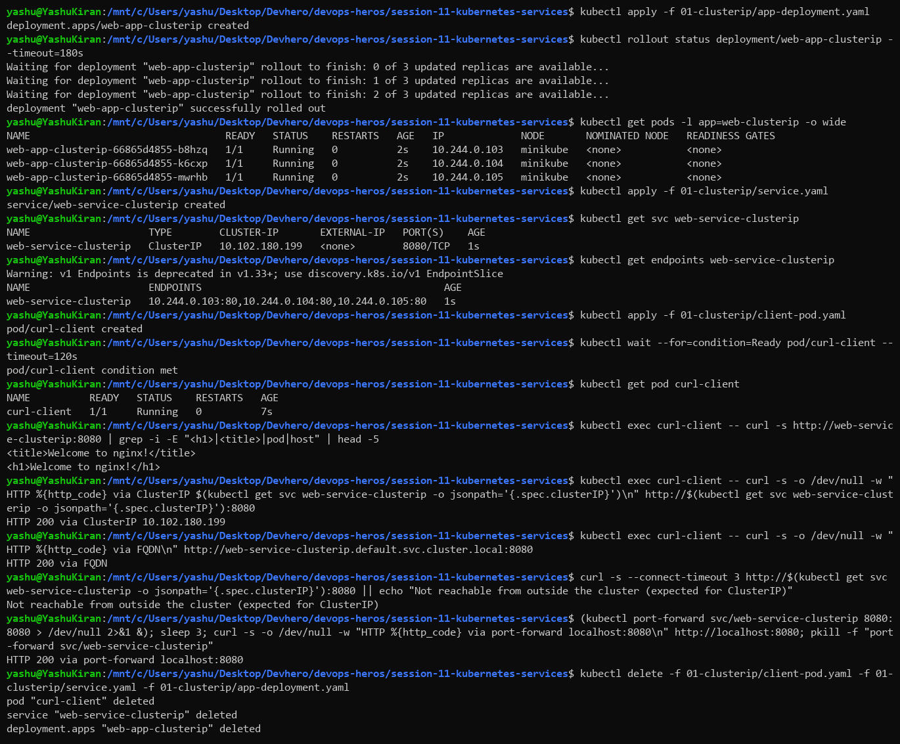
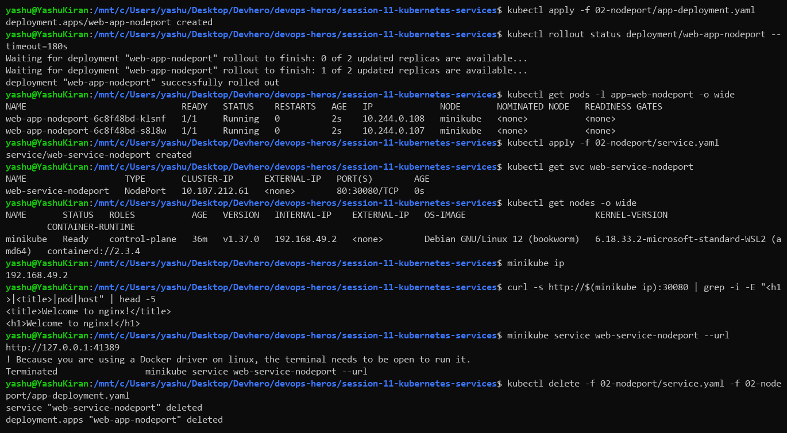
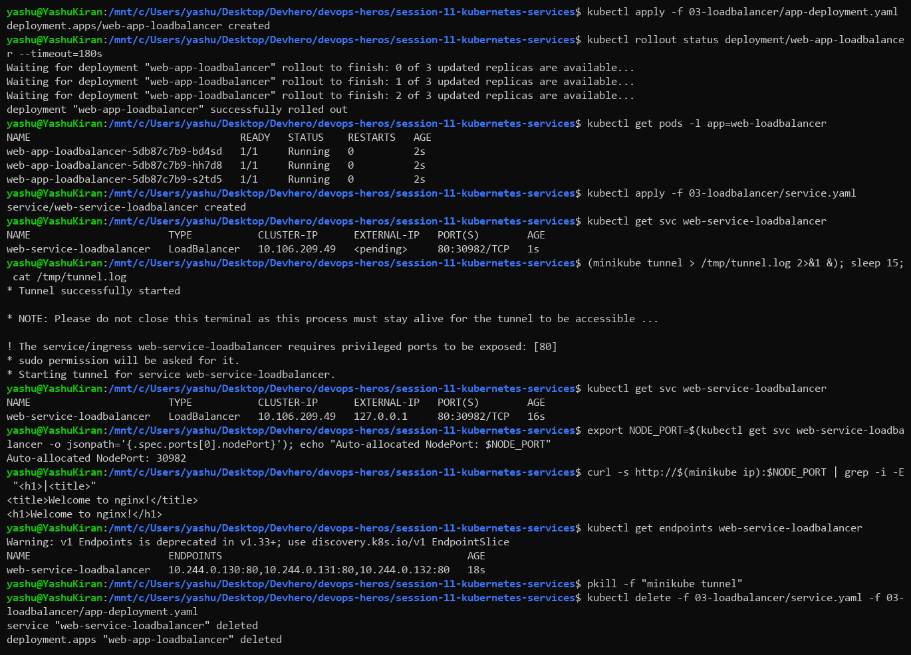
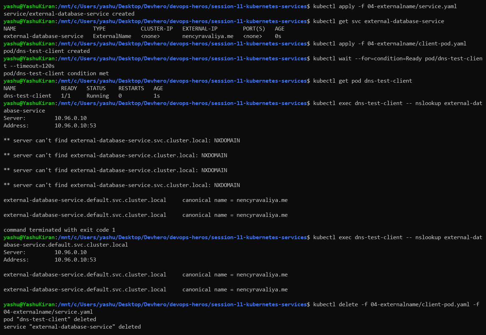
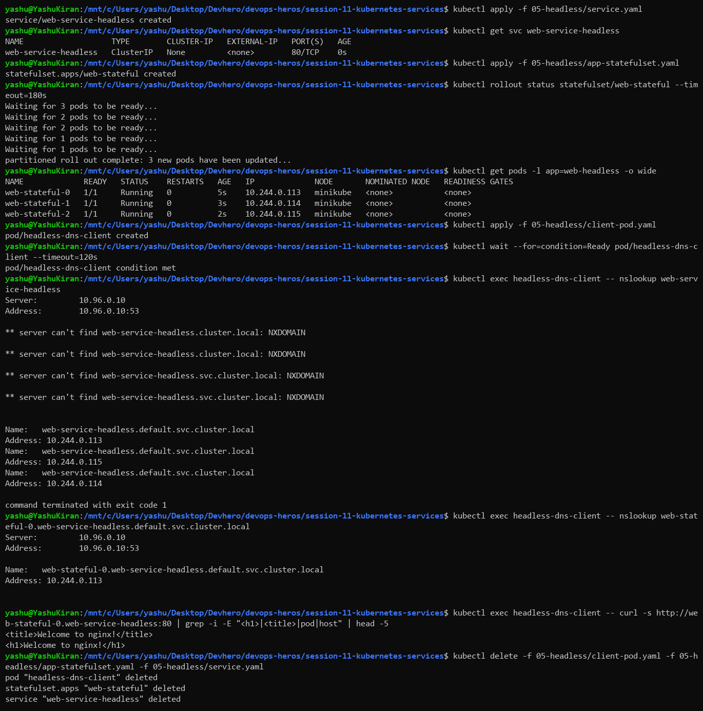
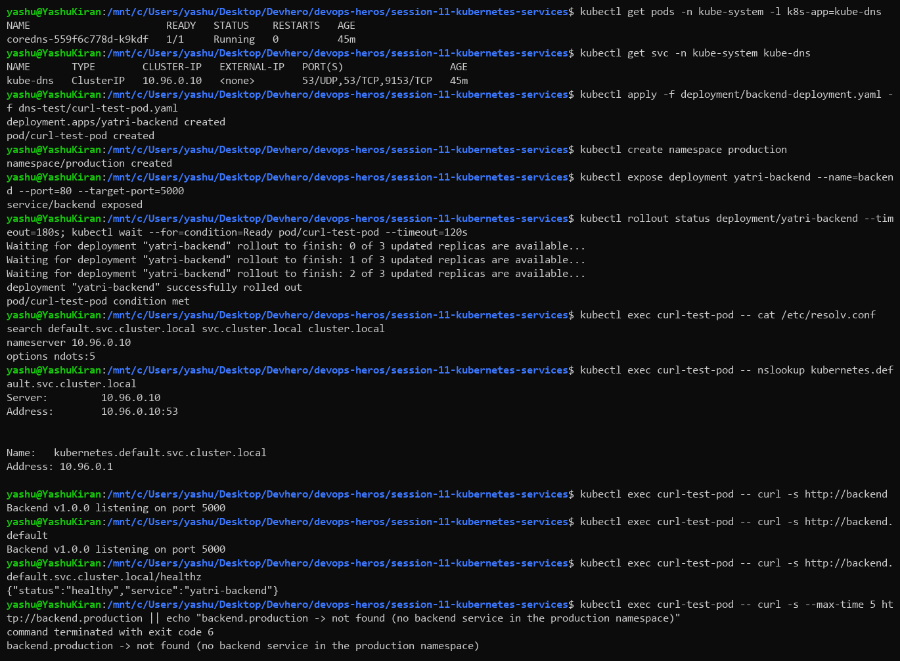
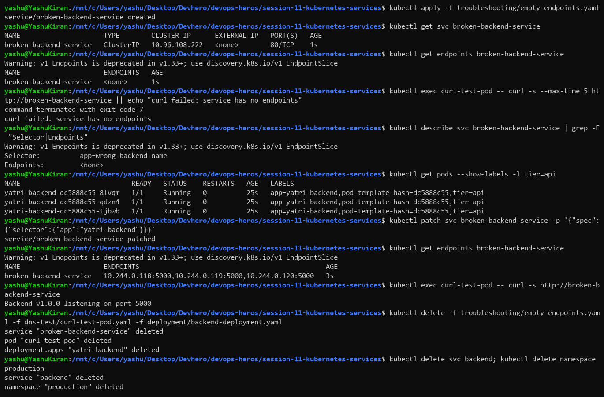

# Kubernetes Services (Session 11)

**Environment:** WSL2 (Ubuntu) on Windows, minikube v1.39.0 (Kubernetes v1.37.0, docker driver)

All commands were run from the `session-11-kubernetes-services` folder of the repo. `kubectl exec -it` from the READMEs was run as `kubectl exec` (no TTY needed for one-off commands).

---

## Why Services exist

Pods are temporary. They get new IPs whenever they restart or reschedule, so nothing should connect to a pod IP directly. A **Service** gives a group of pods (picked by **label selector**) one stable virtual IP and DNS name, and load-balances across whichever of those pods are Ready.

| Type | Reachable from | Use case |
|---|---|---|
| ClusterIP | Inside the cluster only | Default; service-to-service traffic |
| NodePort | `<NodeIP>:30000-32767` | Dev/testing, on-prem |
| LoadBalancer | External IP from a cloud LB | Exposing an app publicly in the cloud |
| ExternalName | Inside the cluster (DNS CNAME) | Alias for something outside the cluster |
| Headless (`clusterIP: None`) | DNS returns pod IPs directly | StatefulSets and databases |

---

## Task 1: ClusterIP

```bash
kubectl apply -f 01-clusterip/app-deployment.yaml
kubectl get pods -l app=web-clusterip -o wide
kubectl apply -f 01-clusterip/service.yaml
kubectl get svc web-service-clusterip
kubectl get endpoints web-service-clusterip
kubectl apply -f 01-clusterip/client-pod.yaml
kubectl exec curl-client -- curl -s http://web-service-clusterip:8080
kubectl exec curl-client -- curl -s http://<CLUSTER-IP>:8080
kubectl exec curl-client -- curl -s http://web-service-clusterip.default.svc.cluster.local:8080
curl http://<CLUSTER-IP>:8080                                   # from WSL, fails
kubectl port-forward svc/web-service-clusterip 8080:8080        # then curl localhost:8080
```



### What I understood

The Service got a virtual IP (`10.102.180.199`), and `get endpoints` lists the 3 real pod IPs behind it on port 80. So the Service listens on **8080** (`port`) and forwards to **80** (`targetPort`) on the pods. From the client pod, the short name, the ClusterIP and the full FQDN all returned the nginx page with HTTP 200.

From my WSL terminal the same ClusterIP was **not reachable**. That's the point of ClusterIP: it only exists inside the cluster network. `kubectl port-forward` is the debugging workaround, and it tunnels a local port through the API server.

---

## Task 2: NodePort

```bash
kubectl apply -f 02-nodeport/app-deployment.yaml -f 02-nodeport/service.yaml
kubectl get svc web-service-nodeport
kubectl get nodes -o wide
curl http://$(minikube ip):30080
minikube service web-service-nodeport --url
```



### What I understood

`PORT(S)` shows `80:30080/TCP`: the Service port is 80, and **30080** is opened on every node. Hitting the node IP (`192.168.49.2`) on 30080 reached the pods. A NodePort Service is still a ClusterIP Service underneath, with a node port added on top. NodePorts must be in the range 30000–32767.

`minikube service --url` gave a `127.0.0.1` tunnel URL. With the Docker driver on Linux it stays in the foreground ("the terminal needs to be open"), so I stopped it with Ctrl+C.

---

## Task 3: LoadBalancer

```bash
kubectl apply -f 03-loadbalancer/app-deployment.yaml -f 03-loadbalancer/service.yaml
kubectl get svc web-service-loadbalancer          # EXTERNAL-IP <pending>
minikube tunnel                                   # separate terminal
kubectl get svc web-service-loadbalancer          # EXTERNAL-IP assigned
curl http://$(minikube ip):<auto-nodeport>
```



### What I understood

On a cloud (EKS/AKS/GKE), creating a `LoadBalancer` Service makes the cloud provider create a real load balancer and put its address in EXTERNAL-IP. minikube has no cloud provider, so it stays `<pending>` until `minikube tunnel` runs. The tunnel then assigned `127.0.0.1`.

The tunnel needed `sudo` to bind port 80 on my machine, so instead I reached the app through the **NodePort (30982) that Kubernetes created automatically**. That's the layering: LoadBalancer is built on NodePort, which is built on ClusterIP. The cloud LB just forwards to the node ports.

---

## Task 4: ExternalName

```bash
kubectl apply -f 04-externalname/service.yaml
kubectl get svc external-database-service
kubectl apply -f 04-externalname/client-pod.yaml
kubectl exec dns-test-client -- nslookup external-database-service
```



### What I understood

ExternalName has **no ClusterIP, no selector and no endpoints**. It's purely a DNS record. `nslookup` returned `canonical name = nencyravaliya.me`, so CoreDNS answers with a CNAME to the external host.

The use case is decoupling. Apps connect to `external-database-service`, and if the database moves (say from RDS to an in-cluster DB) you only change the Service, not the app config. It doesn't proxy traffic, so things like the HTTP `Host` header and TLS certificate names still have to match the external host.

---

## Task 5: Headless Service

```bash
kubectl apply -f 05-headless/service.yaml
kubectl get svc web-service-headless                    # CLUSTER-IP None
kubectl apply -f 05-headless/app-statefulset.yaml
kubectl get pods -l app=web-headless -o wide
kubectl apply -f 05-headless/client-pod.yaml
kubectl exec headless-dns-client -- nslookup web-service-headless
kubectl exec headless-dns-client -- nslookup web-stateful-0.web-service-headless.default.svc.cluster.local
kubectl exec headless-dns-client -- curl -s http://web-stateful-0.web-service-headless:80
```



### What I understood

With `clusterIP: None` there's no virtual IP and no load balancing. A DNS lookup of the Service returns **all three pod IPs** (`.113`, `.114`, `.115`). Combined with a StatefulSet, each pod also gets its **own stable DNS name**: `web-stateful-0.web-service-headless...` resolved to exactly one IP.

That's what databases need. A MySQL or Kafka replica has to talk to a specific peer (for example "the primary is pod-0"), not a random one behind a load balancer.

---

## Task 6: DNS and FQDN

```bash
kubectl get pods -n kube-system -l k8s-app=kube-dns
kubectl get svc -n kube-system kube-dns
kubectl apply -f deployment/backend-deployment.yaml -f dns-test/curl-test-pod.yaml
kubectl expose deployment yatri-backend --name=backend --port=80 --target-port=5000
kubectl exec curl-test-pod -- cat /etc/resolv.conf
kubectl exec curl-test-pod -- curl -s http://backend
kubectl exec curl-test-pod -- curl -s http://backend.default
kubectl exec curl-test-pod -- curl -s http://backend.default.svc.cluster.local/healthz
kubectl exec curl-test-pod -- curl -s http://backend.production
```



### What I understood

Every Service gets a DNS name `<service>.<namespace>.svc.cluster.local`, served by CoreDNS at `10.96.0.10`. The pod's `/etc/resolv.conf` explains why short names work:

```
search default.svc.cluster.local svc.cluster.local cluster.local
nameserver 10.96.0.10
```

`backend` gets expanded with the search list to `backend.default.svc.cluster.local`, and all three forms reached the same backend. `backend.production` failed because there's no `backend` Service in the `production` namespace. **Short names only work within the same namespace.** To reach another namespace you need at least `<service>.<namespace>`.

---

## Task 7: Troubleshooting a Service with no endpoints

```bash
kubectl apply -f troubleshooting/empty-endpoints.yaml
kubectl get endpoints broken-backend-service               # <none>
kubectl exec curl-test-pod -- curl -s http://broken-backend-service   # fails
kubectl describe svc broken-backend-service | grep -E "Selector|Endpoints"
kubectl get pods --show-labels -l tier=api
kubectl patch svc broken-backend-service -p '{"spec":{"selector":{"app":"yatri-backend"}}}'
kubectl get endpoints broken-backend-service               # 3 pod IPs
```



### What I understood

This is the most common Service bug. The Service exists and has a ClusterIP, but `ENDPOINTS <none>` means **its selector matches no pods**. The selector said `app=wrong-backend-name`, while the pods are labelled `app=yatri-backend`. The Service doesn't report an error. Requests just fail (curl exit code 7).

Debugging order: `get endpoints`, then compare `describe svc` (Selector) with `get pods --show-labels`. After fixing the selector the endpoints filled in with all 3 pod IPs on port 5000, and curl worked.

---

## The 4 ports

| Field | Where | Example |
|---|---|---|
| `containerPort` | Pod spec (informational) | 80 |
| `targetPort` | Service → pod port | 80 / 5000 |
| `port` | Port the Service listens on | 8080 |
| `nodePort` | Port opened on every node | 30080 |

## Commands reference

| Command | Purpose |
|---|---|
| `kubectl get svc` | Services, types, ClusterIPs, ports |
| `kubectl get endpoints <svc>` | Pod IPs behind a Service (empty = selector problem) |
| `kubectl describe svc <svc>` | Selector, ports, endpoints |
| `kubectl expose deployment <d> --port --target-port` | Create a Service quickly |
| `kubectl port-forward svc/<svc> <local>:<port>` | Reach a ClusterIP from your machine |
| `minikube service <svc> --url` | URL for a NodePort/LoadBalancer in minikube |
| `minikube tunnel` | Give LoadBalancer Services an external IP locally |
| `kubectl exec <pod> -- nslookup <name>` | Test cluster DNS |
| `kubectl patch svc <svc> -p '<json>'` | Fix a Service in place |
