# Session 13 – Kubernetes Storage, HPA & Probes

Homework for Session 13 of DevOps Heroes. I ran everything on a local **Minikube** cluster (Kubernetes v1.37, Docker driver, `metrics-server` addon enabled), using the YAML files from the [`session-13-storage-hpa-probes`](../../session-13-storage-hpa-probes) folder.

| Task | What I did | Screenshots |
|---|---|---|
| 1 | Kubernetes volumes: emptyDir, hostPath, PV, PVC, StorageClass, dynamic provisioning | `task1-*.png` |
| 2 | HPA hands-on: deployed the app, configured the HPA, generated load, watched it scale up and back down | `task2-*.png` |
| 3 | Mini project: a web app with persistent storage, probes and autoscaling in its own namespace | `task3-*.png` |

Setup:

```bash
minikube start
minikube addons enable metrics-server
kubectl get nodes
kubectl get storageclass
```

---

## Task 1 – Kubernetes Volumes

A container's own filesystem is thrown away when the container goes. A **volume** is storage that is mounted into the container from outside, so its lifetime is no longer tied to the container. Which kind of volume you pick decides *how long* the data lives.

```text
emptyDir   -> lives as long as the Pod
hostPath   -> lives as long as the Node (directory on the node)
PV + PVC   -> lives independently of Pods (cluster storage resource)
```

### 1.1 emptyDir

- Created **empty** when the Pod is scheduled on a node, and deleted for good when the Pod is removed.
- All containers in the same Pod can share it, which makes it useful for scratch space, caches, or a sidecar passing files to the main container.
- It survives a *container* restart inside the Pod, but not deleting or recreating the *Pod*.

```yaml
volumes:
  - name: app-storage
    emptyDir: {}
```

### 1.2 hostPath

- Mounts a file or directory from the **node's** filesystem into the Pod (`/tmp/hostpath-data` on the Minikube node here).
- The data outlives the Pod, but it is tied to **one node**. If the Pod gets scheduled on a different node, it sees a different (empty) directory.
- It's a security risk because the Pod can reach the host's filesystem. Use it only for learning, single-node clusters, or node agents (log collectors and similar).

```yaml
volumes:
  - name: host-storage
    hostPath:
      path: /tmp/hostpath-data
      type: DirectoryOrCreate
```

**Practical demo:** I wrote a file into both Pods, then checked the hostPath file directly on the node with `minikube ssh`:

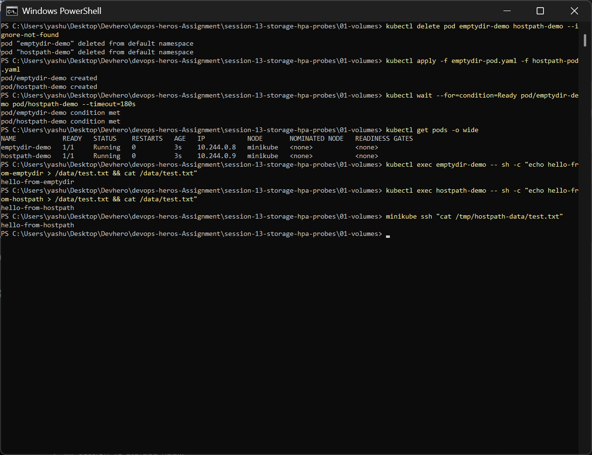

Then I deleted both Pods and recreated them:

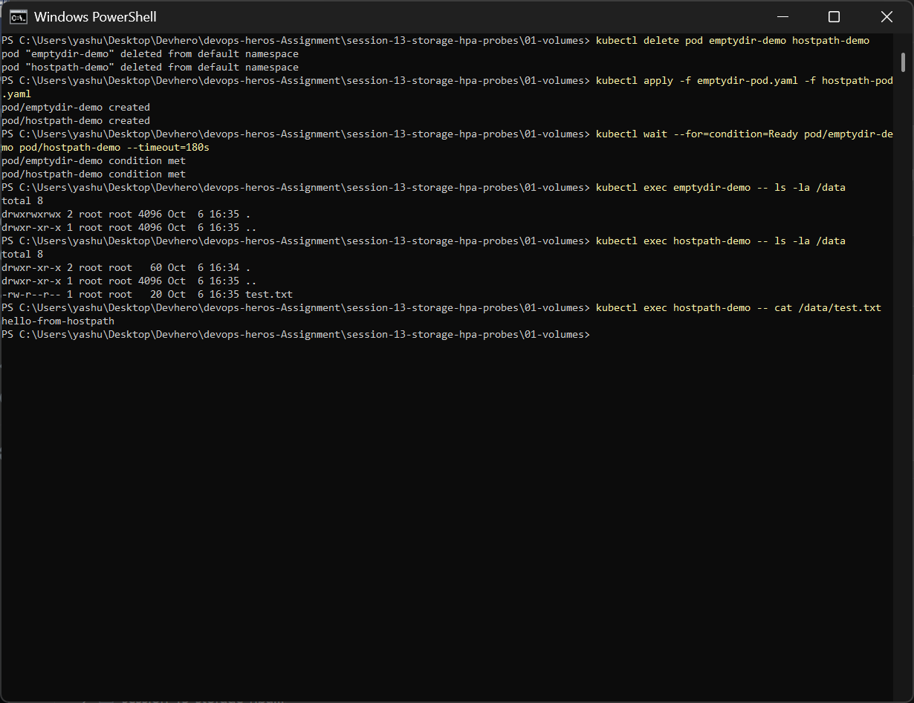

- `emptyDir`: `/data` is **empty** (`total 8`, only `.` and `..`). The data died with the old Pod.
- `hostPath`: `test.txt` is still there with `hello-from-hostpath`, because it lives on the node.

### 1.3 PersistentVolume (PV) and PersistentVolumeClaim (PVC)

Kubernetes separates *providing* storage from *using* it:

| Object | Who creates it | What it is |
|---|---|---|
| **PersistentVolume (PV)** | Admin (or a provisioner) | A piece of storage in the cluster with a size, access mode and reclaim policy. Cluster-scoped. |
| **PersistentVolumeClaim (PVC)** | Developer | A *request* for storage ("I need 500Mi, ReadWriteOnce"). Namespaced. Kubernetes binds it to a matching PV. |
| **Pod** | Developer | Mounts the PVC by name. It never needs to know where the disk actually is. |

```text
Pod --(volume: claimName)--> PVC --(bound)--> PV --> real storage (disk / NFS / cloud volume)
```

Key fields I learned:

- **accessModes**: `ReadWriteOnce` (RWO, one node read/write), `ReadOnlyMany` (ROX), `ReadWriteMany` (RWX, many nodes), `ReadWriteOncePod`.
- **persistentVolumeReclaimPolicy**: `Retain` keeps the data after the PVC is deleted (an admin cleans it up manually). `Delete` removes the underlying storage too.
- **PV status**: `Available` → `Bound` → `Released`.

**Practical demo:** created `student-pv` (1Gi, Retain) and `student-pvc` (500Mi), mounted the claim in `storage-demo`, wrote a file, **deleted the Pod**, recreated it and read the file back:

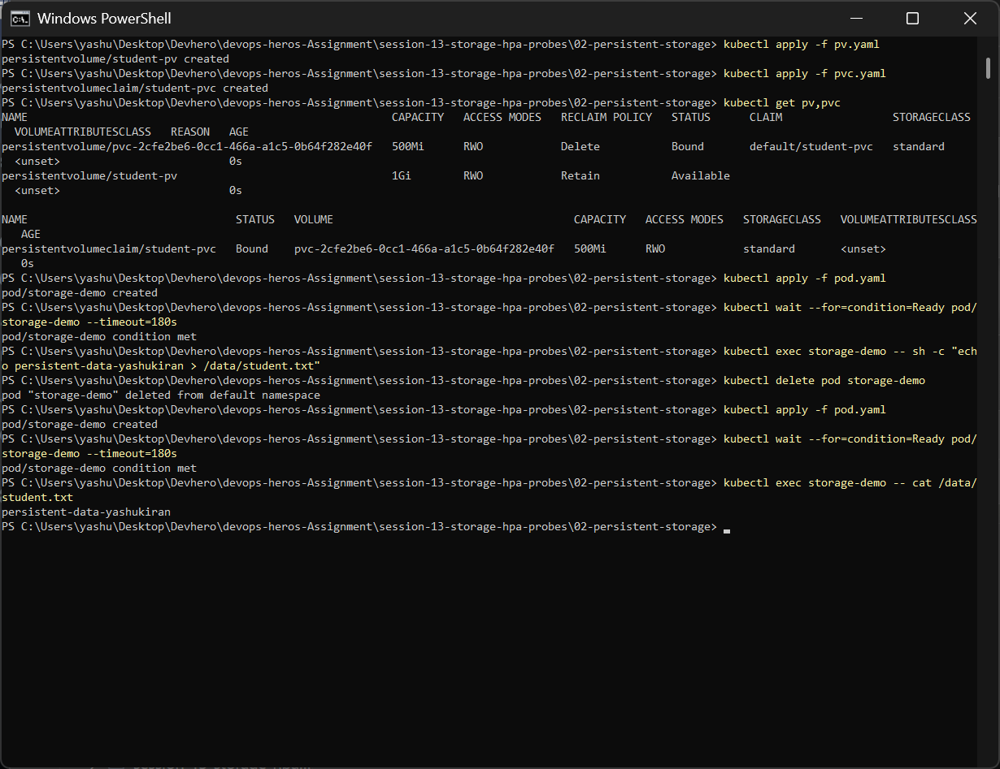

The data `persistent-data-yashukiran` survived the Pod being deleted. That is exactly what PVCs are for.

> **Interesting thing I noticed:** `student-pvc` did **not** bind to my manual `student-pv` (that PV stayed `Available`). The PVC doesn't set a `storageClassName`, so Kubernetes gave it the cluster's **default StorageClass** (`standard`), and the provisioner created a brand-new PV (`pvc-2cfe2be6...`) for it. To force binding to a manually created PV, set `storageClassName: ""` in the PVC, or give the PV and PVC the same class name.

### 1.4 StorageClass

A **StorageClass** describes a *type* of storage and **who provisions it**:

```text
NAME                 PROVISIONER                RECLAIMPOLICY   VOLUMEBINDINGMODE
standard (default)   k8s.io/minikube-hostpath   Delete          Immediate
```

- `provisioner`: the plugin that creates the actual disk (`k8s.io/minikube-hostpath` locally, `ebs.csi.aws.com` on AWS, `pd.csi.storage.gke.io` on GCP).
- `reclaimPolicy`: what happens to dynamically created PVs when the PVC is deleted (default `Delete`).
- `volumeBindingMode`: `Immediate` creates the PV as soon as the PVC appears. `WaitForFirstConsumer` waits until a Pod uses it, so the disk ends up in the same zone as the Pod.
- One StorageClass can be marked as **default** and is used by any PVC that doesn't name a class.

### 1.5 Dynamic provisioning

With *static* provisioning an admin has to create PVs ahead of time. With **dynamic provisioning** the developer only creates a PVC that names a StorageClass, and the provisioner creates a matching PV automatically.

```yaml
apiVersion: v1
kind: PersistentVolumeClaim
metadata:
  name: dynamic-pvc
spec:
  accessModes: [ReadWriteOnce]
  storageClassName: standard
  resources:
    requests:
      storage: 500Mi
```

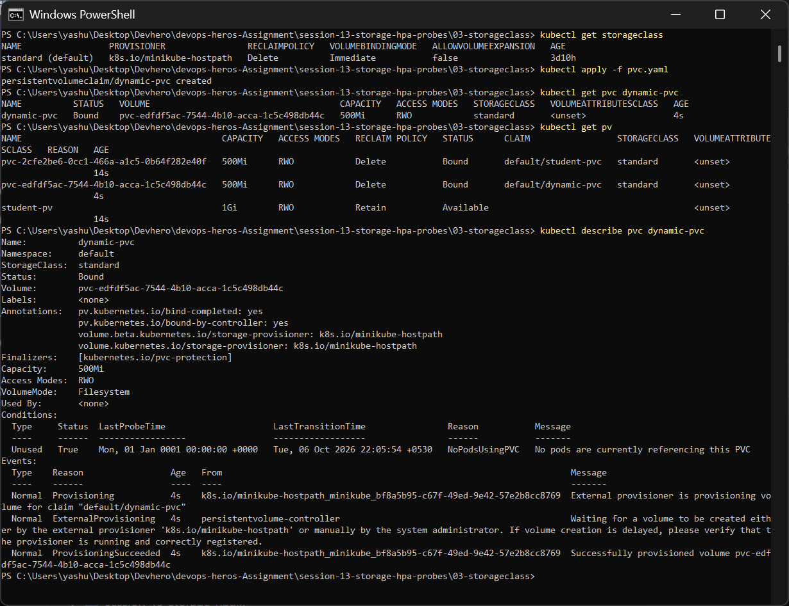

The PVC went to `Bound` within seconds. `kubectl get pv` shows a new PV `pvc-edfdf5ac...` that I never wrote, and the events show `Provisioning` → `ProvisioningSucceeded` from `k8s.io/minikube-hostpath`. This is how storage works on managed clusters (EKS/GKE/AKS): you write PVCs and the cloud disks get created for you.

---

## Task 2 – HPA Hands-on

The **Horizontal Pod Autoscaler** watches a metric (here CPU) and changes the `replicas` of a Deployment to keep that metric near a target.

```text
metrics-server --(CPU per pod)--> HPA controller --(scale replicas)--> Deployment --> Pods
```

The formula the HPA uses:

```text
desiredReplicas = ceil( currentReplicas × currentUtilization / targetUtilization )
```

Utilization is measured **as a percentage of the container's CPU `request`**. That's why the Deployment *must* set `resources.requests.cpu`, otherwise the HPA shows `<unknown>`.

Files used (`04-hpa/`):

```yaml
# deployment.yaml (container part)
resources:
  requests:
    cpu: 100m
  limits:
    cpu: 200m
---
# hpa.yaml
spec:
  scaleTargetRef: { apiVersion: apps/v1, kind: Deployment, name: hpa-demo }
  minReplicas: 1
  maxReplicas: 5
  metrics:
    - type: Resource
      resource:
        name: cpu
        target: { type: Utilization, averageUtilization: 50 }   # 50% of 100m = 50m per pod
```

### 2.1 Deploy the application and configure the HPA

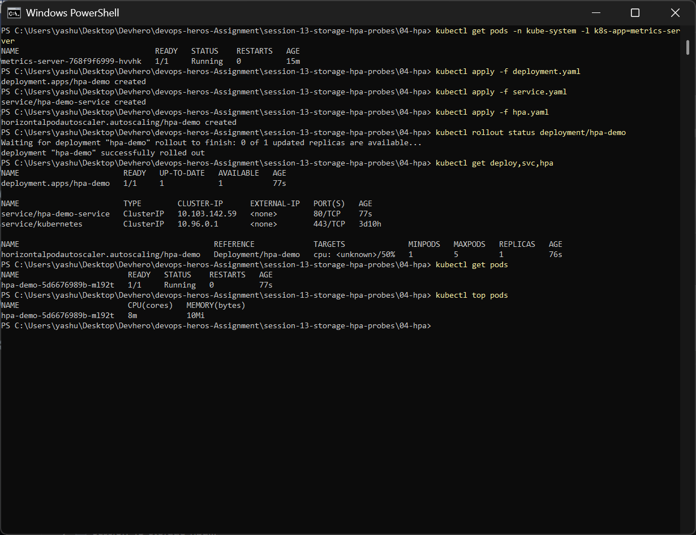

- `metrics-server` is running in `kube-system`. The HPA needs it.
- Applied the Deployment, Service and HPA. 1 replica is running.
- Right after creation the HPA shows `cpu: <unknown>/50%`, because metrics-server needs about a minute to collect the first samples. `kubectl top pods` already shows the idle pod using `8m` CPU.

### 2.2 Load generator → CPU goes up → Pods scale out

The load generator is a busybox Pod running 4 parallel `wget` loops against the Service:

```bash
kubectl run load-generator --image=busybox:1.36 --restart=Never -- /bin/sh -c \
  "for i in 1 2 3 4; do (while true; do wget -q -O- http://hpa-demo-service > /dev/null; done) & done; wait"
kubectl get hpa hpa-demo --watch
```

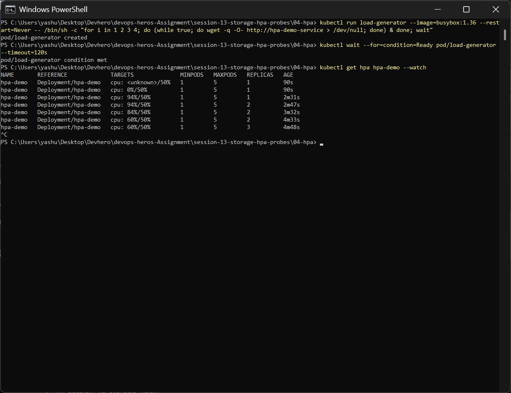

| Time | CPU / target | Replicas | What happened |
|---|---|---|---|
| 90s | `<unknown>` → `0%/50%` | 1 | idle, metrics arrive |
| 2m31s | **94%/50%** | 1 | load hits; 94% > 50% |
| 2m47s | 94%/50% | **2** | HPA scales up: ceil(1 × 94/50) = 2 |
| 3m32s | 84%/50% | 2 | load now shared by 2 pods |
| 4m48s | 60%/50% | **3** | still above target → 3 pods |

### 2.3 Observe CPU utilization and Pod scaling

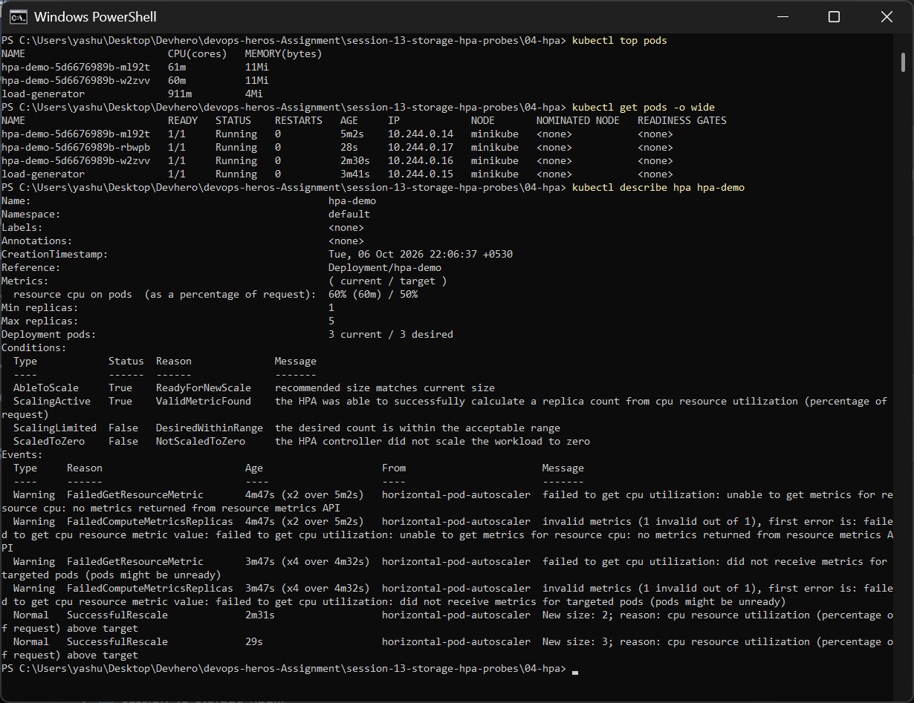

- `kubectl top pods`: each `hpa-demo` pod uses about 60m CPU (60% of its 100m request). The load-generator itself uses about 911m.
- `kubectl get pods`: 3 `hpa-demo` pods, created at different times (5m, 2m30s, 28s).
- `kubectl describe hpa`: shows `Deployment pods: 3 current / 3 desired` and the events `SuccessfulRescale ... New size: 2` and `New size: 3; reason: cpu resource utilization (percentage of request) above target`. The early `FailedGetResourceMetric` warnings were from the first minute before metrics existed. That's normal.

### 2.4 Stop the load → scale down

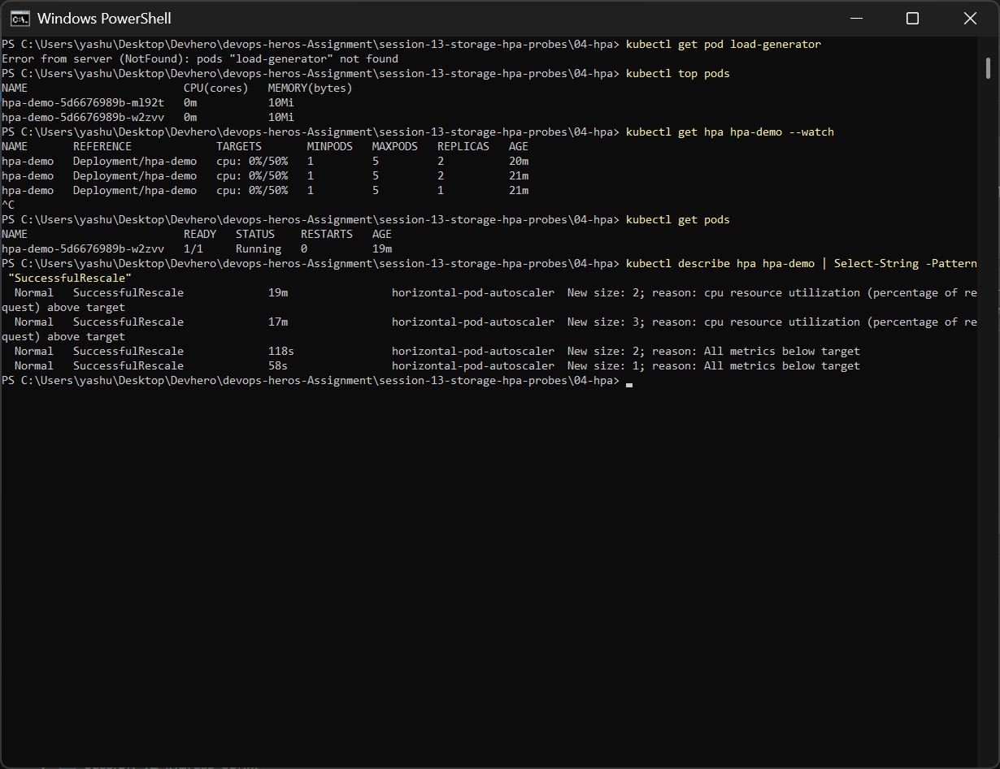

After deleting the load generator, `kubectl top pods` showed `0m` CPU, but the HPA **did not scale down right away**. It waits for a **5-minute stabilization window** (`behavior.scaleDown.stabilizationWindowSeconds: 300` by default) so replicas don't flap up and down on short dips in traffic. After the window it scaled down step by step: **3 → 2 → 1** (`New size: 2/1; reason: All metrics below target`), back to `minReplicas: 1`.

**Full HPA lifecycle seen in this task:** `1 → 2 → 3` (scale up within seconds of the load) and `3 → 2 → 1` (scale down only after the cooldown).

### Useful HPA commands

```bash
kubectl get hpa                 # current/target CPU and replica count
kubectl get hpa <name> --watch  # watch scaling live
kubectl top pods                # actual CPU/memory per pod (needs metrics-server)
kubectl describe hpa <name>     # conditions + SuccessfulRescale events
kubectl get pods                # see new pods being created/terminated
```

---

## Task 3 – Mini Project: Production-Ready Web App

This project combines everything from the session in one app, in its own namespace `production-webapp`:

```text
                    [ Service: web-service :80 ]
                               │
          ┌────────────────────┼────────────────────┐
          ▼                    ▼                    ▼
   [ web-app pod ]      [ web-app pod ]      [ web-app pod ]  (2 → 5, via HPA)
   startup/readiness/liveness probes, cpu 100m request / 200m limit
          │                    │                    │
          └────────── /data ── PVC web-data (500Mi, RWO) ── StorageClass standard
```

| File | What it creates |
|---|---|
| `namespace.yaml` | Namespace `production-webapp` |
| `pvc.yaml` | PVC `web-data`, 500Mi RWO (dynamically provisioned) |
| `deployment.yaml` | `web-app` (nginx, 2 replicas, `Recreate` strategy, 3 probes, resource requests/limits, PVC mounted at `/data`) |
| `service.yaml` | ClusterIP `web-service` on port 80 |
| `hpa.yaml` | HPA `web-app-hpa`: min 2, max 5, target 50% CPU |

### 3.1 Deploy everything

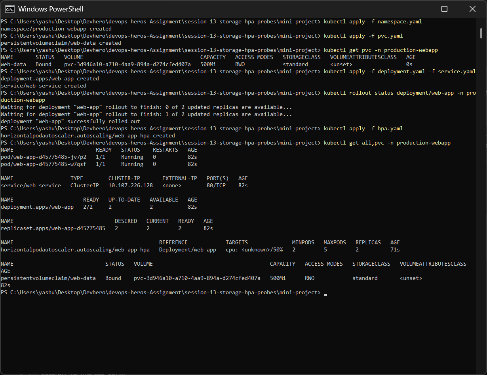

- The PVC `web-data` is `Bound` immediately to a dynamically created PV (`pvc-3d946a10...`).
- The rollout waited until `2 of 2` replicas were available. The startup and readiness probes had to pass first.
- `kubectl get all,pvc` shows 2 running pods, the Service, the Deployment, the ReplicaSet, the HPA (min 2 / max 5) and the bound PVC.

### 3.2 Verify storage persistence

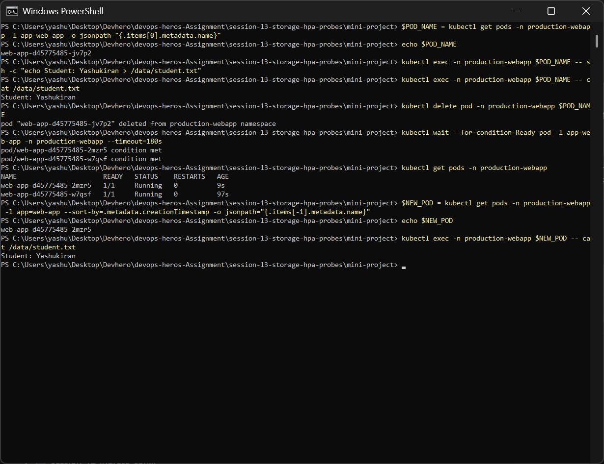

1. Wrote `Student: Yashukiran` into `/data/student.txt` from pod `web-app-...-jv7p2`.
2. **Deleted that pod.** The ReplicaSet immediately created a replacement, `web-app-...-2mzr5` (age 9s).
3. Read the file from the **new** pod: `Student: Yashukiran` is still there.

The data lives on the PersistentVolume, not inside the Pod, so it survives Pods being killed and rescheduled. Both replicas mount the same `web-data` claim. That works on Minikube because it has a single node. With `ReadWriteOnce`, Pods on *different* nodes could not share it (you'd need `ReadWriteMany` storage like NFS/EFS).

### 3.3 Verify the Service and the probes

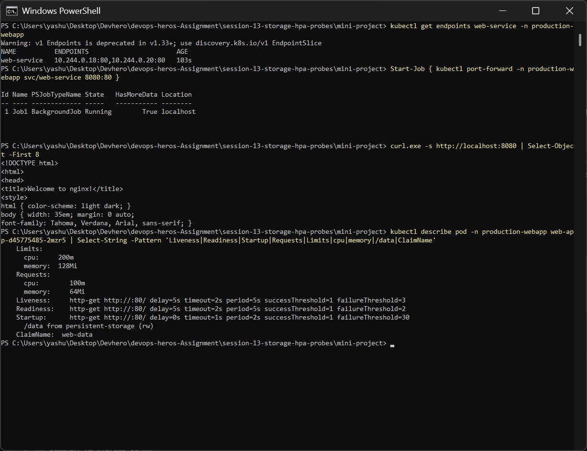

- `kubectl get endpoints web-service` lists both pod IPs (`10.244.0.18:80, 10.244.0.20:80`). A pod is only added here once its **readiness** probe passes.
- Port-forwarded the service to `localhost:8080`. `curl` returns the nginx **"Welcome to nginx!"** page, so traffic flows Service → Pod.
- `kubectl describe pod` confirms all three probes plus the resources and the volume:

| Probe | Config (from describe) | Question it answers | On failure |
|---|---|---|---|
| **Startup** | `http-get :80/ period=2s failureThreshold=30` | Has the app finished starting? (up to 60s allowed) | Container restarted. Liveness/readiness don't run until it passes. |
| **Readiness** | `http-get :80/ delay=5s period=5s failureThreshold=2` | Can this pod receive traffic right now? | Pod removed from Service endpoints (**not** restarted). |
| **Liveness** | `http-get :80/ delay=5s period=5s failureThreshold=3` | Is the container still healthy? | kubelet **restarts** the container. |

### 3.4 HPA autoscaling under load

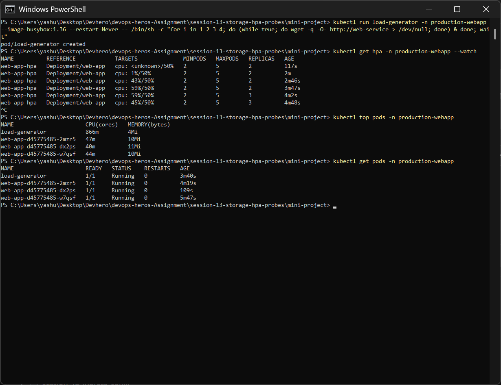

- Started a busybox load generator hitting `http://web-service` (same namespace, so the short DNS name works).
- CPU rose `1% → 43% → 59%`. At 59% (> 50%) the HPA scaled from **2 → 3** replicas: ceil(2 × 59/50) = 3.
- With 3 pods sharing the load, CPU dropped to **45%**, below target, so it stopped scaling there.
- `kubectl top pods` confirms each web-app pod is around 40–47m (about 45% of its 100m request).
- At 43% the HPA did **not** scale. That's below target, and the HPA also ignores changes within a ~10% tolerance of the target, so it doesn't react to small noise.

---

## What I Learned

**Storage**
1. Container storage is temporary. Pick the volume type by how long the data needs to live: `emptyDir` (Pod lifetime), `hostPath` (node lifetime), PV/PVC (independent of Pods).
2. I proved it: after deleting the Pod, the emptyDir data was gone, while the hostPath and PVC data survived.
3. PV vs PVC is a separation of concerns. Admins/provisioners supply storage (PV), developers request it (PVC), and Pods only reference the claim.
4. A PVC without `storageClassName` uses the **default StorageClass**, so it will be dynamically provisioned instead of binding to a manual PV. Use `storageClassName: ""` for static binding.
5. **Dynamic provisioning** through a StorageClass is how real clusters work: create a PVC and the disk is created automatically. The `reclaimPolicy` decides whether it is deleted along with the PVC.
6. `ReadWriteOnce` means one *node*, not one pod. Multi-node sharing needs `ReadWriteMany`.

**HPA**

7. HPA needs **metrics-server** and **CPU requests** on the container. Without them the target shows `<unknown>`.
8. Utilization is a percentage of the **request** (not the limit): 60m used / 100m requested = 60%.
9. `desiredReplicas = ceil(current × currentUtil / targetUtil)`, which matches what I watched (1→2→3 and 2→3).
10. Scale-up is fast, but scale-down waits for a **5-minute stabilization window** to avoid flapping.
11. `kubectl describe hpa` is the best place to debug: the conditions and `SuccessfulRescale`/`FailedGetResourceMetric` events explain every decision.

**Probes**

12. **Startup** protects slow-starting apps, **readiness** controls traffic (endpoints), and **liveness** controls restarts. Readiness failure ≠ restart.
13. Rollouts only finish once new pods pass their probes, which is what makes probes important for zero-downtime deployments.

**Production readiness**

14. A production-ready workload combines all of these: its own namespace, persistent storage, resource requests/limits, health probes, a Service for stable networking, and an HPA for elasticity.

---

## Cleanup

```bash
kubectl delete -f 01-volumes/ -f 02-persistent-storage/ -f 03-storageclass/
kubectl delete -f 04-hpa/
kubectl delete pod load-generator
kubectl delete namespace production-webapp   # removes the whole mini project
```
