# Session 14 – Kubernetes Troubleshooting

Homework for Session 14 of DevOps Heroes. Everything was run on a local **Minikube** cluster (Kubernetes v1.37, containerd) using the files in [`session-14-kubernetes-troubleshooting`](../../session-14-kubernetes-troubleshooting). Course files didn't cover three of the issues (ContainerCreating, Configuration error, Pod networking), so I wrote small broken/fixed manifests for those in [`manifests/`](manifests).

| Task | What I did | Screenshots |
|---|---|---|
| 1 | Hands-on practice with `get`, `describe`, `logs`, `exec`, `events`, `explain`, `top`, `get -o wide` | `task1-*.png` |
| 2 | Broke and fixed 9 common problems: CrashLoopBackOff, ErrImagePull, ImagePullBackOff, Pending, ContainerCreating, Configuration issue, Service connectivity, DNS, Pod networking | `task2-*.png` |
| 3 | Troubleshooting mini project: deploy, a broken image, the Service selector challenge, the troubleshooting table and the README questions | `task3-*.png` |

**The method I followed for every problem:**

```text
GET  →  DESCRIBE  →  EVENTS  →  LOGS  →  EXEC  →  TEST  →  FIX  →  VERIFY
(what?)  (why?)     (history)  (app)    (inside) (network)
```

---

## Task 1 – Kubernetes Troubleshooting Commands

### `kubectl get` and `get -o wide`

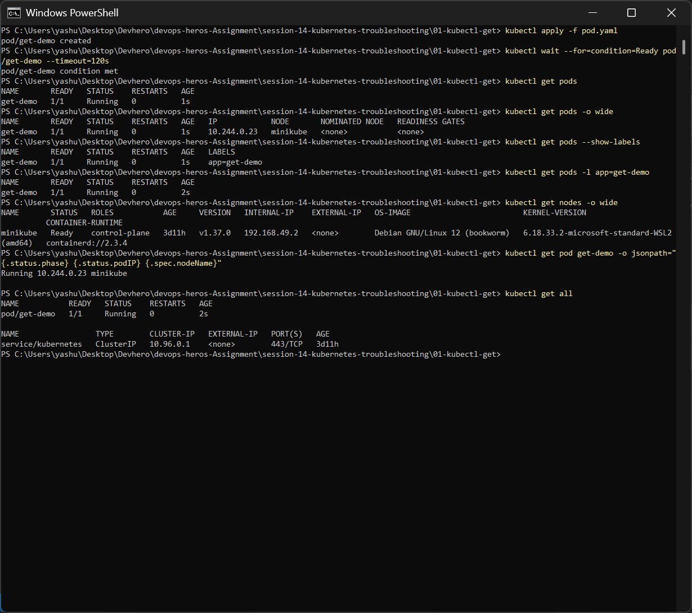

- `get pods` gives a quick **status** view: READY, STATUS, RESTARTS, AGE.
- `-o wide` adds the **Pod IP and Node**, which is useful for networking problems and for spotting which node a pod is on.
- `--show-labels` and `-l app=...` show and filter by labels. This is how Services and Deployments find pods.
- `-o jsonpath` pulls out a single field (phase, IP, node) for scripting.

### `kubectl describe`

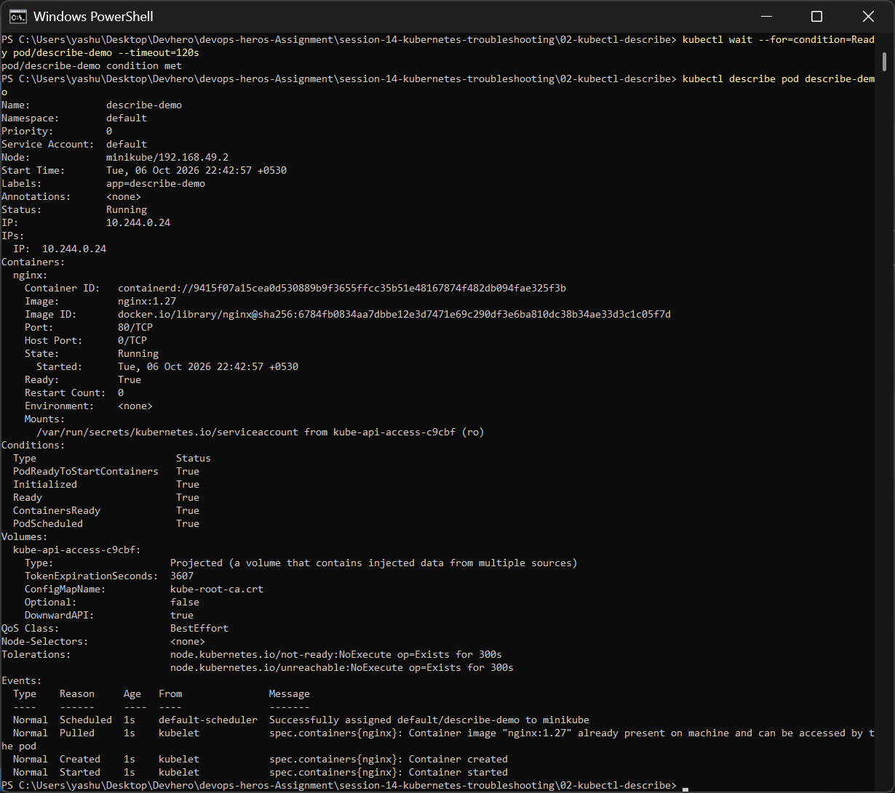

`describe` is the most useful single command. It shows the node, IP, image, container **State / Last State / Exit Code / Restart Count**, mounts, conditions, QoS class, tolerations, and the **Events** at the bottom: Scheduled → Pulled → Created → Started.

### `kubectl events`

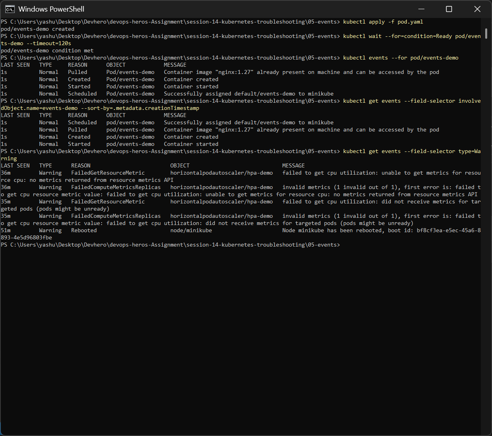

- `kubectl events --for pod/<name>` shows the history of one object.
- `kubectl get events --field-selector type=Warning` shows only problems across the namespace. It even surfaced old HPA warnings from the last session and a node `Rebooted` event.
- Events only last about 1 hour, so check them soon after a problem happens.

### `kubectl logs` and `kubectl exec`

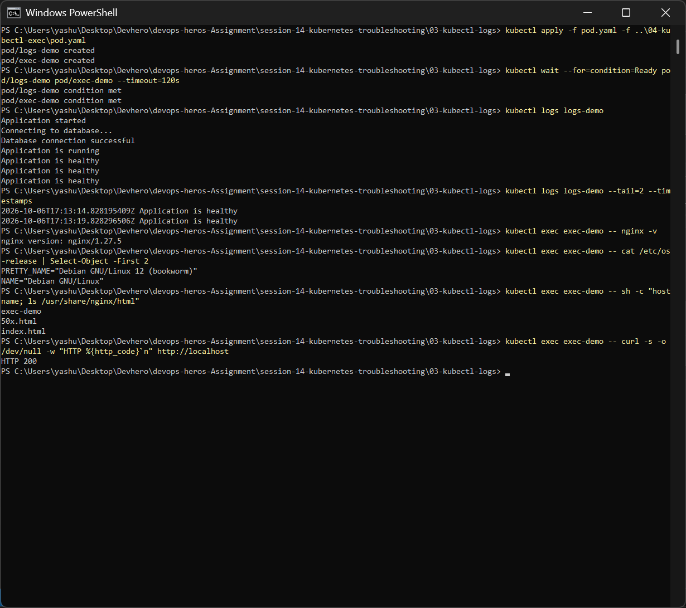

- `logs` shows the app's stdout/stderr. `--tail=2 --timestamps` shows just the latest lines, with times.
- `exec` runs commands **inside** the container: check versions (`nginx -v`), the OS, files (`ls /usr/share/nginx/html`), and test the app locally with `curl localhost` → `HTTP 200`.

### `kubectl explain` and `kubectl top`

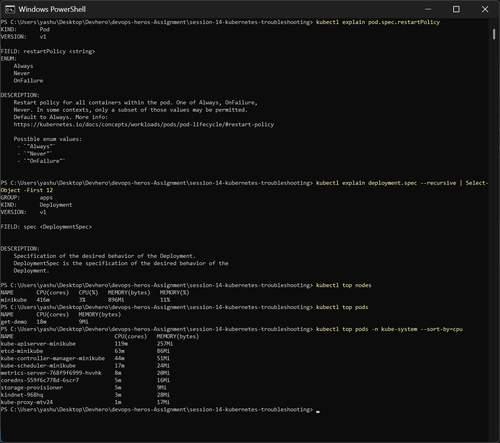

- `explain` is built-in API documentation, e.g. `pod.spec.restartPolicy` = `Always | OnFailure | Never`. It helps you write YAML correctly without opening a browser.
- `top nodes` / `top pods` show real CPU/memory usage (needs metrics-server). Useful for OOMKilled pods, HPA problems, or finding noisy pods (`--sort-by=cpu`).

---

## Task 2 – Troubleshooting Common Issues

### 2.1 CrashLoopBackOff

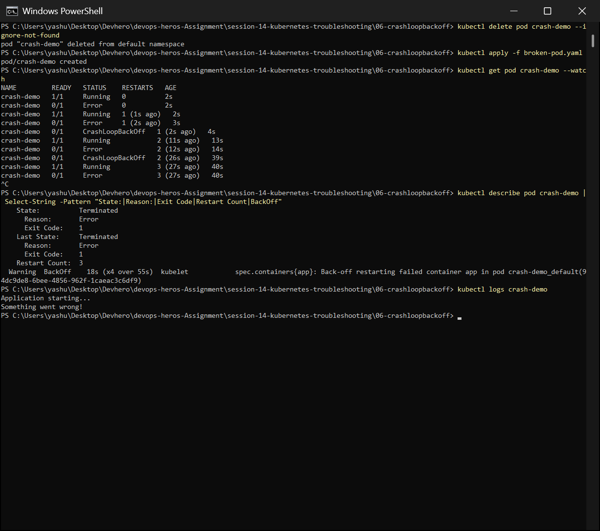

| Step | Result |
|---|---|
| **Identify** | `get --watch` shows a loop: `Running → Error → CrashLoopBackOff`, with RESTARTS going up 1, 2, 3 and the wait between restarts getting longer each time (back-off). |
| **Investigate** | `describe` shows `State: Terminated, Reason: Error, Exit Code: 1`, `Restart Count: 3` and the event `Back-off restarting failed container`. |
| **Root cause** | `logs` shows `Something went wrong!`. The container command ends with `exit 1`, so the app itself exits with an error. Kubernetes keeps restarting it (`restartPolicy: Always`). |
| **Fix** | Changed the command so the app keeps running (`sleep 3600`), deleted the pod and applied `fixed-pod.yaml`. |
| **Verify** | `1/1 Running`, `RESTARTS 0`. The log says `Application is healthy`. |

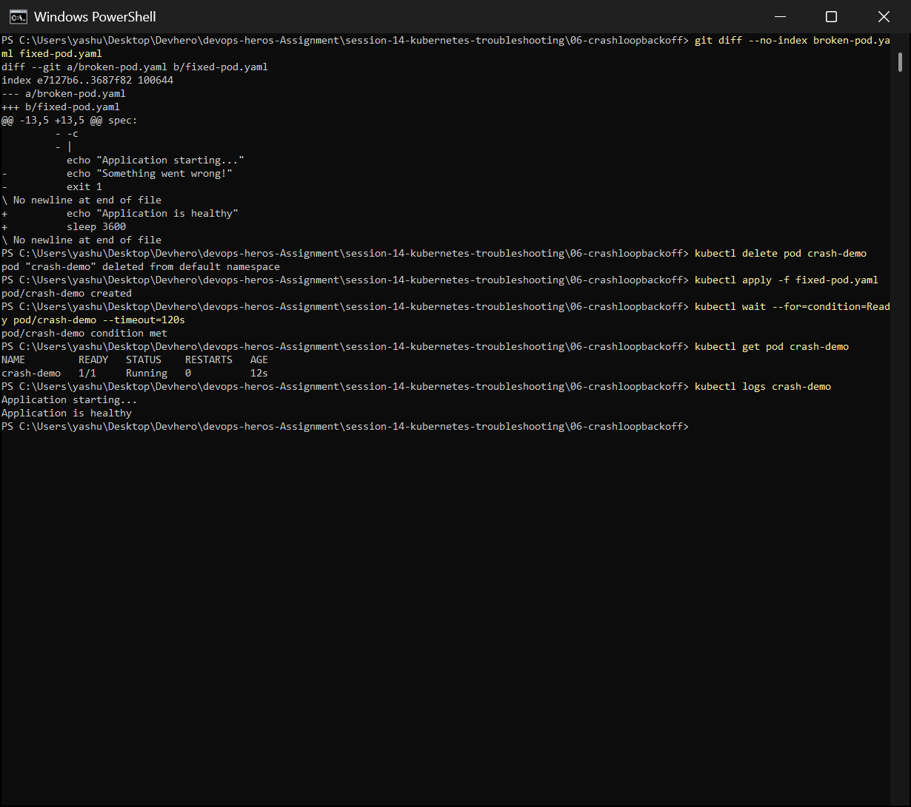

> Note: `kubectl logs --previous` (the usual way to see the crashed instance's logs) kept failing on this minikube/containerd setup because the previous log file had already been rotated. Running `kubectl logs crash-demo` while the container was in the `Error` state still showed the crash output.

### 2.2 ErrImagePull and ImagePullBackOff

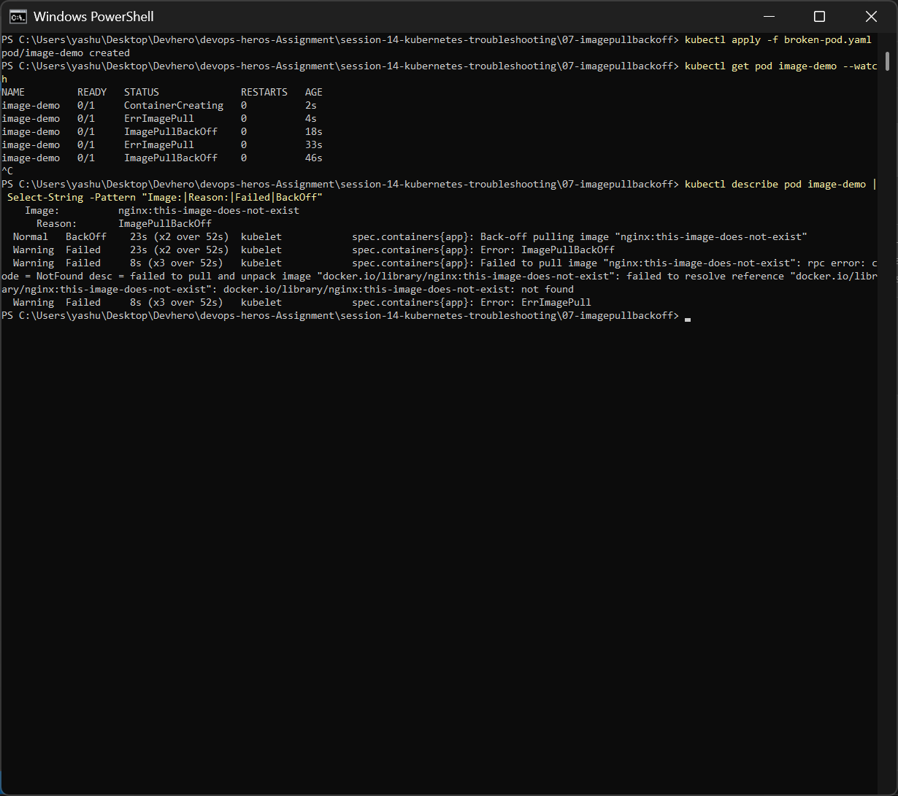

| Step | Result |
|---|---|
| **Identify** | The status cycles `ContainerCreating → ErrImagePull → ImagePullBackOff → ErrImagePull…` |
| **Investigate** | `describe` events: `Failed to pull image "nginx:this-image-does-not-exist" … not found`. |
| **Root cause** | **ErrImagePull** = the pull attempt failed. **ImagePullBackOff** = Kubernetes is *waiting* before trying again (the wait grows each time). The tag doesn't exist on Docker Hub. |
| **Fix** | Use a real tag (`nginx:1.27`). I deleted the pod and applied `fixed-pod.yaml`. (Image is one of the few pod fields you can change in place, so `kubectl set image` also works; I used that in Task 3.) |
| **Verify** | `1/1 Running`. The events show the old failed pulls, then `Pulled / Created / Started`. |

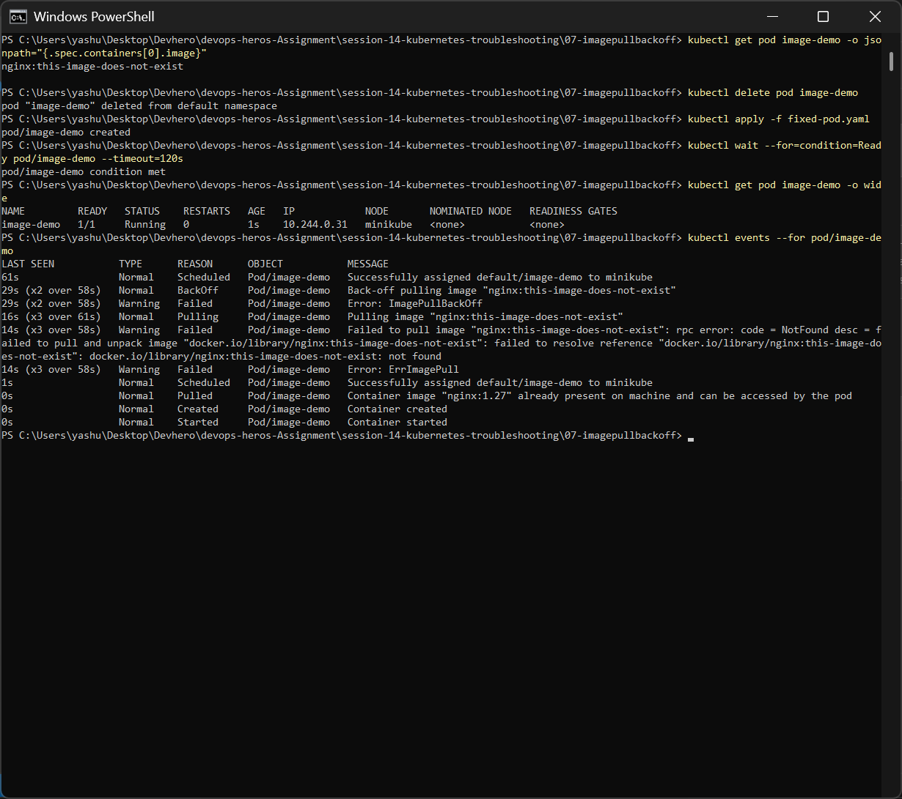

Other common causes: a typo in the image name, a private registry without `imagePullSecrets`, Docker Hub rate limits, or no internet access from the node.

### 2.3 Pending

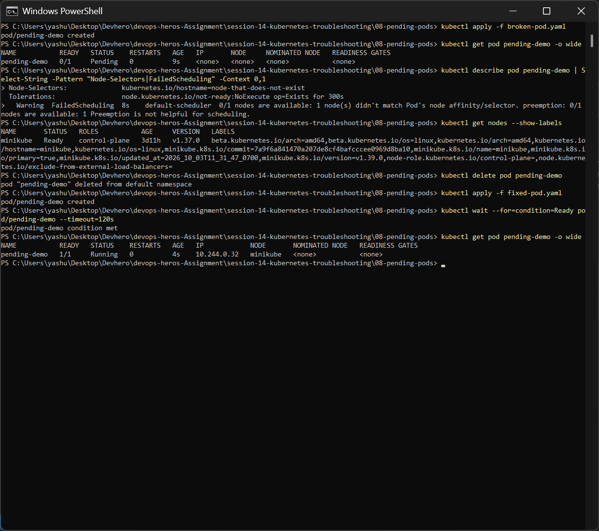

| Step | Result |
|---|---|
| **Identify** | `STATUS Pending`, with **no IP and no NODE**. The pod was never scheduled. |
| **Investigate** | `describe` → `Node-Selectors: kubernetes.io/hostname=node-that-does-not-exist` and `FailedScheduling: 0/1 nodes are available: 1 node(s) didn't match Pod's node affinity/selector`. |
| **Root cause** | `get nodes --show-labels` shows the only node is `kubernetes.io/hostname=minikube`. No node matches the selector. |
| **Fix** | Removed the bad `nodeSelector` (`fixed-pod.yaml`). |
| **Verify** | `Running` on node `minikube` with IP `10.244.0.32`. |

Other Pending causes: not enough CPU/memory on any node for the pod's requests, taints without tolerations, or an unbound PVC.

### 2.4 ContainerCreating (stuck)

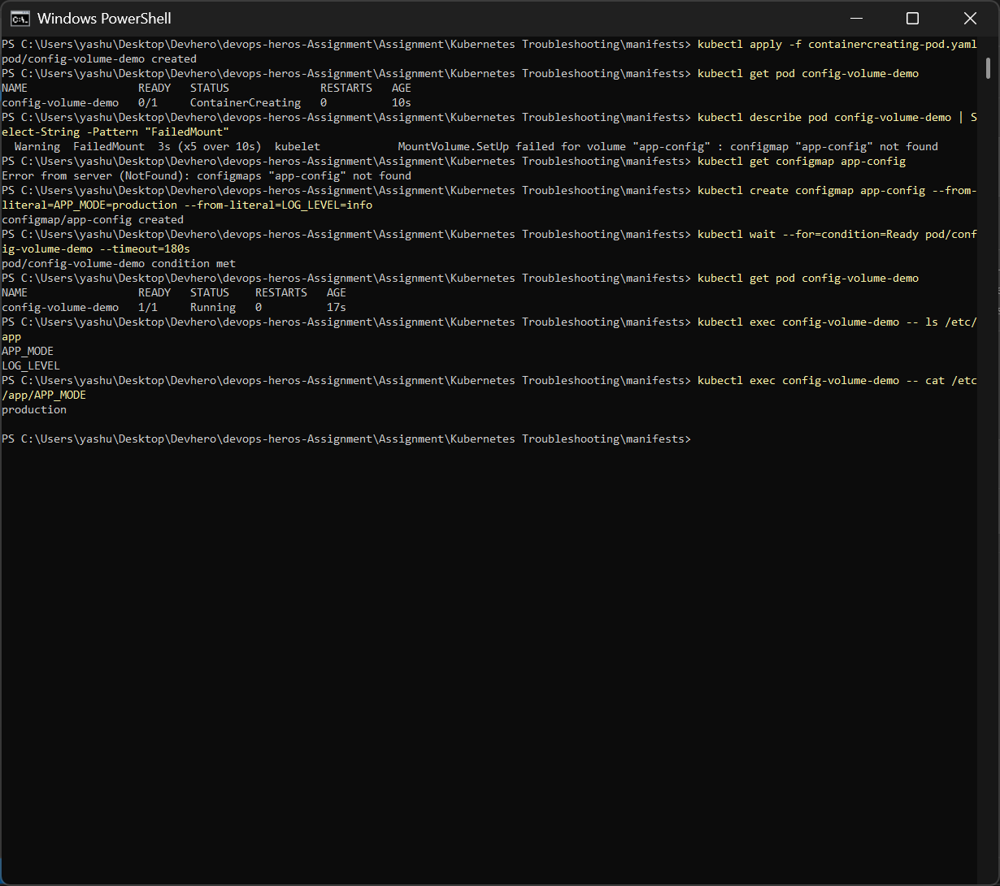

| Step | Result |
|---|---|
| **Identify** | The pod was stuck in `ContainerCreating`. The image was fine, but the container never started. |
| **Investigate** | `describe` → `FailedMount: MountVolume.SetUp failed for volume "app-config" : configmap "app-config" not found` |
| **Root cause** | The pod mounts a ConfigMap volume that doesn't exist. The kubelet can't prepare the volume, so it never creates the container. |
| **Fix** | `kubectl create configmap app-config --from-literal=APP_MODE=production …` (no need to recreate the pod; the kubelet retries automatically). |
| **Verify** | `1/1 Running`. `/etc/app` contains `APP_MODE` and `LOG_LEVEL`, and `APP_MODE` = `production`. |

### 2.5 Configuration issue: CreateContainerConfigError

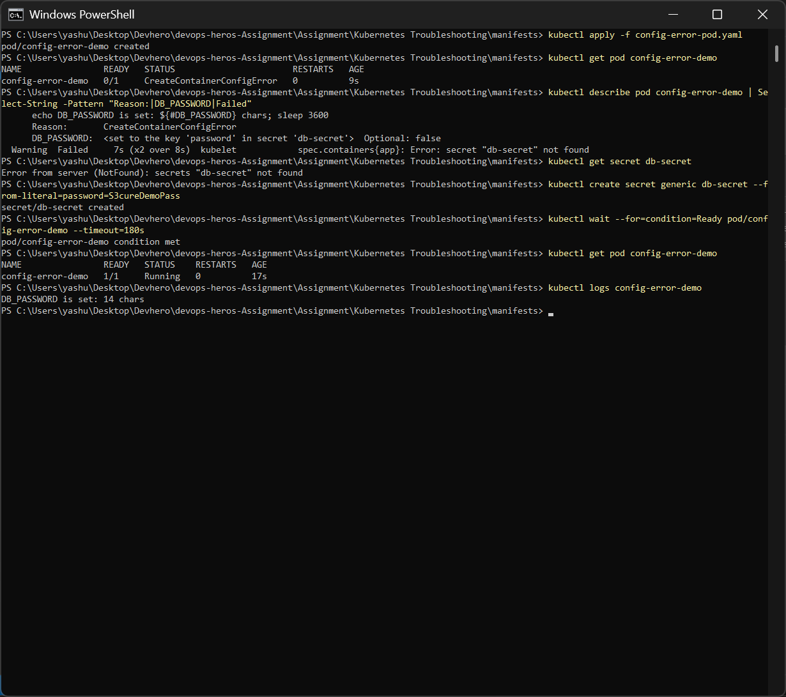

| Step | Result |
|---|---|
| **Identify** | `STATUS CreateContainerConfigError` |
| **Investigate** | `describe` → `DB_PASSWORD: <set to the key 'password' in secret 'db-secret'>` and `Error: secret "db-secret" not found` |
| **Root cause** | An environment variable points to a Secret that was never created. |
| **Fix** | `kubectl create secret generic db-secret --from-literal=password=…` |
| **Verify** | `Running`. The log prints `DB_PASSWORD is set: 14 chars`, which proves the value was injected without printing the secret itself. |

### 2.6 Service connectivity: Service with no endpoints

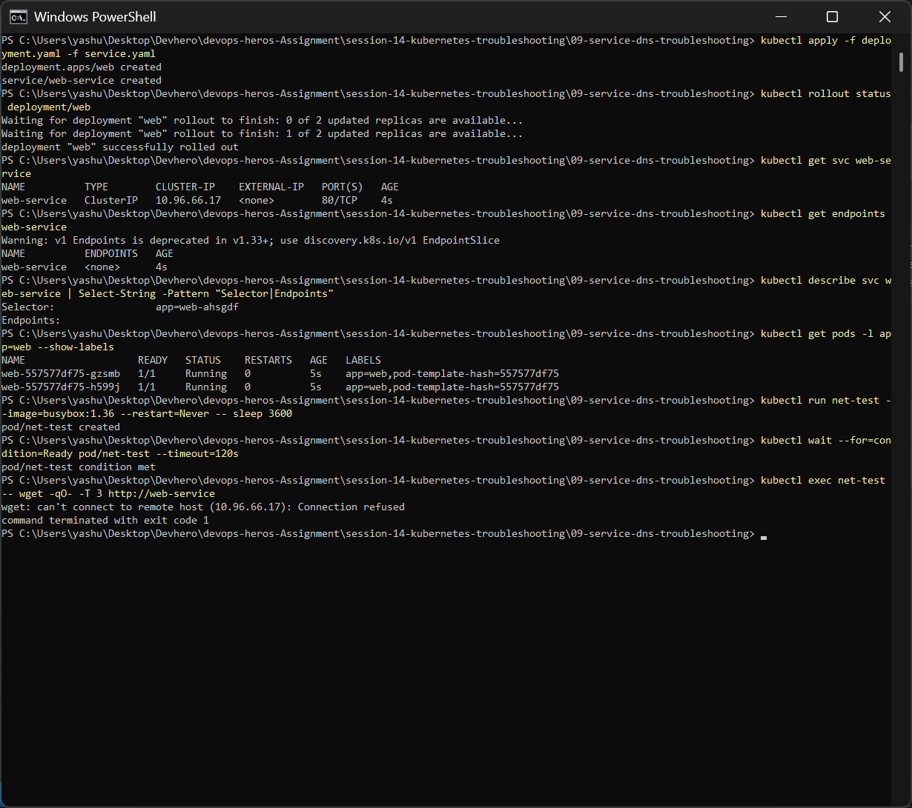

| Step | Result |
|---|---|
| **Identify** | From a test pod, `wget http://web-service` → `Connection refused`. |
| **Investigate** | The Service exists (ClusterIP `10.96.66.17`), but `get endpoints web-service` → **`<none>`**. |
| **Root cause** | `describe svc` shows `Selector: app=web-ahsgdf`, but the pods are labeled `app=web`. The selector matches no pods. |
| **Fix** | `kubectl set selector service web-service app=web` |
| **Verify** | Endpoints are now `10.244.0.35:80, 10.244.0.36:80`, and `wget` returns `Welcome to nginx!`. |

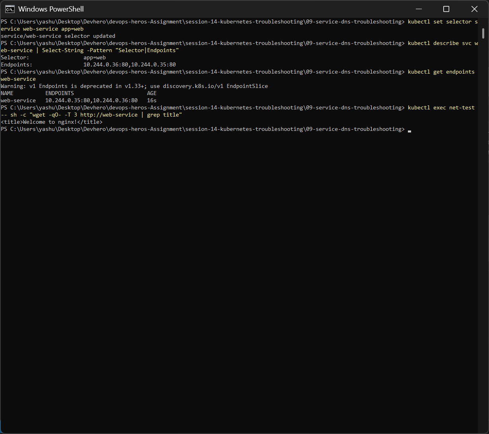

### 2.7 DNS issues

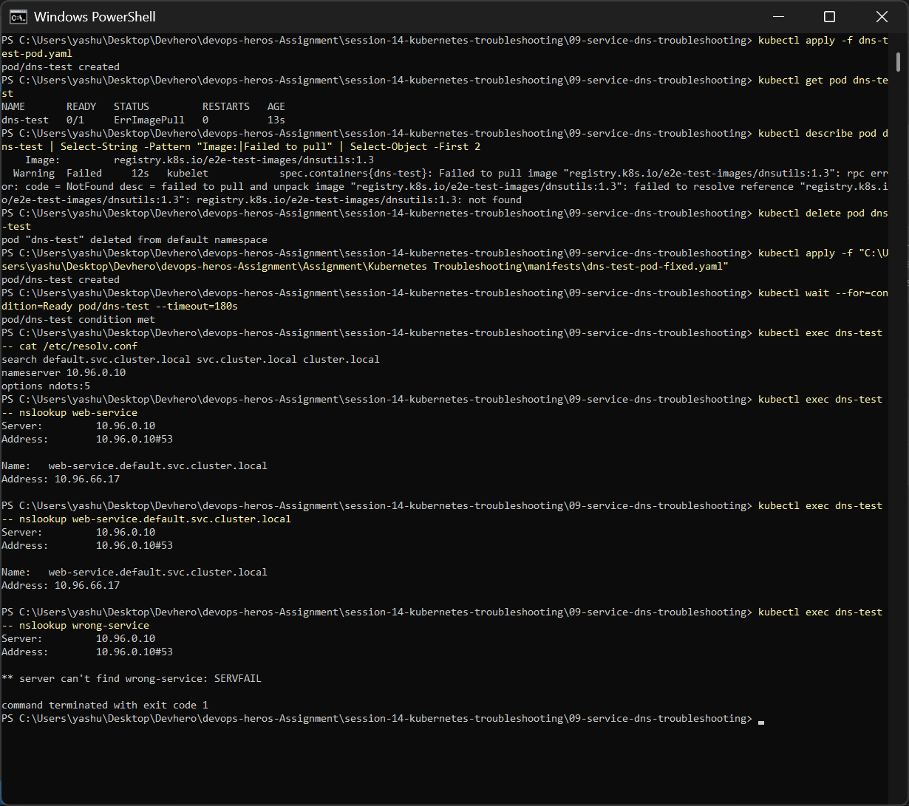

1. **A real bug in the course files:** `dns-test-pod.yaml` uses `registry.k8s.io/e2e-test-images/dnsutils:1.3`. That tag **doesn't exist** (`ErrImagePull … not found`). The correct image is `jessie-dnsutils:1.3`, which I put in [`manifests/dns-test-pod-fixed.yaml`](manifests/dns-test-pod-fixed.yaml).
2. `/etc/resolv.conf` in every pod points to `nameserver 10.96.0.10` (the `kube-dns` Service), with search domains `default.svc.cluster.local svc.cluster.local cluster.local`. That's why the short name `web-service` works.
3. `nslookup web-service` and the FQDN `web-service.default.svc.cluster.local` both resolve to the ClusterIP `10.96.66.17`.
4. `nslookup wrong-service` → **SERVFAIL**. The name doesn't exist (a typo, or the Service is in a different namespace).

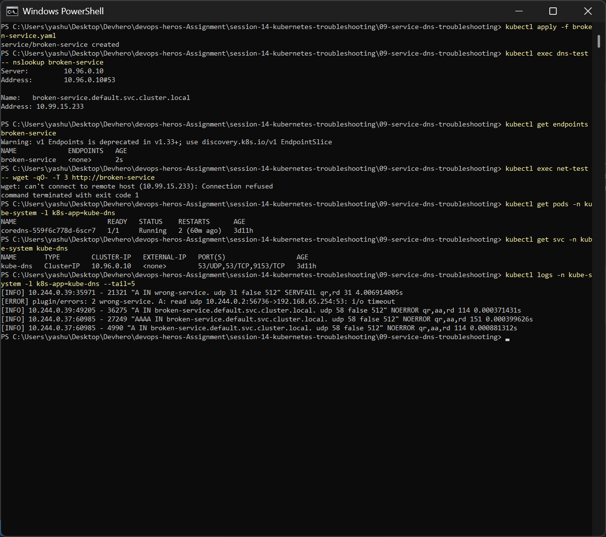

- **Important lesson:** `broken-service` **resolves in DNS** (`10.99.15.233`) but still gets `Connection refused`, because it has **no endpoints**. DNS working ≠ the Service working. Always check endpoints too.
- To check DNS itself: the CoreDNS pod is `Running`, the `kube-dns` Service is on `10.96.0.10:53`, and the CoreDNS **logs** show every query (`NOERROR` for `broken-service`, `SERVFAIL` for `wrong-service`).

### 2.8 Pod networking: wrong targetPort

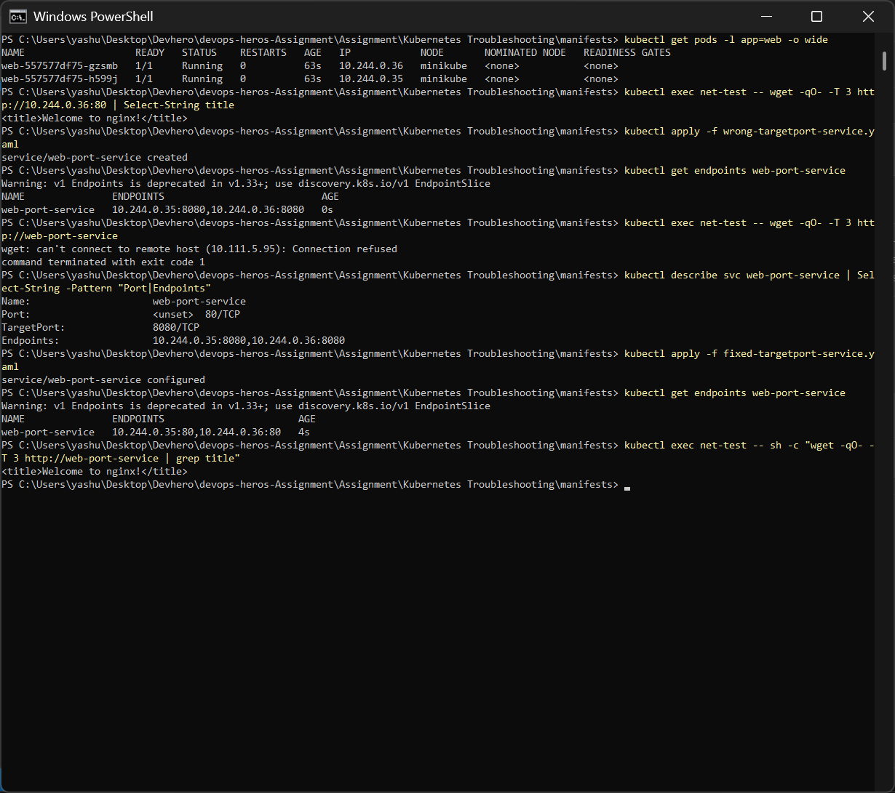

| Step | Result |
|---|---|
| **Identify** | `wget http://web-port-service` → `Connection refused`, even though **endpoints exist**. |
| **Investigate** | Pod-to-pod networking itself works: `wget http://10.244.0.36:80` straight to the pod IP returns nginx. `describe svc` shows `TargetPort: 8080/TCP` and endpoints `…:8080`. |
| **Root cause** | nginx listens on **80**, but the Service forwards to **8080**. |
| **Fix** | `targetPort: 80` ([`fixed-targetport-service.yaml`](manifests/fixed-targetport-service.yaml)). |
| **Verify** | Endpoints now `…:80`, and `wget` returns `Welcome to nginx!`. |

How to narrow down a network problem: test **pod IP** first (pod networking/CNI), then the **Service ClusterIP/name** (selector, ports, kube-proxy), then **DNS**.

---

## Task 3 – Mini Project: Troubleshooting Challenge

### 3.1 Deploy and check the application

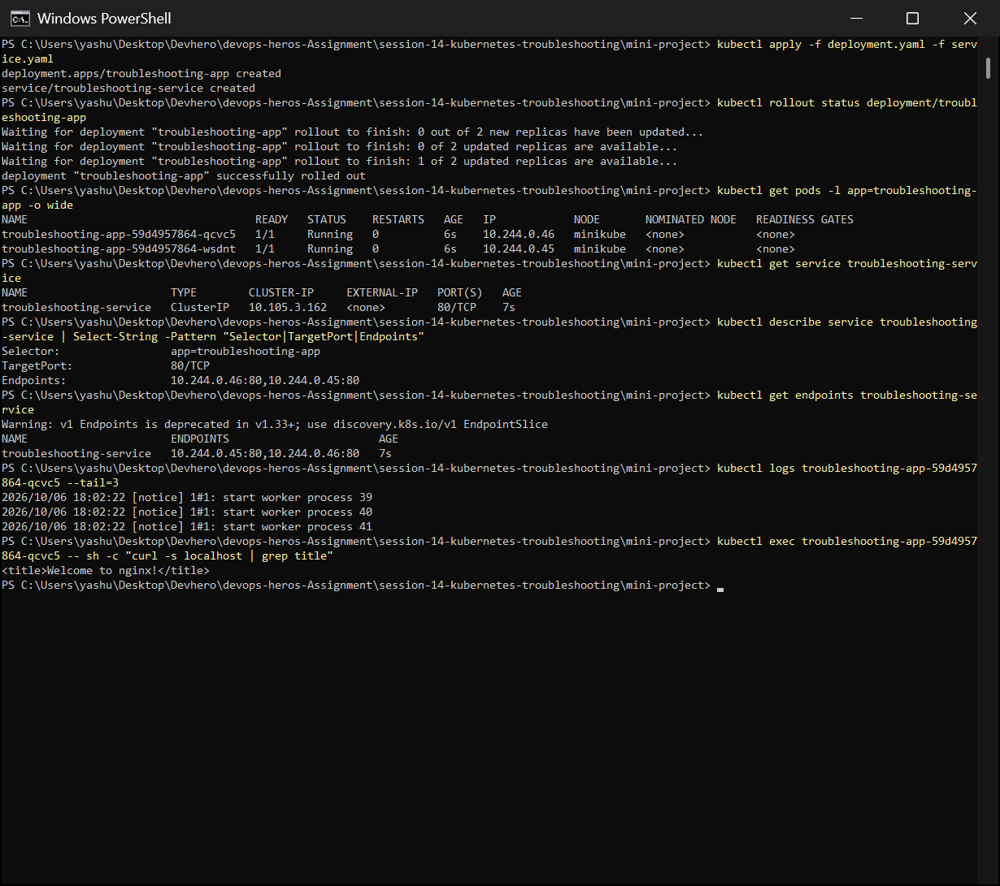

The Deployment rolled out 2/2 replicas. The Service selector `app=troubleshooting-app`, TargetPort `80/TCP`, endpoints `10.244.0.45:80, 10.244.0.46:80`. The nginx logs are clean, and `curl localhost` inside the pod returns `Welcome to nginx!`.

### 3.2 Broken pod (image problem)

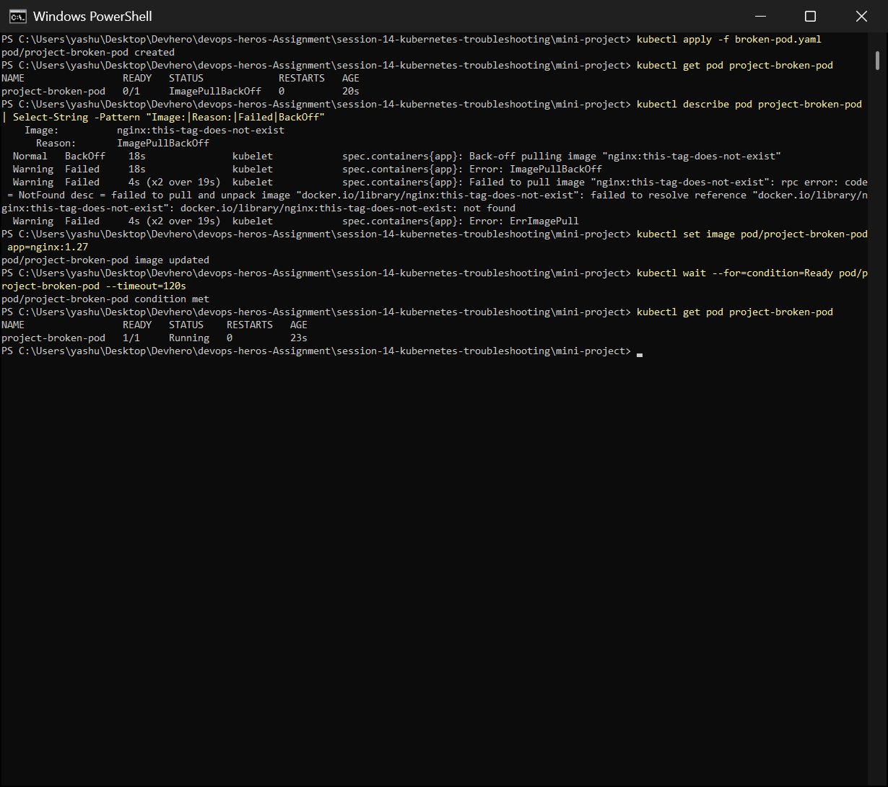

**Q1. What is the Pod status?** `ImagePullBackOff` (`0/1`, switching with `ErrImagePull`).
**Q2. What is the actual error?** `Failed to pull image "nginx:this-tag-does-not-exist": … not found`.
**Q3. Which command helped find the reason?** `kubectl describe pod project-broken-pod`, in the **Events** section.
**Q4. What is wrong with the image?** The **tag** `this-tag-does-not-exist` isn't published for `nginx` on Docker Hub.
**Q5. How would you fix it?** Use a valid tag. I ran `kubectl set image pod/project-broken-pod app=nginx:1.27` (the image is one of the few pod fields you can change in place), and the pod went to `1/1 Running`. In Git, fix the YAML so it doesn't break again.

### 3.3 Service selector challenge

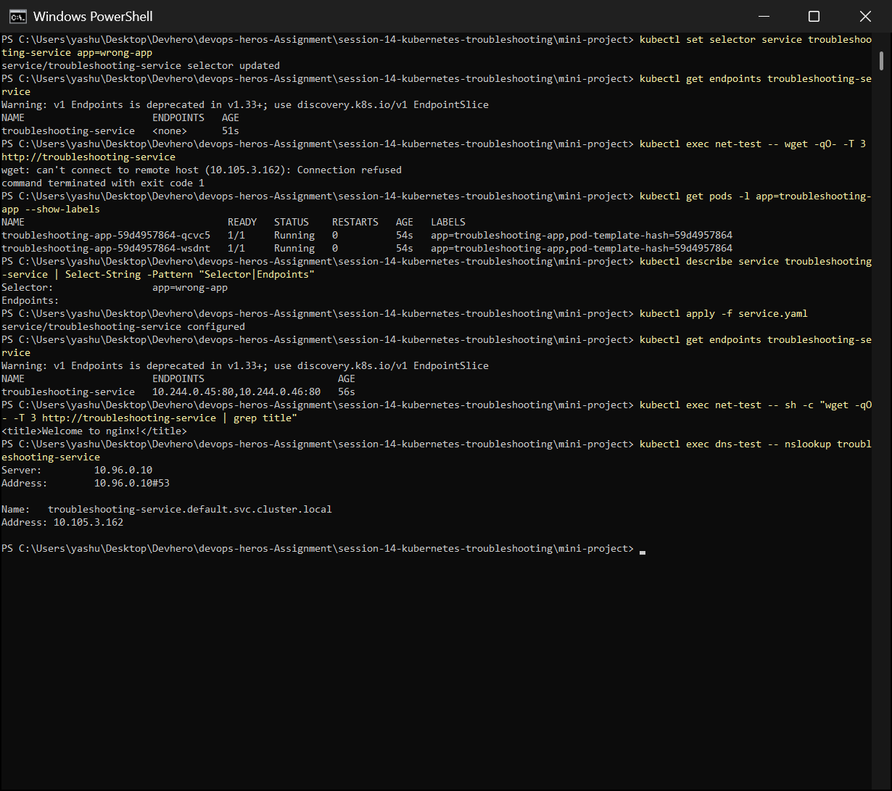

1. **Broke it:** `kubectl set selector service troubleshooting-service app=wrong-app`.
2. **Symptom:** endpoints became `<none>`, and `wget` → `Connection refused`.
3. **Root cause:** `get pods --show-labels` shows `app=troubleshooting-app`, but `describe service` shows `Selector: app=wrong-app`. They don't match.
4. **Fix:** re-applied the correct `service.yaml`.
5. **Verify:** the endpoints are back (`10.244.0.45:80, 10.244.0.46:80`), `wget` returns `Welcome to nginx!`, and `nslookup troubleshooting-service` resolves to `10.105.3.162`.

### 3.4 Troubleshooting table

| Problem | What I Saw | Command I Used | Root Cause | Fix |
| :--- | :--- | :--- | :--- | :--- |
| **Broken Pod** (CrashLoopBackOff) | `Error` → `CrashLoopBackOff`, restarts rising | `get -w`, `describe`, `logs` | Container command runs `exit 1` | Fix the command so the app keeps running |
| **Service Problem** | `Connection refused`, endpoints `<none>` | `get endpoints`, `describe svc`, `get pods --show-labels` | Service selector `app=wrong-app` ≠ pod label `app=troubleshooting-app` | Correct the selector / re-apply `service.yaml` |
| **Image Problem** | `ErrImagePull` / `ImagePullBackOff` | `describe pod` (Events) | Image tag doesn't exist | `kubectl set image … nginx:1.27` / fix the YAML |
| Pending | `Pending`, no node/IP | `describe pod`, `get nodes --show-labels` | `nodeSelector` matches no node | Remove/correct the `nodeSelector` |
| ContainerCreating | Stuck `ContainerCreating` | `describe pod` | ConfigMap volume missing (`FailedMount`) | Create the ConfigMap |
| Config issue | `CreateContainerConfigError` | `describe pod` | Secret referenced by an env var missing | Create the Secret |
| DNS test image | `ErrImagePull` on `dnsutils:1.3` | `describe pod` | Wrong image name in the course file | Use `jessie-dnsutils:1.3` |
| Wrong targetPort | `Connection refused` *with* endpoints | `describe svc`, `wget` to pod IP | `targetPort: 8080`, but the app listens on 80 | `targetPort: 80` |

### 3.5 README questions

1. **What does `kubectl get` tell us?** A quick summary of resources and their current state: whether a pod is Running, how many containers are ready, how many restarts, and its age (with `-o wide`, also IP and node). It answers *"what is the state right now?"*
2. **Difference between `get` and `describe`?** `get` is a one-line summary per object. `describe` is a detailed report of one object: its spec, container states with exit codes and reasons, conditions, and the **events** that explain *why* it is in that state.
3. **Why use `kubectl logs`?** To read the application's own output (stdout/stderr). It's how you find app-level errors: crashes, bad config, failed DB connections. Kubernetes only knows *that* the container exited; the logs say *why*.
4. **When to use `kubectl exec`?** When you need to look inside a running container: check files and config, environment variables, run `curl localhost` to test the app, or test DNS/network from inside the cluster.
5. **What does `CrashLoopBackOff` mean?** The container keeps starting and then crashing. Kubernetes restarts it, and the wait between restarts grows (10s, 20s, 40s… up to 5 min). The cause is usually inside the app: a bad command, missing config, or a failing liveness probe.
6. **What does `ImagePullBackOff` mean?** The kubelet couldn't pull the container image (`ErrImagePull`) and is now waiting before it retries. Causes: a wrong name or tag, a private registry without credentials, rate limits, or no network.
7. **Why can a Pod stay `Pending`?** The scheduler can't place it on any node: no node matches its `nodeSelector`/affinity, there isn't enough CPU or memory for its requests, it has taints without tolerations, or its PVC is unbound. `describe` shows a `FailedScheduling` event.
8. **Why can a Service have no endpoints?** Its selector matches no pods (wrong label), the matching pods aren't **Ready** (failing readiness probe), or there are simply no pods running.
9. **Relationship between a Service selector and Pod labels?** The Service picks its backends purely by label matching. Every Ready pod whose labels match the selector is added to the Service's endpoints. If even one character is different, the Service has nowhere to send traffic.
10. **What is Kubernetes DNS?** CoreDNS, running in `kube-system` behind the `kube-dns` Service (`10.96.0.10`). It gives every Service a name like `<service>.<namespace>.svc.cluster.local`, so pods can find each other by name instead of IP. Each pod's `/etc/resolv.conf` points to it, with search domains that allow short names in the same namespace.

---

## What I Learned

1. **Never guess. Follow the order:** get → describe → events → logs → exec → test → fix → verify.
2. **Where a pod is stuck tells you the type of problem:**
   - `Pending` = scheduling (nodes, resources, selectors).
   - `ContainerCreating` / `CreateContainerConfigError` = the kubelet preparing the pod (volumes, ConfigMaps, Secrets).
   - `ErrImagePull` / `ImagePullBackOff` = the image registry.
   - `CrashLoopBackOff` = the application itself.
3. `describe` **Events** answer most problems. The exact error message (`not found`, `didn't match node selector`, `secret not found`) is almost always there.
4. Fix the **cause, not the symptom**. A missing ConfigMap or Secret can be created and the pod recovers by itself; a wrong image or selector has to be fixed in the spec.
5. For Service problems, check in layers: **pod IP → Service endpoints → selector/labels → ports (targetPort) → DNS**.
6. DNS resolving a Service name does **not** mean it works. A Service with no endpoints still has a DNS record and a ClusterIP.
7. Some pod fields can be changed in place (`image`); most (like `nodeSelector`) need the pod to be deleted and re-created, which is another reason to run pods through Deployments.
8. Even course material can be wrong (`dnsutils:1.3`). The same troubleshooting steps found it in seconds.

---

## Cleanup

```bash
kubectl delete pod crash-demo image-demo pending-demo config-volume-demo config-error-demo dns-test net-test project-broken-pod
kubectl delete deploy web troubleshooting-app
kubectl delete svc web-service broken-service web-port-service troubleshooting-service
kubectl delete configmap app-config && kubectl delete secret db-secret
```
