# Session 20 – Monitoring, Observability & GitOps

All three tasks were done hands-on, on a local **minikube** cluster:

| Task | What I built |
|---|---|
| **1. Monitoring** | **kube-prometheus-stack** (Prometheus, Alertmanager, Grafana, node-exporter, kube-state-metrics), a demo app (**podinfo**) with health probes, a **ServiceMonitor**, 5 custom **alert rules**, a load generator that makes alerts fire, and a **Grafana dashboard as code** |
| **2. Observability** | Documentation of metrics, logs and traces (below), with metrics and logs shown live on the demo app |
| **3. GitOps** | **Argo CD** watching this repository (`Assignment` branch). Scaling the app happened through a **git push**, and manual changes in the cluster were **self-healed** back to what Git says |

## Folder Structure

```text
Monitoring Observability GitOps/
├── README.md
├── monitoring/
│   ├── kps-values.yaml          # helm values for kube-prometheus-stack (slimmed for minikube)
│   ├── podinfo.yaml             # namespace, deployment (probes + limits), service, ServiceMonitor
│   ├── alert-rules.yaml         # PrometheusRule: down, replicas, error rate, CPU, memory
│   ├── load-generator.yaml      # traffic incl. ~10% HTTP 500s
│   └── grafana-dashboard.yaml   # dashboard JSON in a ConfigMap (loaded by the Grafana sidecar)
├── gitops/
│   ├── argocd-application.yaml  # the Argo CD Application (applied once, outside app/)
│   └── app/                     # <- the path Argo CD syncs from Git
│       ├── namespace.yaml
│       ├── deployment.yaml
│       └── service.yaml
└── screenshots/
```

---

## Task 1 – Monitoring demo

```bash
helm upgrade --install kps prometheus-community/kube-prometheus-stack \
  -n monitoring --create-namespace -f monitoring/kps-values.yaml --wait
kubectl apply -f monitoring/podinfo.yaml -f monitoring/alert-rules.yaml -f monitoring/grafana-dashboard.yaml
kubectl apply -f monitoring/load-generator.yaml
```

### 1. Install the monitoring stack
`kube-prometheus-stack` 92.1.0 via Helm:
- the Prometheus Operator
- Prometheus
- Alertmanager
- Grafana
- node-exporter
- kube-state-metrics
- the `monitoring.coreos.com` CRDs (`ServiceMonitor`, `PrometheusRule`, ...)

My first `helm install` failed because the Grafana images took longer than the 10-minute rollout deadline to download over my connection. Re-running `helm upgrade --install` with the images cached gave revision 2, `deployed`.

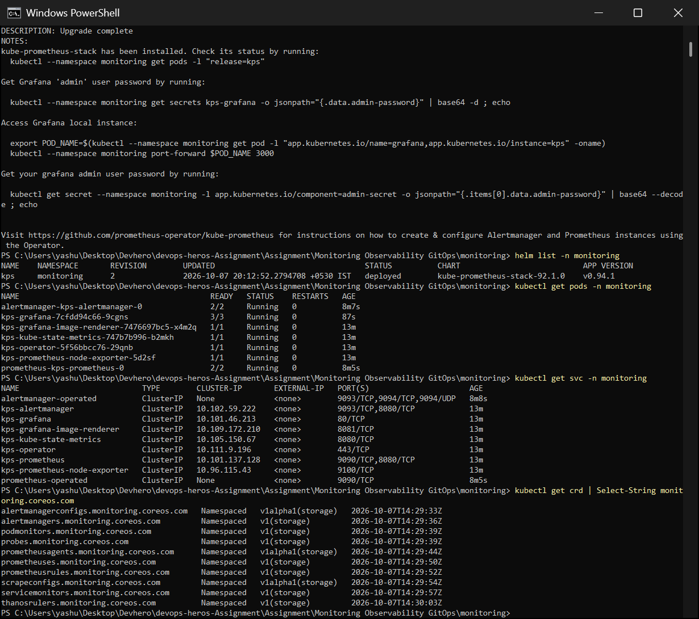

### 2. Demo app + application health
`podinfo` runs with 2 replicas:
- **liveness** probe on `/healthz` and **readiness** probe on `/readyz`; both return `{"status":"OK"}`
- CPU and memory **requests and limits**
- its own Prometheus metrics on `/metrics`, e.g. `http_requests_total{status="200"}`

A **ServiceMonitor** tells Prometheus to scrape it, and a **PrometheusRule** adds 5 alerts.

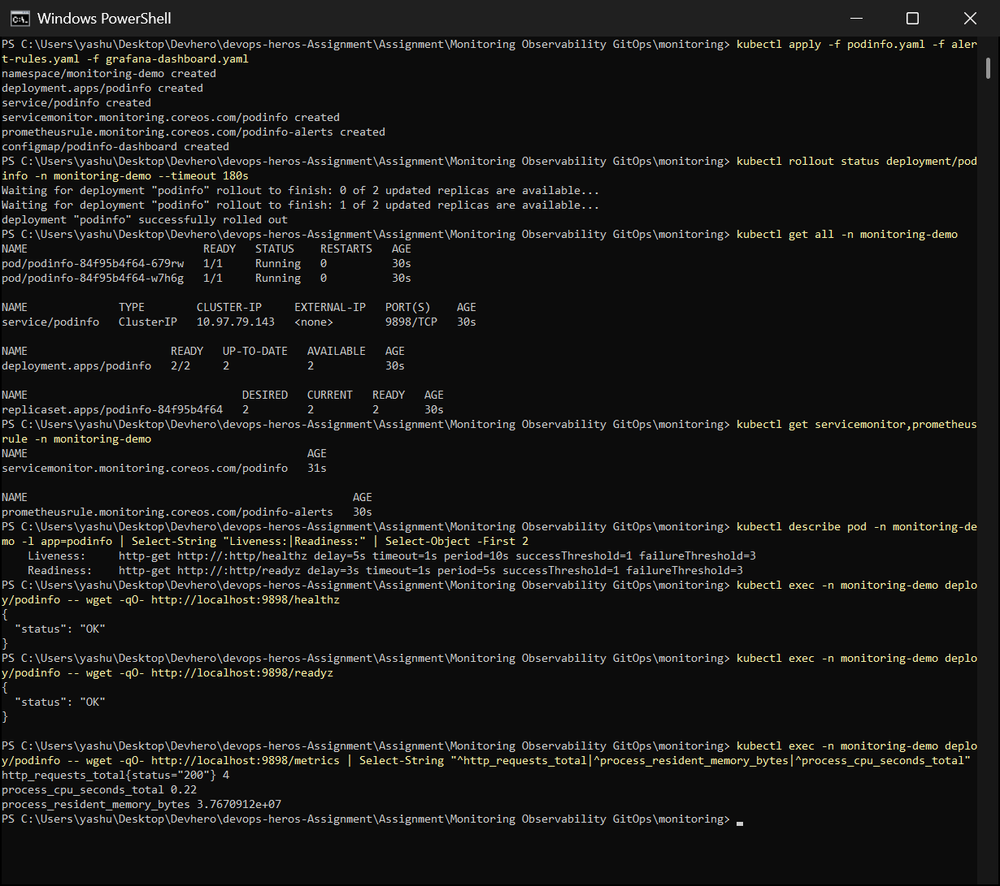

### 3. Logs
A load generator sends traffic: 90% normal requests and 10% `/status/500`.
- `kubectl logs` shows podinfo's **structured JSON logs**: one line per request, with URI, method, remote IP and user-agent.
- I filtered the logs to show only the failing `/status/500` requests, and the startup lines (version 6.9.2, port 9898).
- `kubectl get events` shows the cluster's own event log.

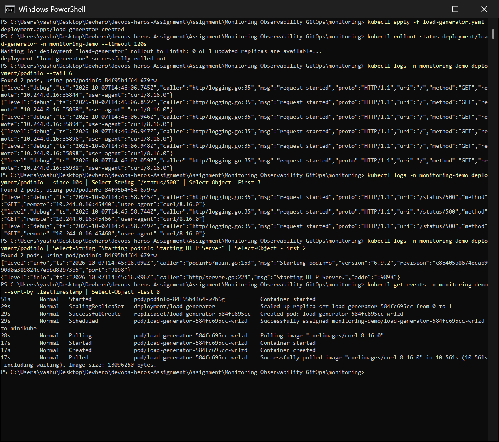

### 4. Metrics: CPU, memory, traffic (PromQL)
Queries run with `promtool` inside the Prometheus pod:

| Query | Result |
|---|---|
| `up{namespace='monitoring-demo'}` | both podinfo targets are `1` (healthy) |
| request rate by status | **~889 req/s `200`** and **~101 req/s `500`** |
| **CPU** per pod (`container_cpu_usage_seconds_total`) | ~0.18–0.21 cores per podinfo pod, ~0.40 for the load generator |
| **memory** per pod (`container_memory_working_set_bytes`) | ~30–37 MB per podinfo pod |
| **node CPU %** (node-exporter) | ~29 % |
| **node memory %** (node-exporter) | ~61 % |

`kubectl top pods/node` (metrics-server) shows the same numbers.

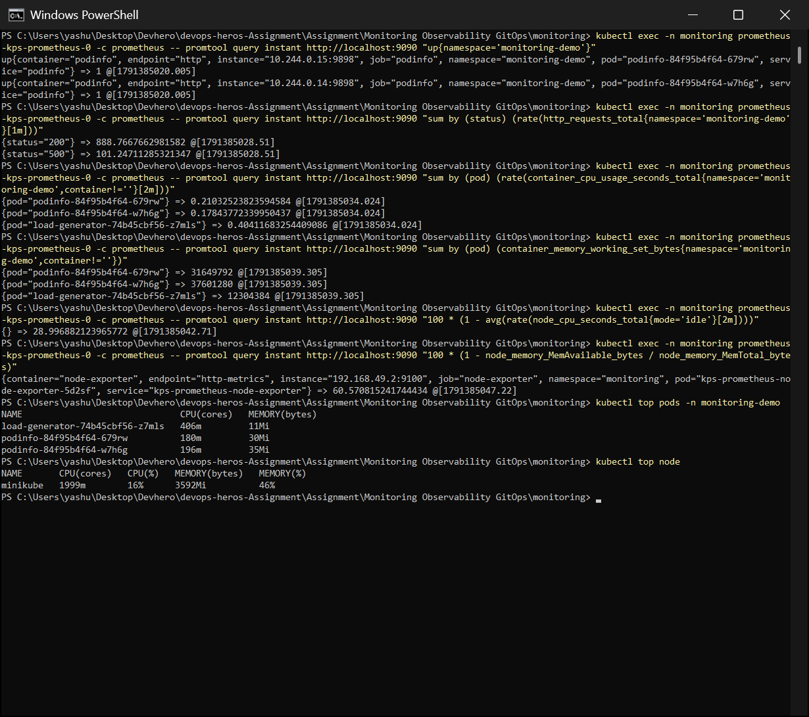

### 4b. Logs + live resource usage (after the load test)
With the load generator stopped, the last log lines show the app's own **health traffic**: the kubelet (`kube-probe/1.37`) calls `/healthz` (liveness) and `/readyz` (readiness) every few seconds, and **Prometheus** (`Prometheus/3.15.0`) scrapes `/metrics`. `kubectl top` shows the node (7% CPU, 45% memory) and per-pod CPU and memory for the demo app, the GitOps app (3 replicas) and the monitoring stack itself. Prometheus (~475 Mi) and Grafana (~674 Mi) are the biggest consumers.

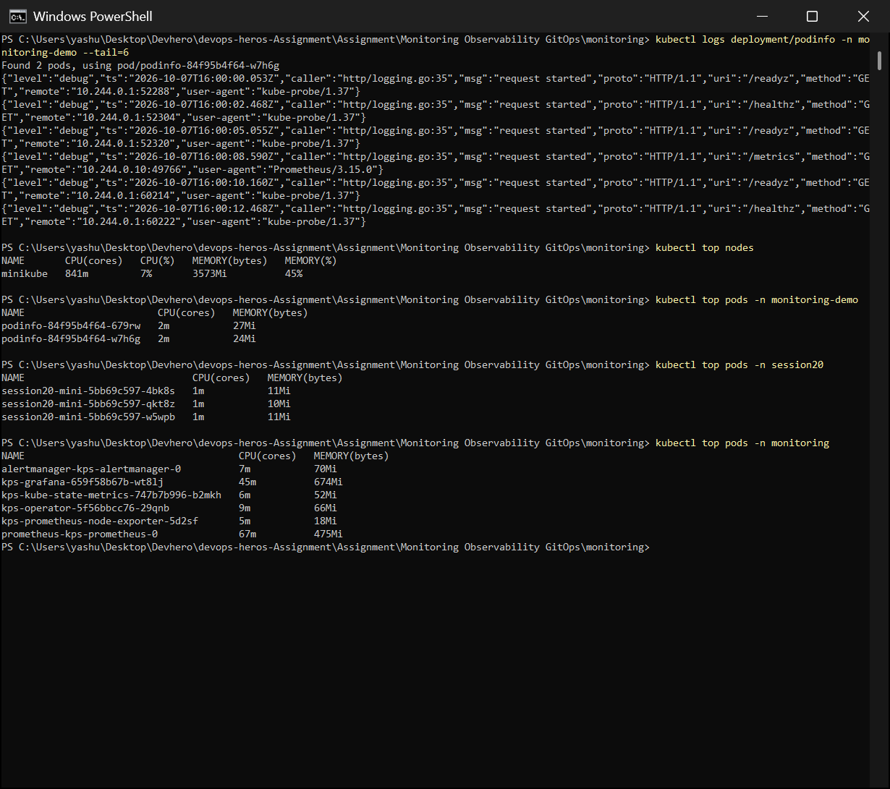

### 5. Alerts
My 5 rules are `PodinfoDown`, `PodinfoReplicasUnavailable`, `PodinfoHighErrorRate`, `PodinfoHighCPU` and `PodinfoHighMemory`.
- **`PodinfoHighErrorRate`** is **firing**: 5xx rate is 10.05%, above the 5% threshold.
- **`PodinfoHighCPU`** is **firing** for both pods: 0.24–0.25 cores, above 0.1.
- The other three are `inactive`: the pods are up, all replicas are available, and memory is far below its limit.

`amtool` shows that the firing alerts reached **Alertmanager**, together with kube-prometheus-stack's always-on **Watchdog** alert, which proves the alert pipeline works end to end.

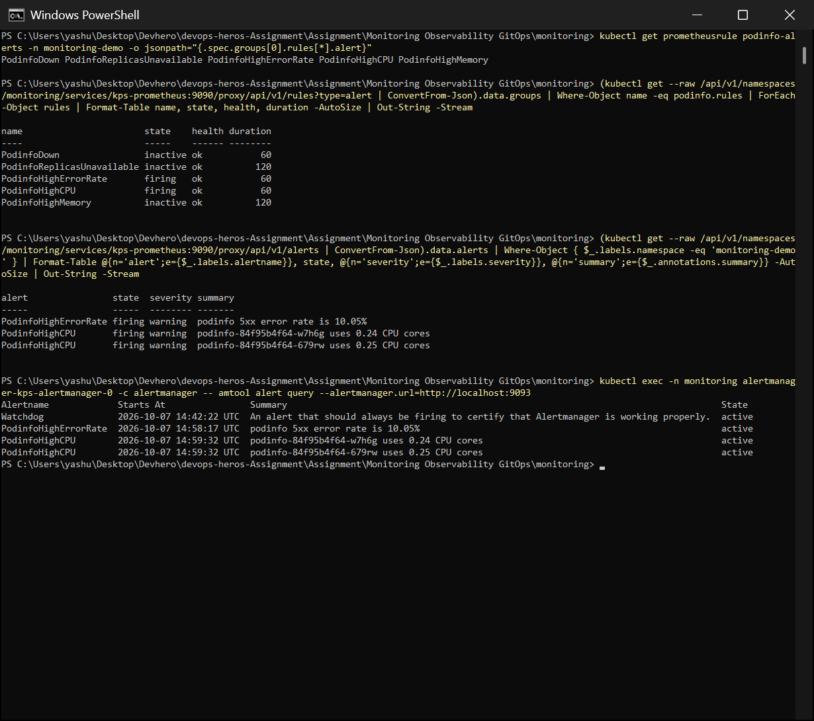

### 6. Grafana
Checked through Grafana's HTTP API, over a `kubectl port-forward`:
- Grafana 13.2.3 is healthy.
- **Prometheus** (default) and **Alertmanager** data sources are provisioned.
- **26 dashboards** are provisioned, including the built-in *Kubernetes / Compute Resources / …* set.
- My own **"Session 20 - podinfo monitoring"** dashboard is loaded. Grafana's sidecar picked it up from [`grafana-dashboard.yaml`](monitoring/grafana-dashboard.yaml), so it's dashboard-as-code. Its 8 panels:
  - stat panels: healthy targets, req/s, 5xx error rate, firing alerts
  - time series: req/s by status code, p50/p95/p99 latency, CPU per pod, memory per pod

To open it: `kubectl port-forward -n monitoring svc/kps-grafana 3000:80`, go to http://localhost:3000, and log in as `admin` with the password from `kubectl get secret -n monitoring kps-grafana -o jsonpath="{.data.admin-password}"` (base64-decode it).

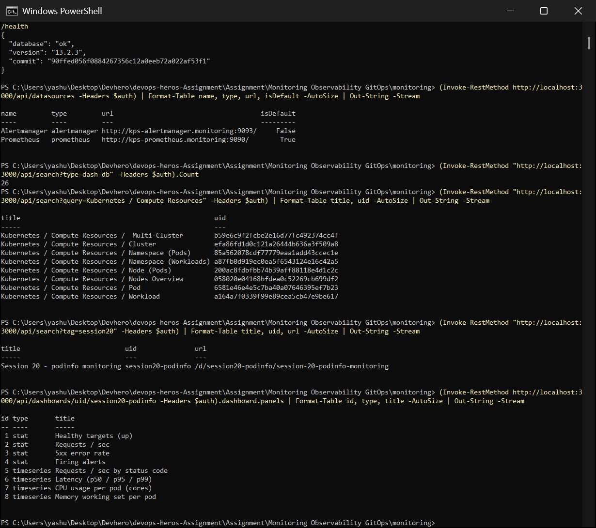

---

## Task 3 – GitOps demo (Argo CD)

### 7. Install Argo CD
```bash
kubectl create namespace argocd
kubectl apply -n argocd --server-side --force-conflicts \
  -f https://raw.githubusercontent.com/argoproj/argo-cd/stable/manifests/install.yaml
```
`--server-side` is needed because Argo CD's CRDs are too big for the client-side `last-applied` annotation.

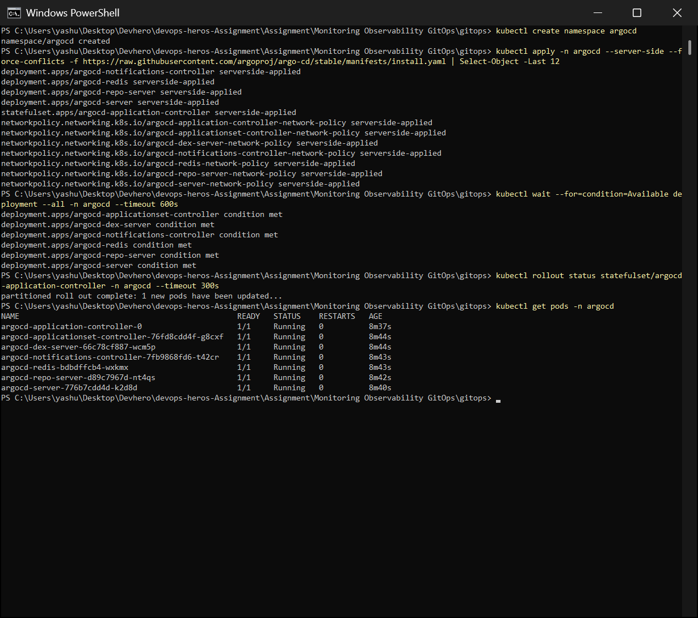

### 8. Point Argo CD at Git
[`argocd-application.yaml`](gitops/argocd-application.yaml) watches **this repository**:
- repo: `https://github.com/Yashukiran/devops-heros.git`
- branch: `Assignment`
- path: `Assignment/Monitoring Observability GitOps/gitops/app`

It uses `automated` sync with `prune` and `selfHeal`. After `kubectl apply`, Argo CD cloned the repo and created the namespace, Deployment (2 replicas) and Service on its own. **I never ran `kubectl apply` on the app manifests.**

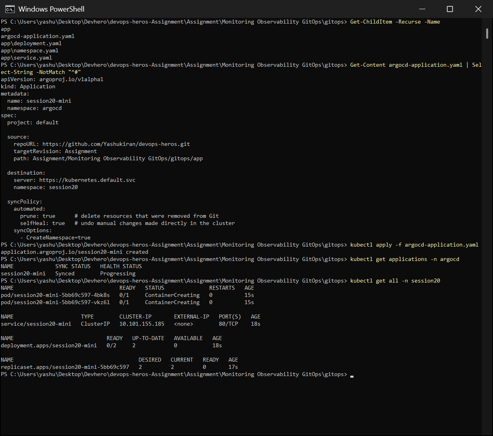

### 9. Change desired state in Git: push rejected = nothing happens
I changed `replicas: 2` to `replicas: 3` and committed. **GitHub rejected the push (HTTP 500)**, and the cluster **stayed at 2/2**. The Application stayed on the old revision `ac33ee5` even after a forced refresh.

In GitOps, a local commit or a laptop change does nothing. **Only what is in Git counts.**

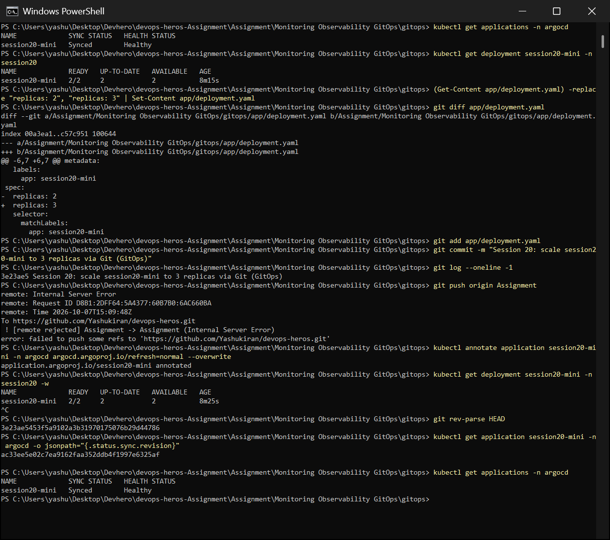

### 10. Push lands, and Argo CD reconciles to 3 replicas
Once the push went through (commit `3e23ae5`):
- `origin/Assignment` contains `replicas: 3`.
- The Application's **sync revision equals the Git commit** (`3e23ae5…`).
- The sync history shows two deployments (`ac33ee5`, then `3e23ae5`).
- The events show `Initiated automated sync to '3e23ae5…'` and `succeeded`.
- The Deployment is **3/3**.

The change travelled **Git → Argo CD → Kubernetes**, with no `kubectl` involved.

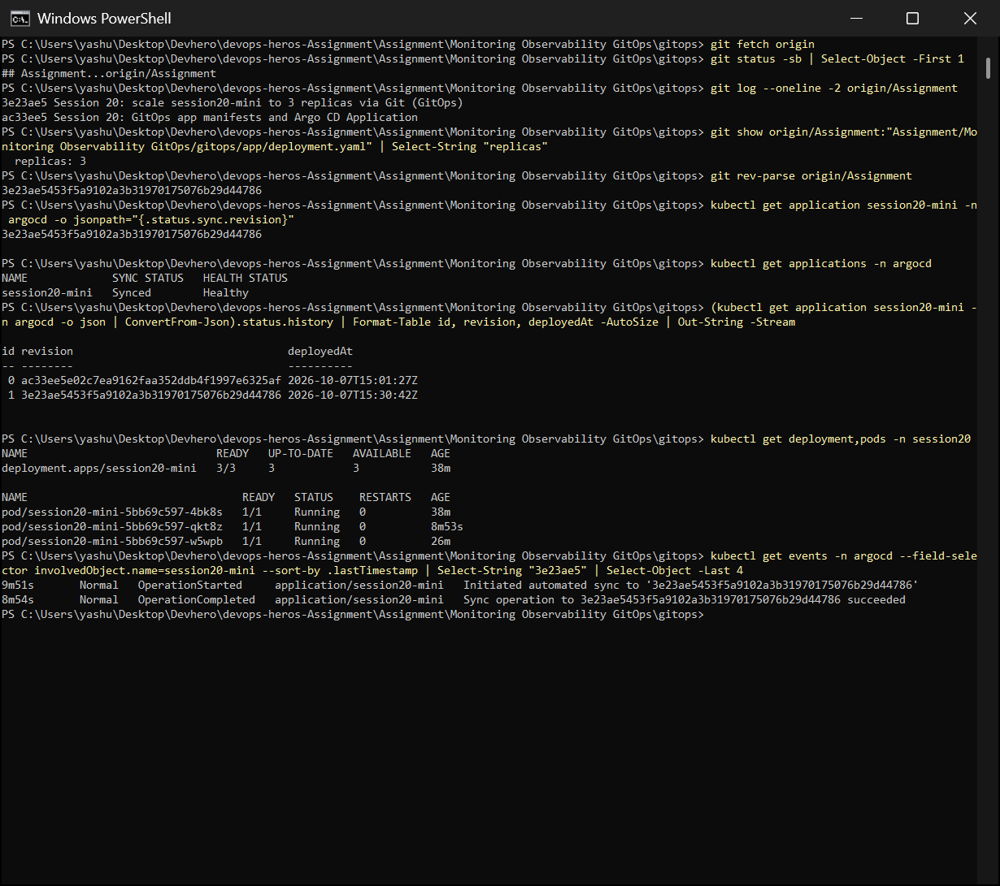

### 11. Self-healing (drift correction)
Done while Git still said `replicas: 2`:
- `kubectl scale --replicas=1` (manual drift): Argo CD saw `OutOfSync` and scaled it **back to 2** within seconds.
- `kubectl delete service session20-mini`: Argo CD **re-created** it (age 13 s).

The events show the loop: `Synced → OutOfSync → Initiated automated sync → Sync operation succeeded → Healthy`.

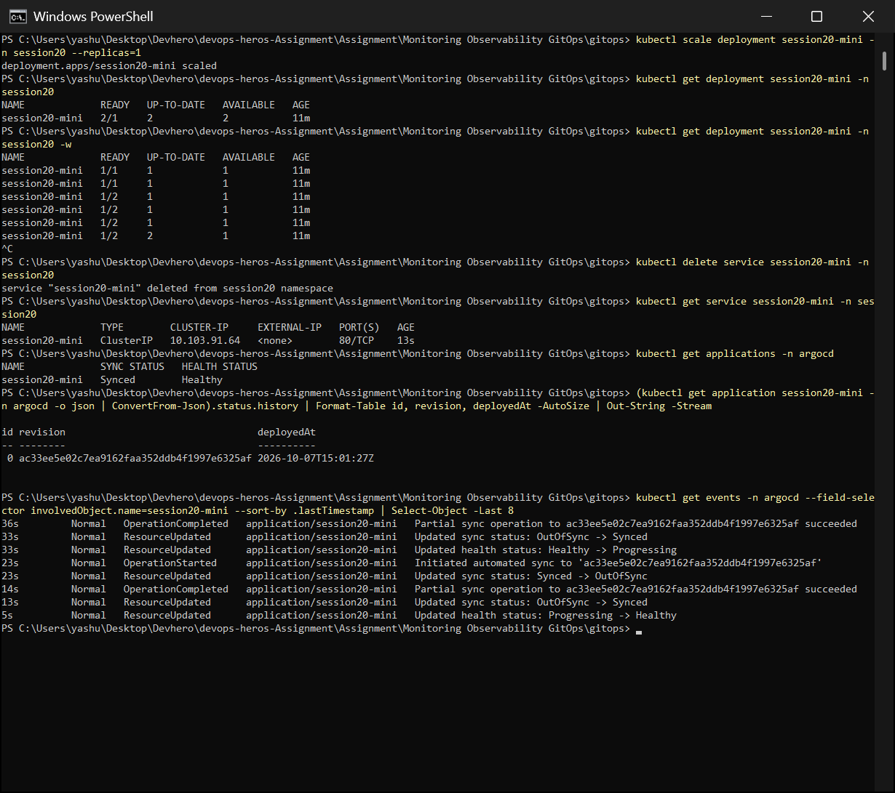

### Troubleshooting I hit
| Problem | Cause | Fix |
|---|---|---|
| `helm install` → `INSTALLATION FAILED: kps-grafana … Progress deadline exceeded` | Slow image download (> 10 min) | Re-ran `helm upgrade --install`; the images were cached, so the release became `deployed` |
| First load generator hardly moved CPU (~12m) | Starting a new `curl` process per request costs more than the request itself | One `curl --parallel` call with 1000 keep-alive URLs per batch: ~1000 req/s |
| `PodinfoHighErrorRate` had no `namespace` label | `sum(...)` drops every label | `sum by (namespace)` (and `by (namespace, pod)` for CPU and memory), so alerts can be filtered and routed by namespace |
| `wget` not found in the Prometheus pod | Prometheus v3 images are minimal | Queried the API through the API-server proxy: `kubectl get --raw /api/v1/namespaces/monitoring/services/kps-prometheus:9090/proxy/api/v1/alerts` |
| Grafana image renderer: `failed to run browser: websocket url timeout` | Headless Chromium never started inside the 4 GB minikube node | Disabled the renderer; Grafana is shown through its API instead |
| API server `TLS handshake timeout`, probes failing, pods restarting | The minikube node hit its **3.9 GB memory limit** with monitoring + Argo CD + load | Stopped the load generator and scaled unused Argo CD parts (Dex, notifications, ApplicationSet) to 0. **Monitoring the monitoring** matters: the stack itself needs resources |
| `git push` → `remote rejected (Internal Server Error)` | Temporary GitHub-side error | Retried; it went through after a few minutes. Shown in screenshot 9 |

### Cleanup
```bash
kubectl delete -f gitops/argocd-application.yaml      # with prune, Argo CD removes the app resources
kubectl delete namespace session20 argocd
kubectl delete -f monitoring/load-generator.yaml -f monitoring/podinfo.yaml -f monitoring/alert-rules.yaml -f monitoring/grafana-dashboard.yaml
helm uninstall kps -n monitoring
```

---

## Task 2 – Observability (documentation)

### Monitoring vs Observability
| | Monitoring | Observability |
|---|---|---|
| Question | "**Is** something wrong?" | "**Why** is it wrong?" |
| Approach | Watch **known** failure modes with predefined dashboards and alerts | Explore **unknown** problems by asking new questions of rich telemetry |
| Example | Alert: error rate > 5 % | Which endpoint, which pod, which version, and which downstream call caused it? |

Monitoring is a *part* of observability. A system is observable when you can understand its internal state from the data it emits, without shipping new code to debug it.

### The three pillars

| Pillar | What it is | Example from my demo | Good for |
|---|---|---|---|
| **Metrics** | Numeric time series: name + labels + value over time. Cheap to store and fast to query and aggregate | `http_requests_total{status="500"}`, `container_cpu_usage_seconds_total` | Dashboards, alerts, trends, capacity planning |
| **Logs** | Timestamped records of discrete **events**, ideally structured (JSON) | podinfo's `{"level":"debug","msg":"request started","uri":"/status/500",...}` | The details of *what happened*: errors, stack traces, audit |
| **Traces** | The **journey of one request** across services, as a tree of timed *spans* that share a trace ID | (not in this demo) frontend → API → DB, with the time spent in each hop | Finding *where* latency or errors come from in microservices |

They work together: a **metric** alert fires (error rate up), the **trace** of a failing request shows which service fails, and that service's **logs** (found by trace ID) show the exact error.

### Why observability is required
- **Distributed systems fail in new ways.** With microservices, containers and autoscaling, there are too many possible failures to predict them all with dashboards.
- **Lower MTTD/MTTR:** detect problems before users do, and find the root cause faster.
- **SLOs and error budgets** need accurate measurements (availability, latency).
- **Capacity and cost:** right-size requests and limits, and inform HPA decisions.
- **Safer deployments:** compare metrics before and after a release, and roll back on regressions.
- **Pods are ephemeral.** When a pod is gone, its local logs are gone too, unless they were collected centrally.

### Common tools
| Area | Open source | Managed / commercial |
|---|---|---|
| Metrics | **Prometheus**, Thanos / Mimir / VictoriaMetrics (long-term) | CloudWatch, Datadog, New Relic |
| Dashboards | **Grafana** | Datadog, CloudWatch dashboards |
| Alerting | **Alertmanager**, Grafana Alerting | PagerDuty, Opsgenie (on-call routing) |
| Logs | **Loki**, ELK/EFK (Elasticsearch + Fluentd/Fluent Bit + Kibana) | CloudWatch Logs, Splunk |
| Traces | **Jaeger**, Tempo, Zipkin | AWS X-Ray, Datadog APM |
| Instrumentation standard | **OpenTelemetry** (one SDK/collector for metrics, logs and traces) | – |

### Kubernetes observability
| Layer | What to watch | Source |
|---|---|---|
| Nodes | CPU, memory, disk, network | **node-exporter** |
| Kubernetes objects | desired vs available replicas, pod phase, restarts, pending pods | **kube-state-metrics** |
| Containers | CPU/memory usage vs requests/limits, throttling, OOMKills | **cAdvisor** (in the kubelet) |
| Applications | request rate, errors, duration (**RED**), business metrics | the app's own `/metrics` + a **ServiceMonitor** |
| Events | scheduling failures, image pulls, probe failures | `kubectl get events` |
| Logs | container stdout/stderr | `kubectl logs`, collected by Fluent Bit / Promtail into Loki or ELK |
| Health | liveness / readiness / startup probes | kubelet; failing readiness → removed from Service endpoints |

Also useful: `kubectl top` (metrics-server) for a quick live CPU/memory view, which is also what the HPA uses.

---

## Task 3 – GitOps (concepts)

**GitOps** = operating infrastructure and applications with **Git as the single source of truth** and an **agent in the cluster** that keeps reality equal to Git.

| Principle | Meaning |
|---|---|
| **Declarative** | Describe *what* you want (YAML: 3 replicas of nginx), not the steps to get there |
| **Versioned and immutable** | The desired state lives in Git: every change is a commit with an author, review (PR) and history. A rollback is a `git revert` |
| **Pulled automatically** | An agent (**Argo CD**, Flux) *pulls* from Git. CI never needs cluster credentials (no `kubectl apply` from the pipeline) |
| **Continuously reconciled** | The agent constantly compares **desired state** (Git) with **actual state** (cluster) and fixes any difference (drift) |

### GitOps workflow
```text
Developer ── PR / commit ──▶ Git repo (desired state)
                                   │  Argo CD polls / webhook
                                   ▼
                              Argo CD ── compare ──▶ OutOfSync?
                                   │                    │ yes
                                   ▼                    ▼
                           Kubernetes (actual) ◀── sync / apply
                                   ▲
            kubectl edit/scale ────┘  (drift) ──▶ selfHeal reverts it
```

### Push-based CD vs GitOps (pull)
| | Push (CI runs `kubectl apply`) | GitOps (Argo CD pulls) |
|---|---|---|
| Cluster credentials | Stored in CI | Stay inside the cluster |
| Drift detection | None | Continuous |
| Audit trail | CI logs | Git history |
| Rollback | Re-run an old pipeline | `git revert` |
| Disaster recovery | Re-run every pipeline | Point Argo CD at the repo, and everything comes back |

---

## What I Learned

1. **Monitoring tells me *that* something is wrong; observability lets me find out *why*.** Metrics, logs and traces each answer a different question.
2. **Prometheus pulls** metrics. With the Prometheus Operator, a **ServiceMonitor** is all it takes to start scraping a new app, with no Prometheus config edits.
3. **kube-prometheus-stack** gives full Kubernetes monitoring in one Helm chart: node-exporter (nodes), kube-state-metrics (objects), cAdvisor (containers), plus default dashboards and alerts.
4. **PromQL**: `rate()` turns counters into per-second rates, `sum by (label)` aggregates, and `histogram_quantile` gives latency percentiles.
5. **Alerts are PromQL + `for:`**. An alert goes `inactive → pending → firing`. The `for` duration stops short spikes from paging anyone. **Alertmanager** groups, silences and routes the alerts. The always-firing **Watchdog** alert proves the alerting pipeline itself works.
6. **Application health = probes + metrics**: Kubernetes uses `/healthz` and `/readyz` to restart pods or remove them from load balancing, and Prometheus uses `up` and the RED metrics to alert people.
7. **Structured (JSON) logs** can be filtered and searched. Logs are per pod and temporary, so production needs central collection (Loki/ELK).
8. **Dashboards as code** (a ConfigMap with dashboard JSON) are versioned and reviewed like everything else.
9. **GitOps:** Git is the desired state, Kubernetes is the actual state, and Argo CD reconciles them. I scaled the app **only with a git push**, and Argo CD **undid my manual `kubectl scale` and `kubectl delete`** because they weren't in Git.
10. With GitOps, the CI pipeline doesn't need cluster credentials, every change is auditable, and a rollback is just a `git revert`.
