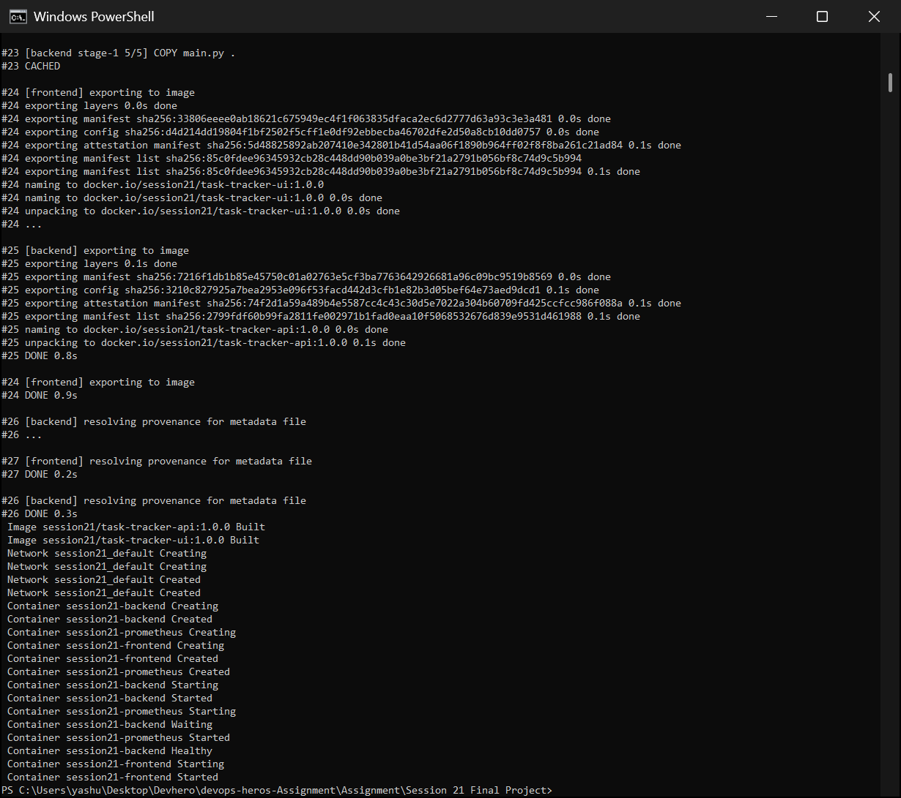
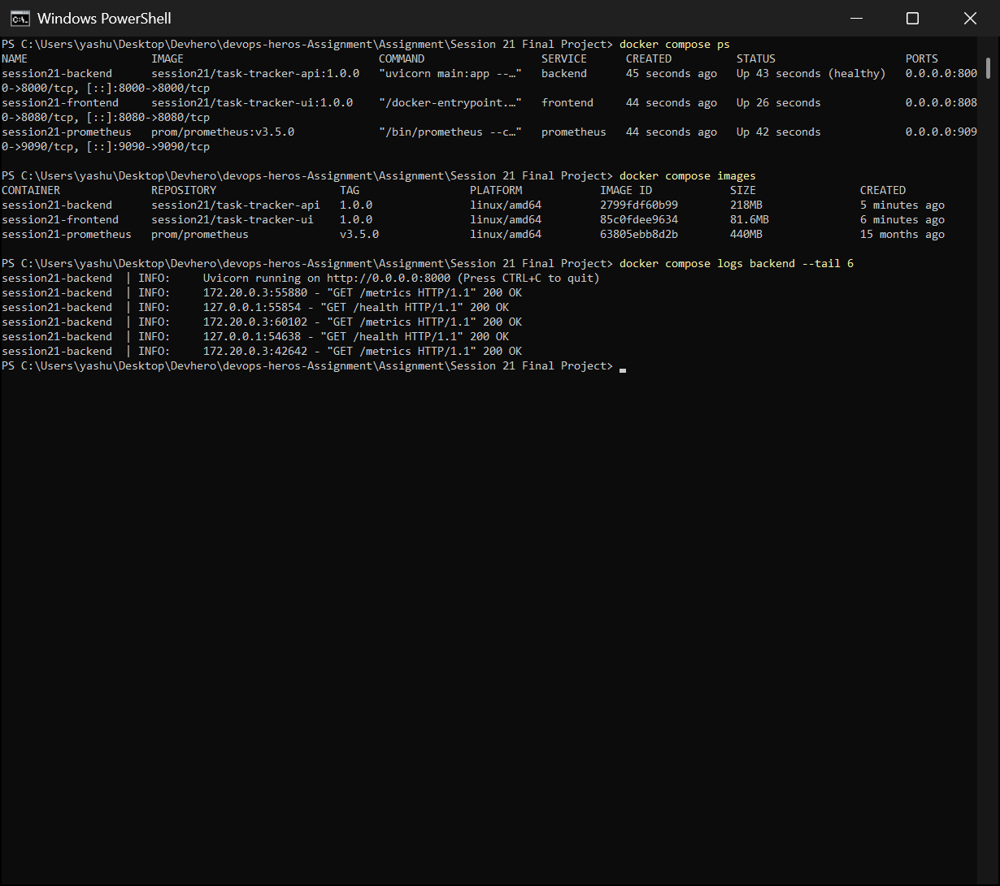
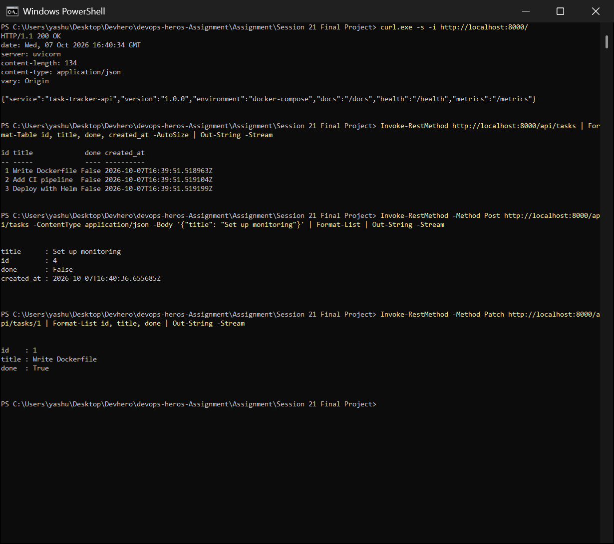
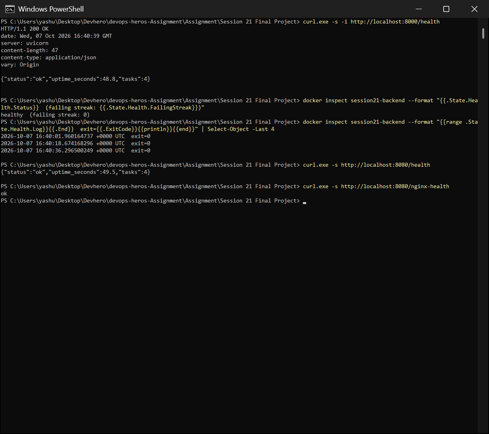
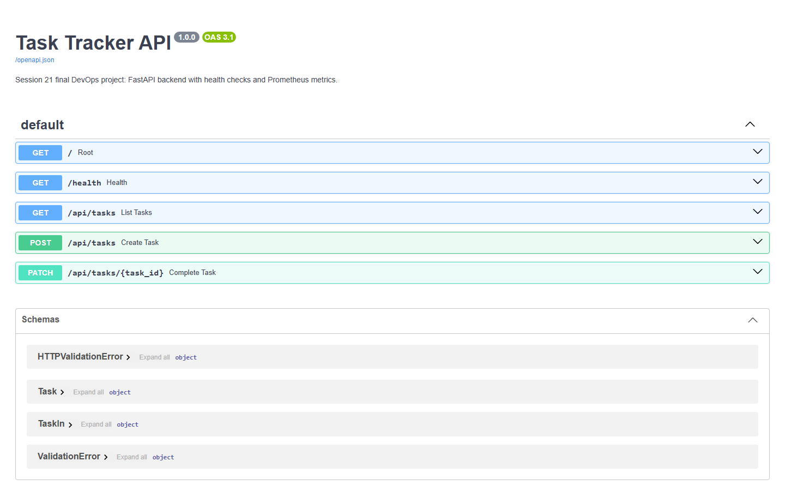
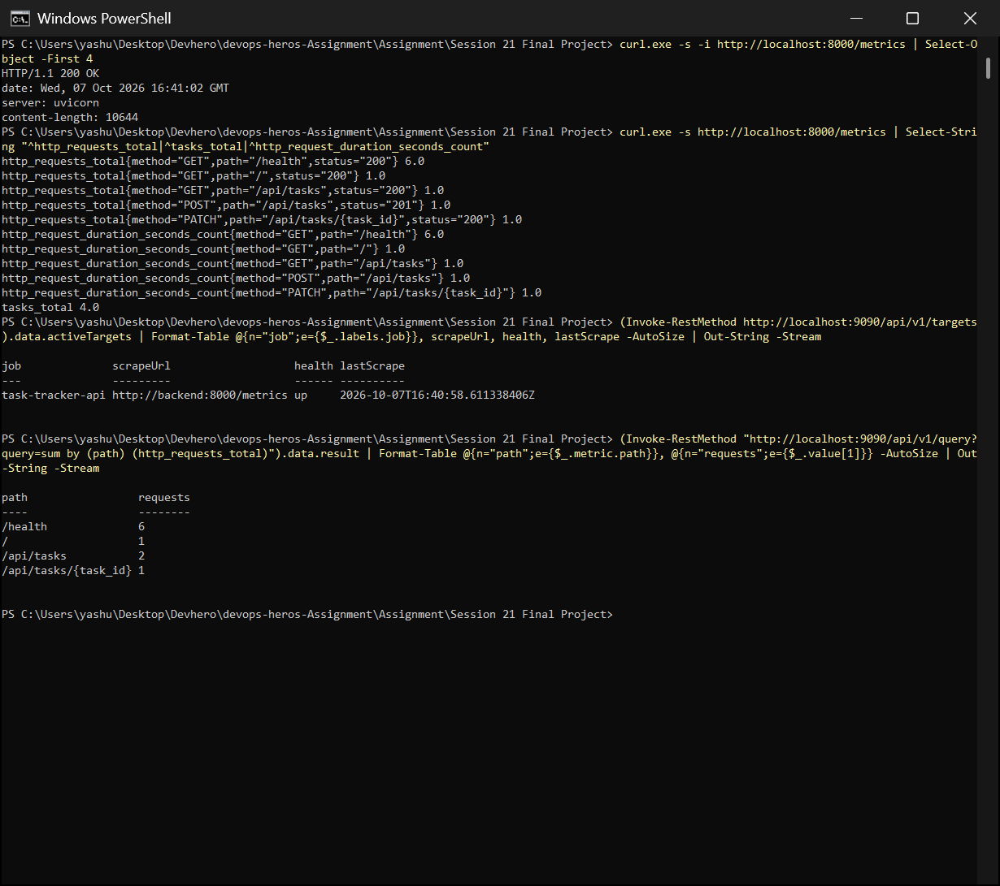
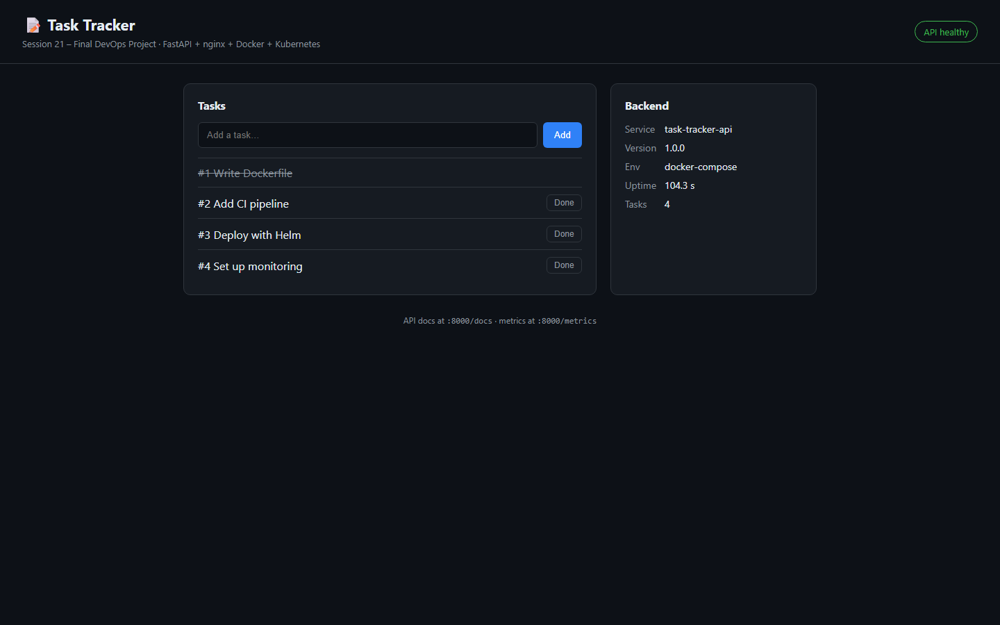

# Session 21 – Final DevOps Project: Task Tracker

An end-to-end DevOps project that ties the course together: a small **Task Tracker** app (FastAPI backend + nginx frontend) taken from code to running service through every stage:

```text
Application (FastAPI + nginx)
   ↓
Git → GitHub (this repo, branch Assignment)
   ↓
CI pipeline (GitHub Actions)  ── Build & Test (pytest)
   ↓                          ── Security scanning (Bandit, pip-audit, Gitleaks, Trivy)
Docker images (multi-stage, non-root)
   ↓
Container registry (GHCR)
   ↓
Kubernetes  ←  Helm chart (probes, resources, HPA, ServiceMonitor)
   ↓
Monitoring (Prometheus /metrics)
   ↓
GitOps (Argo CD Application → Helm chart in Git)

Infrastructure: Terraform (AWS EC2 + security group running the same images)
```

## Project Structure

```text
Session 21 Final Project/
├── README.md
├── docker-compose.yml            # backend + frontend + prometheus
├── app/
│   ├── backend/                  # FastAPI API
│   │   ├── main.py               # /, /health, /api/tasks, /metrics, /docs
│   │   ├── test_main.py          # 6 pytest tests
│   │   ├── requirements.txt / requirements-dev.txt
│   │   ├── Dockerfile            # multi-stage, non-root (uid 10001), HEALTHCHECK
│   │   └── .dockerignore
│   └── frontend/                 # static UI served by nginx
│       ├── index.html            # task list + backend status
│       ├── nginx.conf            # proxies /api and /health to the backend
│       └── Dockerfile            # nginx-unprivileged (non-root, port 8080)
├── monitoring/prometheus.yml     # scrapes backend:8000/metrics
├── helm/task-tracker/            # Kubernetes deployment (Helm chart)
├── gitops/argocd-application.yaml
├── terraform/                    # AWS EC2 deployment target
└── screenshots/
# CI/CD: ../../.github/workflows/session21-final-project.yml
```

## The application

| Endpoint | Purpose |
|---|---|
| `GET /` | service info (name, version, environment, links) |
| `GET /health` | health check: used by the Docker `HEALTHCHECK`, the Kubernetes probes and the frontend status badge |
| `GET/POST /api/tasks`, `PATCH /api/tasks/{id}` | the task API (in-memory store, validated with Pydantic) |
| `GET /metrics` | Prometheus metrics: `http_requests_total{method,path,status}`, `http_request_duration_seconds` (histogram), `tasks_total` |
| `GET /docs` | interactive Swagger UI, generated automatically from the code |

The middleware labels metrics with the **route template** (`/api/tasks/{task_id}`), not the raw URL, so label cardinality stays bounded.

The **frontend** is a single static page served by `nginx-unprivileged`. nginx proxies `/api/*` and `/health` to the backend, so the browser only talks to one origin and no CORS is needed. The backend host is injected at startup with `envsubst` (`BACKEND_HOST`), so the same image works in Compose (`backend`) and in Kubernetes (the `backend` Service).

## Run it locally

```bash
docker compose up -d --build
docker compose ps
# UI:         http://localhost:8080
# API:        http://localhost:8000      docs: http://localhost:8000/docs
# Metrics:    http://localhost:8000/metrics
# Prometheus: http://localhost:9090
docker compose down
```

Tests: `pip install -r app/backend/requirements-dev.txt && pytest app/backend` → **6 passed**.

---

## Screenshots

### 1. `docker compose up -d --build`
Both images are built with BuildKit (the backend is multi-stage). Then Compose creates the network and starts the containers **in dependency order**: the frontend has `depends_on: backend: condition: service_healthy`, so Compose waits until the backend reports **Healthy** before starting the frontend.



### 2. `docker compose ps`
All 3 services are up:
- the backend shows **(healthy)** from its Docker `HEALTHCHECK`
- ports 8000 (API), 8080 (UI) and 9090 (Prometheus) are published

`docker compose images` shows the image sizes: backend **218 MB** (slim + venv only), frontend **81.6 MB**. The backend logs show the health checks and Prometheus scraping `/metrics` every 15 s.



### 3. API root (`/`) and the task API
- `GET /` returns `200 OK` with the service info.
- `GET /api/tasks` returns the 3 seed tasks.
- `POST /api/tasks` creates task #4 (`201`).
- `PATCH /api/tasks/1` marks task #1 done.



### 4. Health check
- `GET /health` returns `{"status":"ok","uptime_seconds":…,"tasks":4}`.
- `docker inspect` shows the container is **healthy** with failing streak 0, and the last health probes all have `exit=0`.
- The same health check also works **through the frontend's nginx proxy** (`:8080/health`).
- nginx has its own `/nginx-health`.



### 5. API docs (Swagger UI)
`http://localhost:8000/docs`: FastAPI generates the OpenAPI 3.1 spec and Swagger UI from the code, including every endpoint and the `Task` / `TaskIn` / validation schemas.



### 6. Metrics + Prometheus
- `/metrics` returns Prometheus text format. The counters match exactly the requests made in screenshots 3–4: 6× `/health`, 1× `/`, GET and POST `/api/tasks`, 1× PATCH. `tasks_total` is 4.
- The Prometheus container's `/targets` API shows `task-tracker-api` **up**.
- A PromQL `sum by (path) (http_requests_total)` returns the same numbers from Prometheus itself.



### 7. Frontend UI
`http://localhost:8080`: the task list (task #1 struck through as done, #4 created through the API) and a **Backend** panel with service, version, environment, uptime and task count. The **API healthy** badge comes from polling `/health` every 10 s.



---

## CI/CD pipeline – `.github/workflows/session21-final-project.yml`

Runs on every push to `Assignment` that touches this project:

| Job | What it does | Gate |
|---|---|---|
| **Build & Test** | Python 3.13, install deps, `pytest -v` | any failing test fails the pipeline |
| **Security Scanning** | **Bandit** (SAST on the backend code), **pip-audit** (known-vulnerable dependencies), **Gitleaks** (secrets in the git history) | findings fail the pipeline |
| **Helm lint** | `helm lint helm/task-tracker` | chart errors fail the pipeline |
| **Docker Image → Trivy → GHCR** | builds both images, **Trivy** scans them (reports HIGH and CRITICAL, fails on a fixable CRITICAL), then pushes `:<sha>` and `:1.0.0` to **ghcr.io/yashukiran/session21-task-tracker-{api,ui}** | runs only after the 3 jobs above pass (`needs:`) |

## Kubernetes – Helm chart `helm/task-tracker`

| Resource | Details |
|---|---|
| backend Deployment + Service `backend` | readiness/liveness probes on `/health`, CPU/memory requests and limits, non-root, read-only root filesystem, all capabilities dropped |
| backend **HPA** | 2–5 replicas at 70 % CPU |
| frontend Deployment + Service (NodePort) | probes on `/nginx-health`, non-root |
| **ServiceMonitor** (optional) | lets kube-prometheus-stack (Session 20) scrape `/metrics` |

```bash
helm lint helm/task-tracker
helm install tt helm/task-tracker -n task-tracker --create-namespace
```

## GitOps – `gitops/argocd-application.yaml`

Argo CD watches `helm/task-tracker` on the `Assignment` branch, with `automated` sync, `prune` and `selfHeal`. To release a new version, change `image.tag` in `values.yaml`, commit and push. Argo CD renders the chart and rolls the change out; nobody runs `kubectl` or `helm` by hand. (Session 20 showed this exact flow live with scale-via-git and self-heal.)

## Infrastructure – Terraform `terraform/`

A single-host AWS deployment target:
- the **default VPC**
- a **security group** opening only 8000/8080
- an **EC2 t3.micro**: Amazon Linux 2023 AMI looked up through SSM, **IMDSv2 required**, encrypted gp3 volume
- **`user_data`** that installs Docker and runs the same GHCR images CI pushes

Outputs are `frontend_url` and `api_docs_url`. `terraform init` and `terraform validate` pass. It wasn't applied for this submission; the same apply/verify/destroy workflow was shown in Sessions 18 and 19.

## DevSecOps choices

- **Multi-stage** backend image: build tools stay in the build stage, and the runtime image contains only the venv and `main.py`.
- **Non-root** containers: backend uid 10001, frontend `nginx-unprivileged` on port 8080.
- A Docker **HEALTHCHECK**, plus Kubernetes **probes**.
- **Pinned** dependency versions, audited by pip-audit.
- `.dockerignore` keeps tests and dev dependencies out of the image.
- **Input validation** (Pydantic: title 1–100 characters gives a `422`), and CORS restricted to the UI origin.
- Low-cardinality metric labels.

---

## What I Learned

1. **Glue matters more than any single tool.** The project worked because every stage agreed on the same contracts: the `/health` endpoint is used by Docker, Kubernetes, nginx and the UI, and `/metrics` is used by Prometheus and the ServiceMonitor.
2. **Docker Compose** is great for local end-to-end runs. `depends_on` with `condition: service_healthy` fixes start-order problems properly, instead of using `sleep`.
3. **One image, many environments:** configuration comes from environment variables (`ENVIRONMENT`, `BACKEND_HOST`), never from rebuilding the image.
4. **Health checks and metrics belong in the app from day one.** They make Docker, Kubernetes, load balancers and Prometheus "just work".
5. **FastAPI** gives validation and an OpenAPI/Swagger spec for free, so the documentation is always in sync with the code.
6. **CI as a quality gate:** tests, SAST, dependency audit, secret scan, chart lint and image scan all run *before* an image can reach the registry.
7. **Helm and GitOps** separate *what* to run (the chart and values in Git) from *how* it gets there (Argo CD). A deployment is a reviewed commit.
8. **Terraform** gives the same app a reproducible cloud home that can be created and destroyed on demand.
9. Small security defaults (non-root, read-only filesystem, dropped capabilities, IMDSv2, minimal images) add up to a much smaller attack surface.
