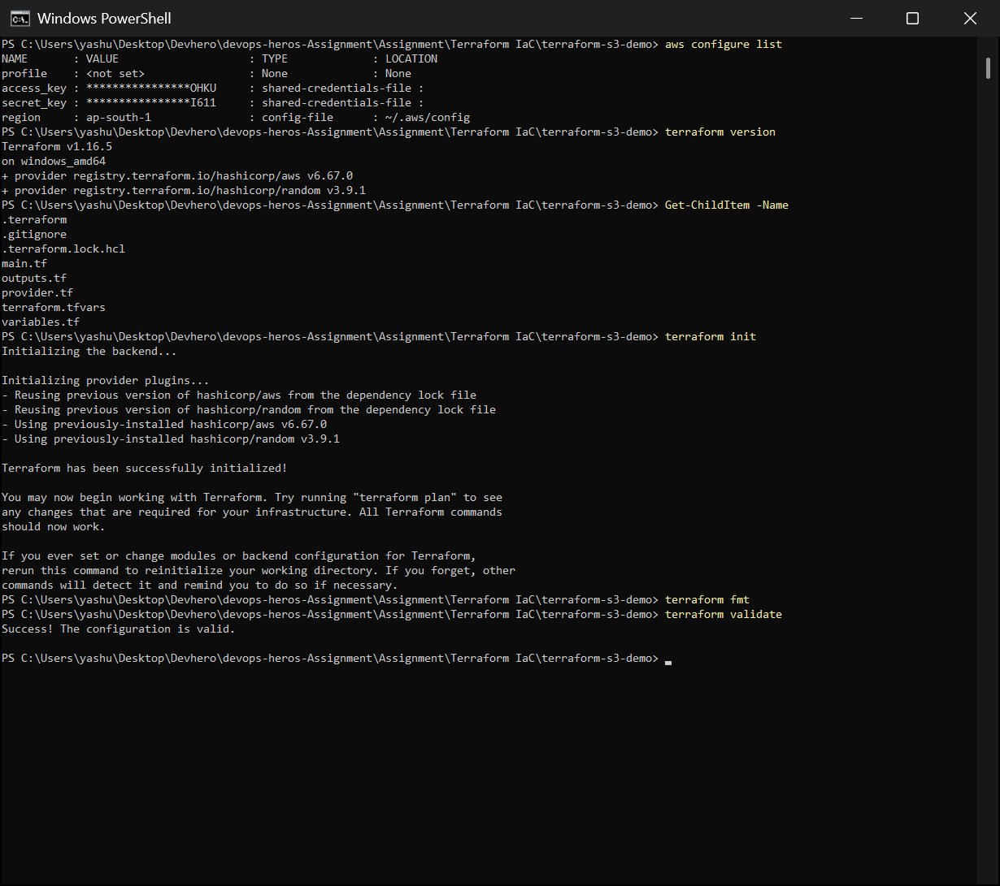
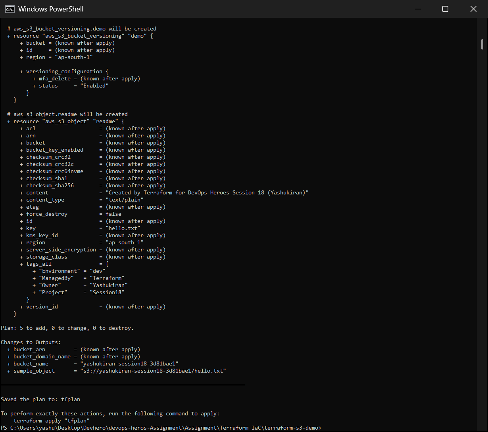
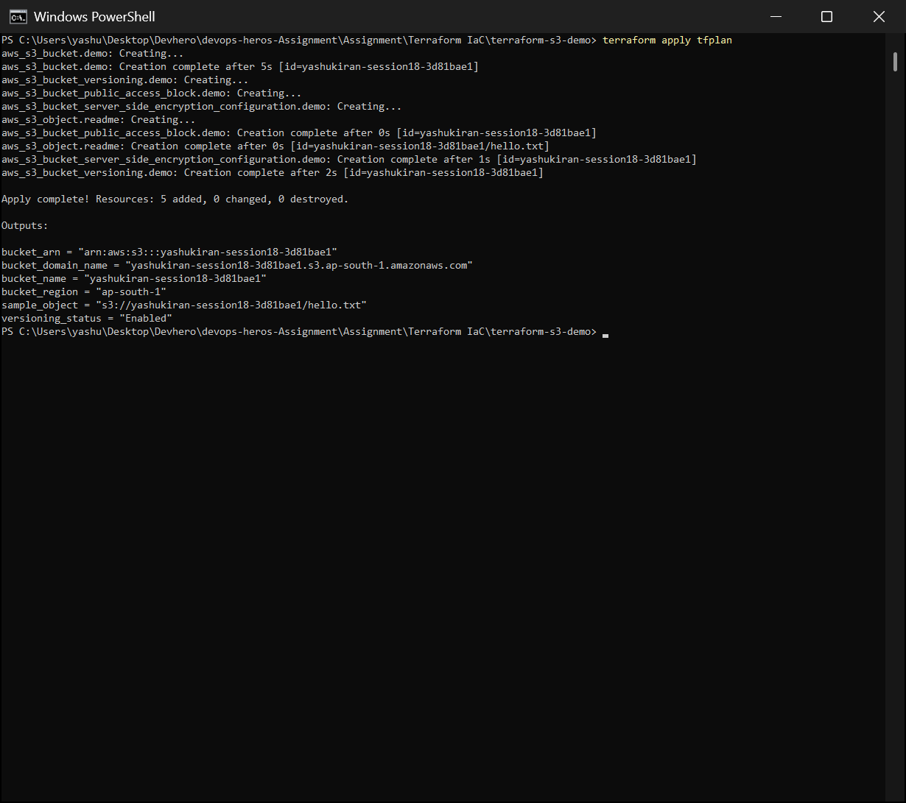
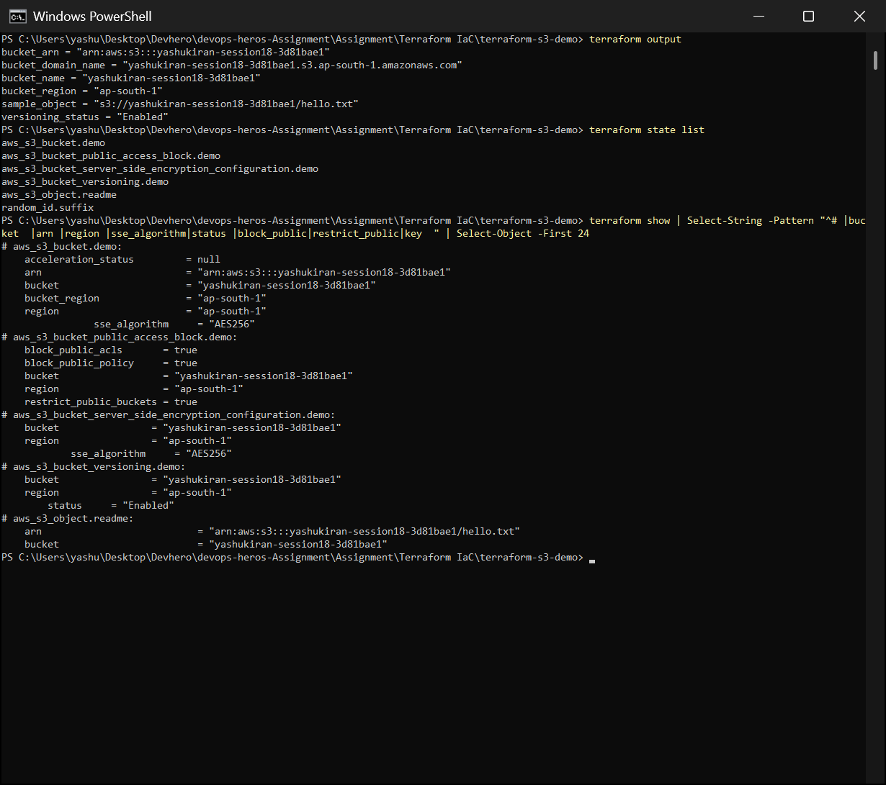
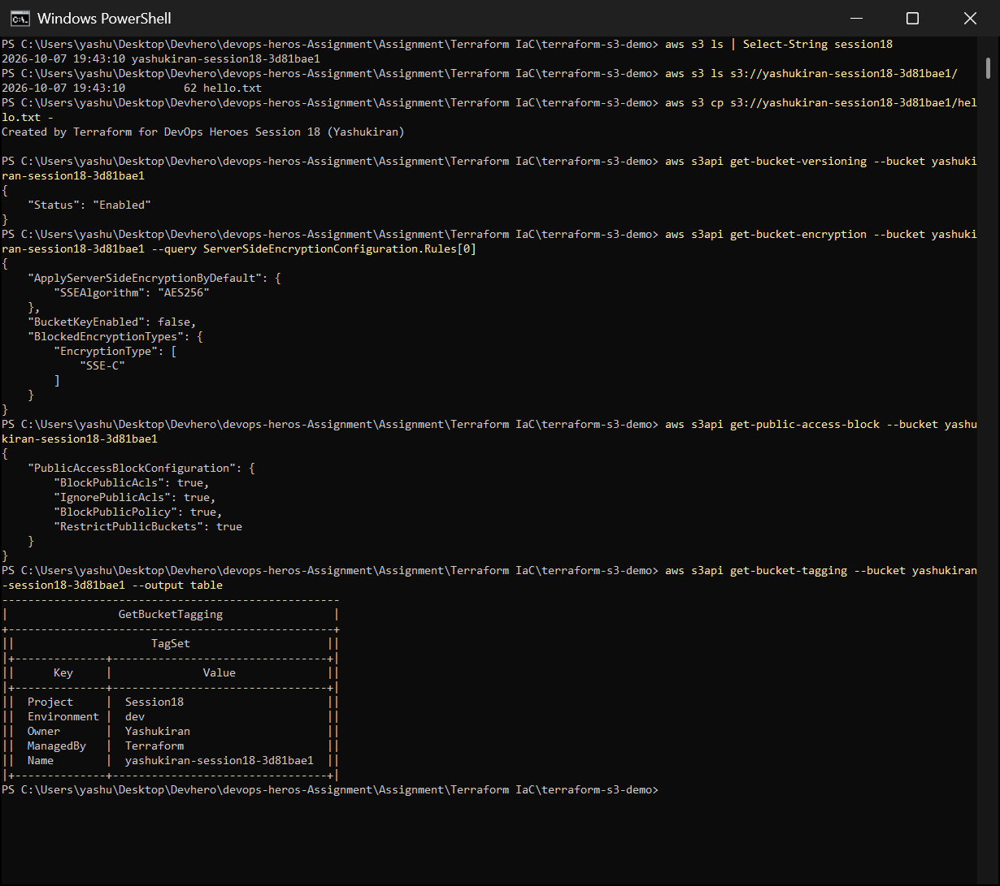
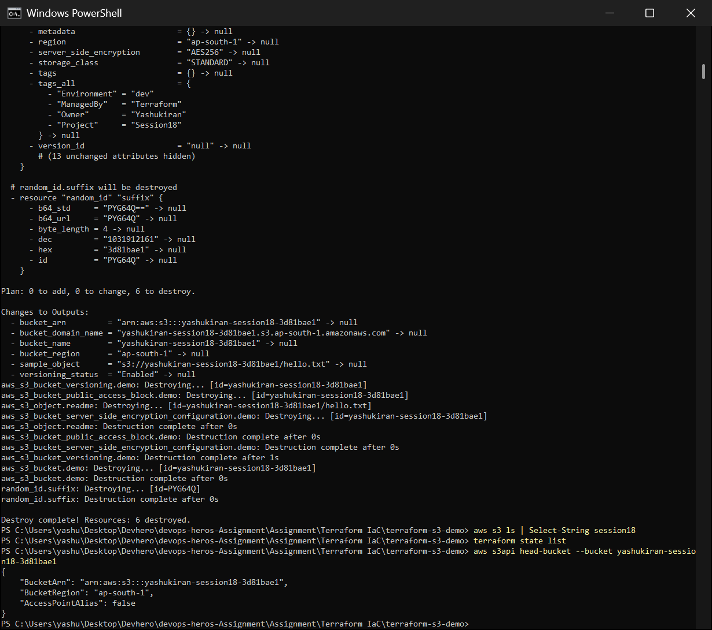
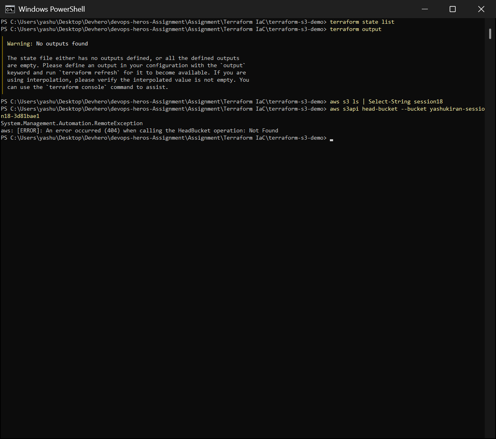

# Session 18 – Terraform & Infrastructure as Code

Two parts:
1. **AWS core services**: notes on IAM, EC2, S3, VPC, DynamoDB and RDS (in [`aws-services/`](aws-services)).
2. **Terraform hands-on**: a real, secure **S3 bucket** created on my AWS account (ap-south-1), checked with the AWS CLI, then destroyed. Everything ran through the full `init → fmt → validate → plan → apply → verify → destroy` lifecycle.

## Folder Structure

```text
Terraform IaC/
├── README.md
├── aws-services/
│   ├── 01-iam/README.md            # users, groups, roles, policies, least privilege
│   ├── 02-ec2/README.md            # instances, AMIs, instance types, security groups
│   ├── 03-s3/README.md             # buckets, objects, storage classes, versioning
│   ├── 04-vpc/README.md            # VPC, subnets, IGW, route tables, NAT
│   └── 05-dynamodb-rds/README.md   # NoSQL vs relational managed databases
├── terraform-s3-demo/
│   ├── provider.tf          # terraform + aws/random providers, default_tags
│   ├── variables.tf         # region, bucket_prefix (with validation), environment, owner, versioning
│   ├── main.tf              # random suffix, bucket, versioning, encryption, public-access block, object
│   ├── outputs.tf           # bucket name, ARN, region, domain, versioning, sample object
│   ├── terraform.tfvars     # my values
│   └── .gitignore           # state, plans and .terraform/ are never committed
└── screenshots/
```

---

## Part 1 – AWS Services

| Service | Category | One-line summary |
|---|---|---|
| [IAM](aws-services/01-iam/README.md) | Governance | Who can do what: users, groups, roles and JSON policies (least privilege) |
| [EC2](aws-services/02-ec2/README.md) | Compute | Virtual servers: AMI + instance type + security group + key pair |
| [S3](aws-services/03-s3/README.md) | Storage | Object storage in globally unique buckets: versioning, encryption, storage classes |
| [VPC](aws-services/04-vpc/README.md) | Networking | Your private network: subnets, route tables, Internet/NAT gateways |
| [DynamoDB & RDS](aws-services/05-dynamodb-rds/README.md) | Database | Managed NoSQL key-value vs managed relational (MySQL/Postgres…) |

---

## Part 2 – Terraform: S3 bucket

### What gets created (6 resources)

| Resource | Purpose |
|---|---|
| `random_id.suffix` | 4-byte hex suffix, because S3 bucket names are globally unique |
| `aws_s3_bucket.demo` | `yashukiran-session18-<hex>`, `force_destroy = true` so `destroy` works on a non-empty bucket |
| `aws_s3_bucket_versioning.demo` | keeps old object versions (`Enabled`) |
| `aws_s3_bucket_server_side_encryption_configuration.demo` | SSE-S3 `AES256` encryption at rest |
| `aws_s3_bucket_public_access_block.demo` | all 4 public-access blocks on, so the bucket can never be made public by mistake |
| `aws_s3_object.readme` | a sample `hello.txt` |

The provider's **`default_tags`** add `Project`, `Environment`, `Owner` and `ManagedBy=Terraform` to every resource without repeating them.

### Commands

```bash
cd terraform-s3-demo
aws configure list            # credentials + region (keys are masked)
terraform init                # download aws + random providers
terraform fmt                 # format
terraform validate            # check syntax/types
terraform plan -out tfplan    # preview: 5 to add
terraform apply tfplan        # create
terraform output              # bucket name, ARN, ...
terraform state list          # what Terraform manages
aws s3 ls / aws s3api ...     # verify in AWS, independently of Terraform
terraform destroy -auto-approve
```

---

## Execution & Screenshots

### 1. Init, fmt, validate
AWS CLI configured for `ap-south-1` (keys masked), Terraform v1.16.5 with the AWS v6.67.0 and random v3.9.1 providers. `init` installs the providers, `fmt` changes nothing (already formatted), and `validate` passes.



### 2. Plan
`terraform plan -out tfplan` shows **5 to add** (the bucket, its versioning, encryption and public-access-block settings, and the object). `random_id.suffix` was already in the state from an earlier run, so the bucket name `yashukiran-session18-3d81bae1` is known at plan time.



### 3. Apply
`terraform apply tfplan` creates exactly the saved plan: **5 added, 0 changed, 0 destroyed**. The bucket is ready in about 5 s, then the dependent resources are created in parallel.



### 4. Outputs, state and show
`terraform output` prints the values. `terraform state list` shows the 6 managed resources. A filtered `terraform show` confirms AES256, versioning `Enabled` and all `block_public_*` / `restrict_public_buckets = true`.



### 5. Verify with the AWS CLI
Checked independently of Terraform:
- the bucket exists
- `hello.txt` can be read back
- versioning is `Enabled`
- the encryption is `AES256`
- all four public-access blocks are `true`
- the tags (from `default_tags` + `Name`) are present



### 6. Destroy
`terraform destroy -auto-approve` removes **6 resources** (the dependent settings and the object first, then the bucket, then the random suffix). `aws s3 ls` and `terraform state list` are both empty afterwards.

Interesting detail: the `head-bucket` call **immediately** after the destroy still answered. S3 is a global, *eventually consistent* service, so a deleted bucket can still be visible for a few seconds.



### 7. Confirm it's gone
A few seconds later: empty state, no outputs, no bucket in `aws s3 ls`, and `head-bucket` returns **404 Not Found**.



---

## Troubleshooting I hit

| Problem | Cause | Fix |
|---|---|---|
| `AccessDenied: s3:CreateBucket` on the first `apply` | The new IAM user had **no policies attached**, so AWS denies everything by default | Attached `AmazonS3FullAccess` to the user. (In a real company: a least-privilege custom policy scoped to `arn:aws:s3:::yashukiran-session18-*`) |
| `head-bucket` still succeeded right after `destroy` | S3 eventual consistency | Wait a few seconds; it then returns 404 |

---

## What I Learned

1. **Infrastructure as Code**: the bucket and all of its security settings are ~60 lines of reviewable, versionable code instead of console clicks, and can be recreated identically at any time.
2. **Terraform workflow**: `init` (providers) → `fmt`/`validate` (quality) → `plan` (safe preview) → `apply` (change) → `destroy` (clean up). `plan -out` + `apply tfplan` applies *exactly* what was reviewed.
3. **Providers** talk to the cloud APIs. Pinning versions (`~> 6.0`) and the `.terraform.lock.hcl` file make runs reproducible.
4. **Variables + validation + tfvars** separate code from values. Bad input (e.g. an uppercase bucket prefix) fails before anything reaches AWS.
5. **State** (`terraform.tfstate`) is how Terraform maps code to real resource IDs. It's git-ignored because it can hold sensitive data. Teams use a remote backend (S3 + locking).
6. In AWS provider v4+, S3 settings are **separate resources** (`_versioning`, `_server_side_encryption_configuration`, `_public_access_block`), and Terraform orders them after the bucket automatically through references.
7. **`default_tags`** tag every resource consistently, which helps with cost tracking and ownership.
8. **IAM is deny-by-default**: valid credentials aren't enough, the identity also needs a policy that allows the action. Least privilege is the goal.
9. The **AWS core services** cover different needs: IAM controls access, EC2 is compute, S3 is object storage, VPC is networking, and DynamoDB/RDS are managed databases. Terraform can manage all of them with the same workflow.
